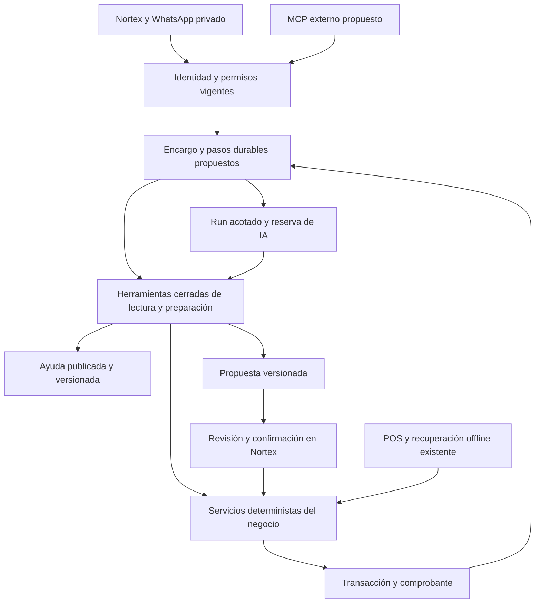

# Arquitectura para los agentes de Nortex

Diseño vigente del programa: **2026-09-19**. Los componentes marcados propuestos
no se implementan por este documento. [Estado del código](ESTADO_ACTUAL_NORTEX.md),
[reglas](REGLAS_AGENTES_NORTEX.md) y [orden de entrega](ROADMAP_AGENTES_NORTEX.md).

## Componentes y autoridad

Conservar React/Vite, Express, Prisma 6.4.1, MySQL 8, Node 22.23.2 y npm. El núcleo
transaccional sigue siendo un monolito modular. El coordinador organiza trabajo;
contabilidad, RRHH y finanzas usan perfiles de herramientas sobre los mismos
servicios, con Haiku detrás de un adaptador. No requiere tres procesos ni tres
proveedores. Nuevos módulos fuera de `backend/server.ts` y `components/POS.tsx`.

## Cuatro objetos distintos

| Objeto | Responsabilidad | Estado de referencia |
|---|---|---|
| Conversación privada | Mensajes y hechos aportados, ligados a usuario/negocio | Existe; no basta para representar un trabajo de varios días |
| Encargo y pasos | Objetivo, responsable, dependencias, evidencia, espera y aceptación | Propuestos para A01/W01; no existen como coordinador completo |
| `AssistantRun` | Intento acotado, checkpoints, resultado y consumo | Existe en candidato; recuperar un run abandonado no autoriza repetir acciones |
| Propuesta y comprobante | Versión revisable y resultado autoritativo del servicio de dominio | Existen por capacidades; cada acción nueva necesita contrato propio |

Nombres propuestos: `WorkItem`, `WorkStep`, `WorkEvidence`, `WorkEvent`. Reusar runs
y propuestas; no duplicar el motor de compras ni transformar cada mensaje en un
workflow. Para W01 bastan expediente, aportes/excepciones, versiones y referencias;
agenda recurrente, MCP y coordinación W04 se incorporan después.

## Contrato mínimo A01/W01

- **Encargo:** tenant derivado del servidor, creador, responsable autorizado,
  objetivo/período, versión, estado, criterios de aceptación y política de retención.
- **Paso:** tipo cerrado, dependencias, argumentos validados, hash de entrada,
  versión, run/evidencia, identidad idempotente y límite de intentos. Sin SQL/URL
  libre ni permiso de confirmación.
- **Evidencia:** entidad/fuente, versión/hash, período/corte Managua, fecha de
  consulta, clasificación y permisos. Distinguir snapshot histórico de estado
  actual; una explicación derivada conserva sus dependencias de acceso.
- **Excepción:** diferencia, evidencia faltante, responsable y estado de revisión.
  Asignarla no la resuelve; el informe puede aceptarla de manera explícita.
- **Aceptación:** usuario autorizado, versión/hash del informe y fecha. Cambio
  material de fuentes/criterios exige reconsulta y nueva aceptación.

Estados semánticos propuestos: preparado, ejecutando, esperando información,
esperando revisión, esperando presupuesto/dependencia, pausado, acceso revocado,
reconciliando, terminado, cancelado, fallido y vencido. Definir transiciones en
código, sin aceptar un estado arbitrario del modelo. Cancelación con efecto
incierto mantiene conciliación hasta conocer su comprobante.

Una API propuesta bajo `/api/assistant/work-items` ofrece creación idempotente,
listado paginado, lectura autorizada, aportes versionados, pausa/reanudación,
cancelación y aceptación del informe. Un GET no prepara, siembra ni llama a IA.
Aceptar W01 no llama servicios de cierre/ajuste/asientos.

## Concurrencia y recuperación

Reclamar trabajo mediante transacción corta y lease con generación; cada escritura
del worker comprueba su vigencia. Salir de la transacción antes de IA. Guardar
checkpoint y evento de transición juntos; una outbox futura se añade en esa
transacción y envía después. Un worker vencido no publica ni adelanta pasos.

Un reinicio recupera el paso por identidad. Dedupe no demuestra que una operación
externa no ocurrió. Costos/envíos UNKNOWN conservan incertidumbre; una llamada
iniciada puede cobrarse aunque se cancele el encargo. La liquidación del consumo
es idempotente y no se pierde por rechazar un resultado de lease vencido.

Inicialmente proponer un trabajo pesado activo global y una extracción concurrente,
con reparto por negocio; concretar y probar límites antes de activar workers. Pool
Prisma por proceso: medir la suma de API, workers y tareas, más reserva operativa.
No deducir conexiones de un conteo de constructores ni clientes de vCPU/RAM.

W01 no requiere sondeo pagado: aportes humanos/eventos autorizados despiertan un
paso elegible. Hasta cuatro iteraciones/60 segundos por run; fijar límites por
encargo antes de implementarlo. Punto de partida para ensayo: ocho pasos y dos
runs, todavía **propuesta**, sin aumentar presupuesto ni ocultar reintentos.

## Retención y restauración

Conservar la política existente de chat 30 días y adjuntos no confirmados 7 días;
originales de operaciones registradas siguen la retención del dominio. Un encargo
no amplía esos plazos automáticamente. Antes de persistirlo, definir qué evidencia
mínima guarda, cuándo vence, quién accede y qué hacer si expira un adjunto pendiente.
Referenciar/minimizar datos; nunca conservar todo por llamarlo memoria.

Restaurar SQL, originales y referencias conjuntamente en entorno aislado, con
hashes, permisos y resultados conciliados. Invalidar leases restaurados y mantener
envíos/ejecución/IA apagados hasta revalidar. Probar también revocaciones posteriores
al backup; una restauración no debe revivir acceso externo. RPO/RTO requieren
objetivos aceptados y medición, no sólo un comando de backup exitoso.

## MCP y proveedores

MCP es un adaptador externo **pendiente**. Diseñar autorización delegada,
consentimiento sobre datos enviados, scopes, revocación, audiencia, carga y
trazabilidad; verificar la especificación oficial vigente al implementarlo.
No entregar JWT del POS a clientes externos ni exponer una herramienta de confirmar.
Primero ayuda/lecturas aceptadas, luego preparar y abrir la propuesta exacta en
Nortex autenticado. Usar un cliente compatible no demuestra integración probada.

Una llamada determinista desde IA externa no obliga a llamar otra vez a Haiku.
Cualquier síntesis/OCR pagado por Nortex conserva reserva, autorización y enlace
explícito a su run, job u operación de extracción/interpretación según contrato,
sin fabricar una ejecución. Cambiar de modelo o adoptar un runtime de agentes exige nueva evaluación;
no cambia los servicios del dominio ni sus permisos.

La [arquitectura anterior del candidato](/Users/stark/Developer/Nortex/candidates/nortexgpt-editorial-20260919/docs/ARQUITECTURA_EQUIPO_ADMINISTRATIVO_2026-09-09.md)
conserva alternativas y parámetros de ensayo históricos. Este contrato y el roadmap
priorizan el corte mínimo de W01; aquellos parámetros no son configuración aplicada.
