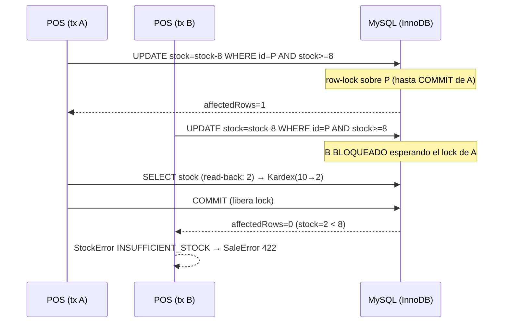
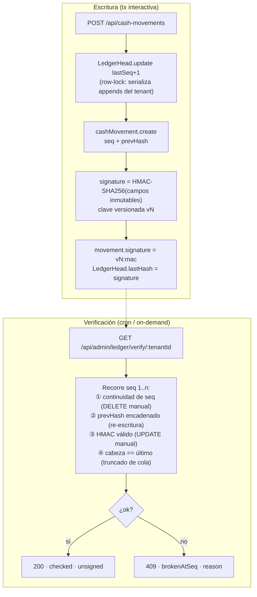

# Nortex — Blindaje de Concurrencia, Criptografía y Aislamiento Multi-Tenant

> Estado: M1 y M2 **implementados** en `claude/compassionate-wozniak-OzS9K` (PR #4). M3 entregado como arquitectura de referencia + plan de adopción.
> Stack: Node.js · Express · Prisma · MySQL 8.0 (InnoDB).

---

## MISIÓN 1 — Concurrencia POS vs Inventario

### Problema

Patrón previo en `salesService.ts` y `sync.ts`:

```
T1: SELECT stock (lee 10)        T2: SELECT stock (lee 10)
T1: valida 10 >= 8 ✓             T2: valida 10 >= 8 ✓
T1: UPDATE stock = 2             T2: UPDATE stock = 2   ← vendimos 16, quedó 2
```

La validación y la escritura eran sentencias separadas (TOCTOU). El Kardex registraba `stockBefore/stockAfter` calculados de la lectura sucia → libro de inventario corrupto bajo carga.

### Solución implementada: decremento condicional atómico

`backend/services/stockService.ts` — un único UPDATE donde **la condición de suficiencia vive en el WHERE**:

```sql
UPDATE Product SET stock = stock - :qty
WHERE id = :id AND tenantId = :tenant AND stock >= :qty
```

- `affectedRows = 0` → no hay stock (o el producto no es del tenant). No existe ventana entre validar y escribir: **son la misma sentencia**.
- El UPDATE toma el **row-lock de InnoDB** hasta el COMMIT; la lectura posterior dentro de la misma transacción ve la propia escritura de forma estable → `stockBefore/stockAfter` del Kardex salen sin carrera (`stockBefore = stockAfter + qty`).



### Modos

| Canal | `enforceSufficient` | Semántica |
|---|---|---|
| POS online (`executeSale`) | `true` | Rechaza con 422 si no alcanza |
| Sync offline (`sync.ts`) | `false` | La venta física **ya ocurrió**: se aplica el delta aunque quede negativo — el Kardex refleja la realidad para auditoría, no la niega |
| Devoluciones (`POST /api/returns`) | `false` | Incremento atómico con read-back |

### Alineación de `sync.ts` (cambios adicionales)

| Hueco encontrado | Fix |
|---|---|
| `product.findUnique({ id })` sin `tenantId` (IDOR de lectura/escritura) | `findFirst({ id, tenantId })` + delta tenant-scoped |
| `shift.update({ id })` sin tenant → inflar caja ajena | `shift.updateMany({ id, tenantId })` |
| Skip por `offlineId` global → filtraba `saleId` de otro tenant | `findFirst({ offlineId, tenantId })` |
| Decremento de lotes (FEFO) leía `batch.stock` y descontaba sin condición | `updateMany({ id, tenantId, stock: { gte: deduct } })`; si `count=0` el lote fue drenado por otra tx → el remanente cae al siguiente lote o al asiento "sin lote" |
| Carrera de dos syncs con el mismo `offlineId` → `failed` | `P2002` → se resuelve como `skipped` idempotente |
| Kardex por lote usaba el mismo `stockBefore` para todos los lotes | Cursor acumulativo por asiento |

### Alternativa evaluada: bloqueo pesimista (`SELECT … FOR UPDATE`)

| Criterio | UPDATE condicional (elegido) | `$queryRaw FOR UPDATE` |
|---|---|---|
| Round-trips | 2 (update + read-back) | 3 (lock + lógica + update) |
| Ventana de lock | Mínima (desde el UPDATE) | Mayor (desde el SELECT) |
| Riesgo de deadlock | Bajo (orden natural por ítem) | Mayor si varias filas se lockean en órdenes distintos |
| Expresividad | Solo condiciones expresables en WHERE | Lógica arbitraria entre lock y write |
| Portabilidad Prisma | 100 % API tipada | SQL crudo (bypassa el tipado) |

`FOR UPDATE` queda reservado para flujos futuros con decisiones complejas entre lectura y escritura (p. ej. reservas de carrito multi-ítem con prioridad). Para decrementos simples es estrictamente peor.

**CHECK constraint (`stock >= 0`):** MySQL 8.0.16+ lo aplica, pero Prisma no lo modela y `prisma db push` (el flujo de deploy actual) no lo gestiona — no puede ser el guard primario. Además la política offline **requiere** permitir negativos. Decisión: el guard es el WHERE condicional; el CHECK queda descartado deliberadamente.

---

## MISIÓN 2 — Criptografía y Fundación Neobanking

### Principio rector: nunca firmar saldos mutables

`walletBalance` y el corte de caja son **proyecciones**. Firmar un agregado que cambia con cada operación obliga a re-firmar en cada write (frágil, condición de carrera sobre la firma misma). Lo correcto: firmar el **libro inmutable** que genera el saldo y verificar la proyección **recomputando**.



### Implementación

| Pieza | Archivo | Qué hace |
|---|---|---|
| Primitivas | `backend/services/crypto.ts` | AES-256-GCM (FLE), blind index HMAC, firma canónica versionada |
| Cadena del libro | `backend/services/ledger.ts` | `appendSignedCashMovement`, `signCapitalLoan`, `verifyTenantLedger` |
| Schema | `CashMovement.seq/prevHash/signature` + `@@unique([tenantId, seq])`, `CapitalLoan.signature`, `model LedgerHead` | Columnas nullable → rollout sin big-bang |
| Integración | `server.ts` (creación de CashMovement y CapitalLoan) | Único sitio de escritura de cada tabla, ya cableado |
| Verificación | `GET /api/admin/ledger/verify/:tenantId` (SUPER_ADMIN) | 200 ok / 409 con `brokenAtSeq` y causa |

**Detalle de diseño:** la anulación (`isVoided`, `voidReason`, …) **no** entra en la firma — el hecho económico es inmutable; el void es una anotación posterior auditada por `AuditLog`. Alterar `amount` rompe la firma; borrar una fila rompe la continuidad de `seq`; reescribir la cola rompe `prevHash`; truncar el final rompe la cabeza.

### Field-Level Encryption para PII (primitivas listas; rollout por fases)

Formato: `enc:<kid>:<iv>:<tag>:<ct>` — un valor sin prefijo se devuelve tal cual (`decryptField` es total), lo que permite backfill gradual sin romper lecturas.

Campos objetivo: `Customer.taxId/phone/email/address`, `Employee.cedula/inss/bankAccount/phone`, `Tenant.dgiAuthCode`.

| Fase | Acción |
|---|---|
| 1 | Definir `NORTEX_DATA_KEYS` + `NORTEX_INDEX_KEY` en el entorno |
| 2 | Escrituras nuevas: `encryptField()` + columna gemela `phoneIdx = blindIndex(phone, 'customer.phone')` |
| 3 | Backfill por lotes (UPDATE de filas legacy) |
| 4 | Lookups por igualdad migran a `WHERE phoneIdx = blindIndex(:q, …)` — **prerrequisito del lookup `wa_id` del agente WhatsApp** |

**Trade-off estructural:** un campo cifrado pierde `LIKE`/rangos/`ORDER BY`. El blind index recupera **solo igualdad exacta**. La búsqueda parcial de clientes por nombre debe permanecer en claro (el nombre no es PII de alto riesgo) o resolverse con índice de tokens — decisión de producto previa a la Fase 2.

### Auditoría JWT (`auth.ts` / `server.ts`)

| Hallazgo | Severidad | Estado |
|---|---|---|
| Fallback hardcodeado `nortex_dev_secret_key_2026` | Crítica | ✅ Eliminado (PR #4); fail-closed al arranque |
| Secreto duplicado en 2 archivos (`auth.ts` + `server.ts`) → deriva de configuración | Alta | ✅ Centralizado en `services/secrets.ts` |
| Sin rotación posible (un solo secreto, invalidar = desloguear a todos) | Alta | ✅ Keyring `JWT_SECRETS="nuevo,viejo"`: el primero firma, todos verifican. Rotación: agregar → esperar TTL (7d) → quitar |
| `TokenExpiredError` enmascarable al probar múltiples claves | Media | ✅ Corta de inmediato (la firma fue válida; la causa real es expiración) |
| HS256 simétrico (quien verifica puede firmar) | Media | ⏭️ Pendiente: RS256/EdDSA si algún servicio externo (agente WhatsApp) necesita verificar tokens sin poder emitirlos |
| TTL 7d sin revocación server-side | Media | ⏭️ Pendiente: lista de revocación o TTL corto + refresh token |

### Variables de entorno nuevas

```bash
# Firma del libro (activa el chaining; sin ella los writes siguen sin firmar)
NORTEX_LEDGER_KEYS="v1:$(node -e "console.log(require('crypto').randomBytes(32).toString('base64'))")"
# FLE de PII (necesaria recién en Fase 2 del rollout PII)
NORTEX_DATA_KEYS="v1:<base64-32-bytes>"
NORTEX_INDEX_KEY="<base64-32-bytes>"   # NUNCA rotar sin re-indexar
# JWT (opcional; JWT_SECRET legacy sigue funcionando)
JWT_SECRETS="secretoNuevo,secretoActual"
```

---

## MISIÓN 3 — Aislamiento Multi-Tenant Estructural

### Diagnóstico

117 rutas filtran por `tenantId` **manualmente**. Los IDOR encontrados (payroll, returns, sync) no son bugs aislados: son el modo de fallo natural del patrón "acordate de filtrar". El objetivo es que la inyección del `tenantId` sea **obligatoria e invisible**.

### Capa 1 — MySQL hoy: Prisma Client Extension (guard en aplicación)

```ts
// backend/db/tenantGuard.ts (referencia de adopción)
import { Prisma } from '@prisma/client';

// Modelos con columna tenantId (de schema.prisma)
const TENANT_MODELS = new Set([
  'Customer', 'Supplier', 'Employee', 'Sale', 'Shift', 'AuditLog', 'Expense',
  'B2BOrder', 'Product', 'ProductBatch', 'KardexMovement', 'Purchase',
  'ManualPayment', 'Quotation', 'Invitation', 'CashMovement', 'ProductReturn',
  'Account', 'JournalEntry', 'FiscalRetention', 'CapitalLoan', 'Payroll', /* … */
]);

export function forTenant(tenantId: string) {
  return Prisma.defineExtension((client) =>
    client.$extends({
      name: 'tenant-guard',
      query: {
        $allModels: {
          async $allOperations({ model, args, query }) {
            if (!TENANT_MODELS.has(model)) return query(args);
            const a = args as { where?: Record<string, unknown>; data?: Record<string, unknown> };
            // Lecturas/updates/deletes: AND obligatorio
            if ('where' in a) a.where = { AND: [a.where ?? {}, { tenantId }] };
            // Creates: inyección del tenant (pisa cualquier valor del caller)
            if ('data' in a && a.data && !Array.isArray(a.data)) a.data = { ...a.data, tenantId };
            return query(args);
          },
        },
      },
    })
  );
}
// Uso en una ruta:  const db = prisma.$extends(forTenant(req.tenantId));
```

- El handler **no puede olvidar** el filtro: la extensión lo aplica a todo modelo tenant-scoped.
- `$queryRaw` queda fuera del guard → prohibir SQL crudo sobre modelos tenant-scoped por convención + revisión.

**Guard de regresión en CI** (complemento, del plan de hardening): test que escanea el código y **falla** si encuentra `prisma.<modeloTenant>.update|delete|findUnique` sin `tenantId` en el `where`. Bloquea reintroducciones mientras dura la migración de las 117 rutas.

### Capa 2 — PostgreSQL futuro: Row-Level Security (defensa en la DB)

```sql
-- Por cada tabla tenant-scoped:
ALTER TABLE "Sale" ENABLE ROW LEVEL SECURITY;
ALTER TABLE "Sale" FORCE ROW LEVEL SECURITY;   -- aplica también al owner

CREATE POLICY tenant_isolation ON "Sale"
  USING ("tenantId" = current_setting('app.tenant_id', true))
  WITH CHECK ("tenantId" = current_setting('app.tenant_id', true));
```

```ts
// El middleware fija el tenant de la conexión ANTES de cada operación:
await prisma.$transaction(async (tx) => {
  await tx.$executeRaw`SELECT set_config('app.tenant_id', ${tenantId}, true)`; // true = scope de tx
  // ... toda la lógica de la request corre con RLS activo
});
```

| Aspecto | Extension (MySQL hoy) | RLS (Postgres futuro) |
|---|---|---|
| Capa de defensa | Aplicación (Prisma) | Base de datos (inviolable desde la app) |
| Cubre `$queryRaw` | ❌ | ✅ |
| Cubre acceso directo a la DB (psql, BI) | ❌ | ✅ |
| Riesgo connection-pool | n/a | `set_config(..., true)` scope de transacción — obligatorio con pgBouncer |
| Migración requerida | Ninguna | MySQL→Postgres (proyecto mayor) |

Arquitectura objetivo: **ambas capas** (defensa en profundidad). La extension es además el puente: cuando llegue Postgres, el código de rutas ya no menciona `tenantId` y solo cambia la capa de sesión.

---

## Análisis de Riesgos y Trade-offs

| # | Decisión | Costo | Mitigación |
|---|---|---|---|
| 1 | UPDATE condicional + read-back | +1 SELECT por ítem vendido (~µs con PK, fila ya lockeada y caliente) | Despreciable frente a la integridad del Kardex |
| 2 | Lock por producto hasta COMMIT | Ventas concurrentes del **mismo** producto se serializan; tx largas (contabilidad fail-soft incluida) alargan la espera | Volumen PyME: contención real ≈ 0. Si crece: acortar la tx (mover `recordSale` fuera) antes que cambiar el patrón |
| 3 | `LedgerHead` serializa el libro por tenant | Throughput de movimientos de caja por tenant ≈ 1/RTT-tx | Un negocio físico no genera >5 mov/s; el lock es por-tenant, no global |
| 4 | Firma HMAC por movimiento | 2 writes extra por movimiento (update signature + head) | Solo en la ruta de caja (baja frecuencia); gate por env para apagar |
| 5 | HMAC simétrico (no firma asimétrica) | Quien posee `NORTEX_LEDGER_KEYS` puede re-firmar el libro | Umbral correcto para tamper-evidence de DB; umbral neobanking real: KMS/HSM + Ed25519 (documentado como siguiente nivel) |
| 6 | FLE rompe LIKE/rangos/ORDER BY | Búsquedas parciales sobre campos cifrados imposibles | Blind index para igualdad; mantener nombre en claro (decisión de producto) |
| 7 | Latencia FLE | ~µs por campo (AES-NI por hardware) — irrelevante vs RTT de red | n/a |
| 8 | `NORTEX_INDEX_KEY` no rotable en caliente | Rotar = re-indexar tablas completas | Documentado; clave separada del ring de datos precisamente por esto |
| 9 | Columnas de firma nullable | Filas legacy sin firmar conviven con firmadas | `verifyTenantLedger` reporta `unsigned`; backfill opcional posterior |
| 10 | Extension no cubre `$queryRaw` | SQL crudo bypassa el guard | Convención + CI-guard; RLS lo cierra definitivamente en Postgres |

## Orden de Adopción

1. **Merge PR #4** → deploy (`prisma db push` crea columnas y `LedgerHead` automáticamente).
2. Definir `NORTEX_LEDGER_KEYS` en Coolify → la cadena se activa sola; smoke test: `GET /api/admin/ledger/verify/:tenantId`.
3. `JWT_SECRETS` (opcional ya; obligatorio antes de exponer servicios externos).
4. Fase 0 del plan de hardening (tests + CI) → luego migración de rutas al `forTenant` con el CI-guard activo.
5. FLE de PII (fases 1-4) — prerrequisito del lookup `wa_id` del agente WhatsApp.
