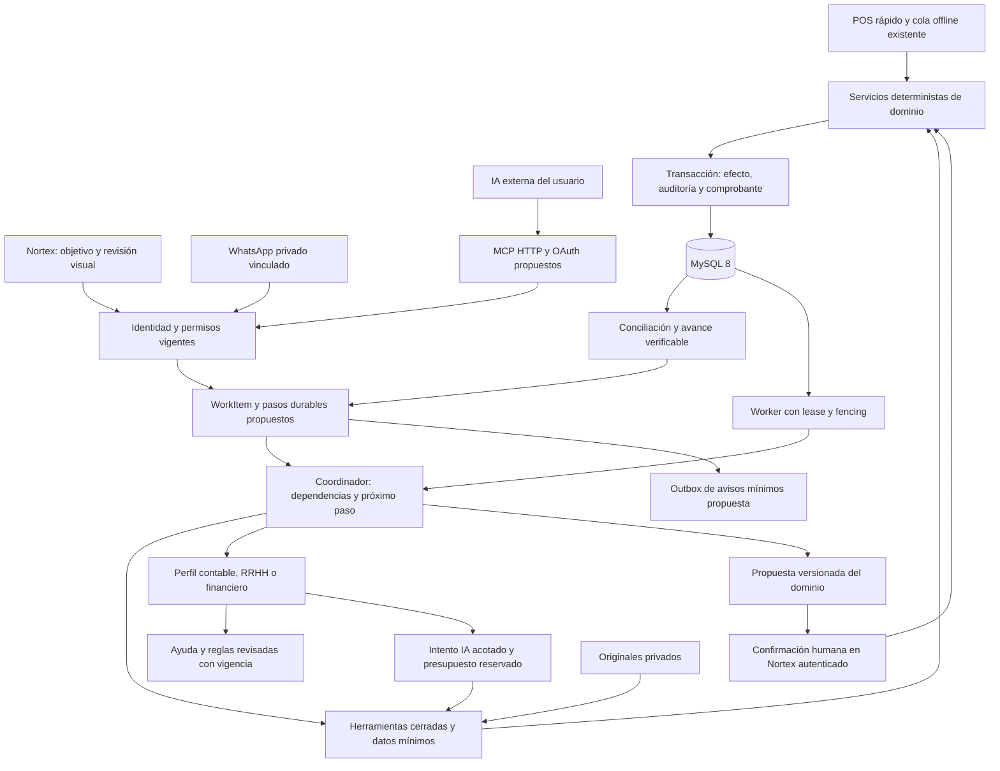

# Arquitectura del equipo administrativo de Nortex

**Estado: diseño propuesto, 2026-09-09. No implementa servicios, tablas, OAuth, workers ni infraestructura.** Complementa la [meta maestra](META_NORTEX_EQUIPO_ADMINISTRATIVO.md), el [estado verificable](ESTADO_ACTUAL_NORTEX.md), el [plan de estabilidad y RAG](PLAN_DESARROLLO_RAG_Y_ESTABILIDAD_2026-09-08.md) y el [equipo de desarrollo](EQUIPO_DESARROLLO_NORTEX.md). Inspección del candidato local con HEAD `ead043c2aa27e25e6522e97b3cdc2c3a4e585783` y cambios de presupuesto aún sin integrar; no identifica esos cambios con la producción publicada `07f30c9`.

El objetivo es que una persona tenga un equipo administrativo accesible que organice trabajo de contabilidad, RRHH y finanzas alrededor de un resultado verificable. El objetivo comercial de **US$20 por negocio/mes** requiere validar costos y utilidad; no es una tarifa publicada ni una autorización para gastar US$20 de IA por negocio. El POS, sus botones y el trabajo habitual siguen disponibles: vender rápido no debe depender del modelo ni de una conversación.

**Actualización de ejecución:** el [primer incremento W01](NORTEXGPT_REVISION_SEMANAL_CAJA_2026-09-09.md) ya reutiliza snapshots, runs y permisos existentes. Esta arquitectura sigue siendo el diseño del programa completo; la agenda genérica A01 no es requisito para demostrar la primera revisión útil. Piloto y costos acompañan cada incremento.

## 1. Decisión técnica

Conservar un **monolito modular** con React/Vite, Express, Prisma 6.4.1, MySQL 8, Node 22.23.2 y npm. Separar procesos de trabajo por necesidad operativa, manteniendo servicios, contratos, migraciones y pruebas en el mismo repositorio. No introducir microservicios, otra base vectorial, un nuevo proveedor ni un motor de workflows externo para esta primera entrega.

Tres fronteras de autoridad:

1. **Núcleo determinista:** calcula dinero, impuestos, disponibilidad, cortes Managua, nómina y asientos mediante servicios autorizados. Decimal para importes nuevos, snapshots fiscales/costos históricos y `applyStockDelta` para existencias. Falta de datos se representa como indisponibilidad.
2. **Coordinador durable:** organiza dependencias, fechas, evidencia y responsables; decide qué paso elegible ejecutar o qué dato/confirmación falta. Esperar días no mantiene un proceso ni una llamada de IA abiertos.
3. **Especialistas lógicos:** contabilidad, RRHH y finanzas son perfiles de herramientas, fuentes y criterios de revisión. Se activa solo el especialista necesario. Pueden usar el mismo adaptador Haiku; no son tres modelos permanentes ni tres llamadas obligatorias para cada pregunta.

MCP ofrece a una IA externa el mismo límite de herramientas; no la convierte en administradora de la infraestructura ni delega la confirmación. MCP describe un protocolo de contexto y herramientas. La IA externa puede investigar y proponer pasos; Nortex conserva la autoridad, las reglas y el estado durable de los trabajos aceptados. [Arquitectura oficial de MCP](https://modelcontextprotocol.io/docs/2026-07-28/learn/architecture).

## 2. Mapa real y ampliación propuesta

| Capacidad | Código/modelo/ruta existente inspeccionado | Ampliación propuesta, todavía inexistente |
|---|---|---|
| Conversación privada | [conversations.ts](../backend/services/assistant/conversations.ts), `AssistantConversation`/`AssistantMessage`, `/api/assistant/conversations` | Mantener diálogo por usuario; vincular una conversación a un expediente sin compartir automáticamente su contenido. |
| Intento acotado | [orchestrator.ts](../backend/services/assistant/operations/orchestrator.ts), [runService.ts](../backend/services/assistant/operations/runService.ts), `AssistantRun`, `/conversations/:id/runs`, `/runs/:id`, `/cancel`, `/recover` | `WorkItem` para objetivo multi-día y `WorkStep` para dependencia/estado. Cada intento IA sigue siendo un run acotado. |
| Herramientas | [operations/tools.ts](../backend/services/assistant/operations/tools.ts): ayuda, cifras, comparación, cobertura, vencimientos, catálogo, preparación operativa, `review_weekly_cash` e `inspect_cash_close` de W01/W01B | Contratos de conciliación y lectura de RRHH; no hay hoy herramientas del registro para ejecutar nómina o cierre contable. |
| Ayuda | [knowledge.ts](../backend/services/assistant/knowledge.ts): 12 artículos compilados, roles, sección/versión y ranking léxico top-2 | Publicación, retiro, fuente y pasaje consultables según D02–D04. Reglas fiscales/laborales requieren jurisdicción, vigencia y revisión profesional; no indexar expedientes de empleados como ayuda común. |
| Propuestas y resultado | [proposals.ts](../backend/services/assistant/proposals.ts), [actions/service.ts](../backend/services/assistant/actions/service.ts), `AssistantProposal`, `AssistantActionProposal`, `PurchaseCommand`, `AssistantActionCommand` | Referenciar estas propuestas desde los pasos. Nómina/asientos nuevos necesitan contratos propios antes de ser habilitados. Ningún coordinador vuelve a implementar sus efectos. |
| Jobs y transporte privado | [worker.ts](../backend/services/assistant/worker.ts), [workers/assistant.ts](../backend/workers/assistant.ts), [privateWhatsapp/inbox.ts](../backend/services/assistant/privateWhatsapp/inbox.ts), [outbox.ts](../backend/services/assistant/privateWhatsapp/outbox.ts), `AssistantJob`, `AssistantWaInbox`/`Outbox`/`Binding` | `administration/coordinator.ts`, `workRepository.ts`, `reconciliation.ts`, `backend/workers/administration.ts`; outbox administrativa separada del transporte WhatsApp. |
| Finanzas/contabilidad | [accounting.ts](../backend/services/accounting.ts), [salesService.ts](../backend/services/salesService.ts), [purchaseRegistrationService.ts](../backend/services/purchaseRegistrationService.ts), `JournalEntry`/`JournalLine` | Lecturas agregadas, conciliación y borradores explícitos; conservar auditoría y asiento en la misma transacción del efecto confirmado. |
| RRHH | [routes/hr.ts](../backend/routes/hr.ts), modelos `Employee`, `Payroll`, `PayrollRun`, `PayrollLine` en [schema](../backend/prisma/schema.prisma); cálculo de nómina aún compuesto en servidor | Extraer servicios después de caracterizarlos; resolver riesgos D11 antes de conectar decisiones/pagos. La existencia de tablas no acredita integridad de todos sus recorridos. |
| Consumo | [budget.ts](../backend/services/assistant/budget.ts), [budgetPolicy.ts](../backend/services/assistant/budgetPolicy.ts), `AssistantBudget`/`Usage`, nueva autorización `AssistantTenantConfig.approvedMonthlyBudgetUsd` y `AssistantBudgetRequest` | Relación `WorkItem → WorkStep → AssistantRun → AssistantUsage`; cupos por objetivo subordinados al presupuesto existente, sin contador paralelo que permita excederlo. |
| Acceso externo | JWT interno, [accessPolicies.ts](../backend/middleware/accessPolicies.ts), permisos del [asistente](../backend/services/assistant/access.ts); montaje en [assistantMounts.ts](../backend/routes/assistantMounts.ts) | `/mcp`, metadatos OAuth y concesiones delegadas; no existen como producto externo acreditado en esta revisión. |

### Separar consulta, inicialización, cálculo y registro antes de exponer herramientas

Continuación [W01B](NORTEXGPT_INVESTIGACION_CIERRES_2026-09-12.md): `inspect_cash_close` consulta un turno autorizado y su snapshot, y lista movimientos actuales por separado. El comando del enlace conserva ID/hash y evita una llamada de interpretación. Sus pendientes humanos usan la evidencia durable del run; no agrega WorkItem, asignación o aceptación. El reporte v1 no conserva tender desglosado ni cabeza del libro al cerrar, por lo que no permite reconstruir esos hechos ni demostrar causas.

Inspección de código, sin reproducir incidentes de clientes en esta entrega:

- W01 comparte `validateShiftSnapshot` con `getShiftSnapshot` en [salesReportService.ts](../backend/services/salesReportService.ts), consumido por `GET /api/reports/shifts/:shiftId/document` en [salesReports.ts](../backend/routes/salesReports.ts). La herramienta semanal consulta sus dos conjuntos acotados y reutiliza el verificador; no llama una vez por turno al endpoint del documento. No llamar a `closeShiftWithReport` para explicarlo, porque ejecuta el cierre. Un turno sin comprobante no se cierra por pedir revisión.
- `getBalanceGeneral` y `getEstadoResultados` en [accounting.ts](../backend/services/accounting.ts) llaman a `seedChartOfAccounts`. Separar inicialización explícita de lecturas antes de registrarlas como herramientas READ. Revisar además períodos construidos con zona local del runtime, límites/paginación y agregaciones; una función llamada “get” no acredita ausencia de efectos ni corte Managua correcto.
- `/api/payroll/calculate` en [server.ts](../backend/server.ts) persiste `Payroll` y aplica adelantos; no es una vista previa. Separar cálculo puro del motor laboral, persistencia de propuesta y confirmación. El pago consulta `PAGADO` antes de la transacción y captura fallos de asiento para continuar; el cambio a `PAGADO` sí ocurre dentro de la transacción. Reproducir concurrencia y rollback, después reparar D11 antes de exponerlo al asistente.
- El mayor contable no acredita disponibilidad bancaria. La inspección acotada no encontró reconciliación contra extracto bancario; hasta validarla, W03 declara esa fuente no conciliada o usa evidencia bancaria explícita revisada, sin afirmar que falta toda capacidad de finanzas.

Los nombres de módulos/modelos propuestos son contratos de diseño, no archivos creados. Schema, servidor, POS, CI y tipos compartidos mantienen un integrador único. No añadir código operativo a `server.ts` ni a `POS.tsx`. Cada extracción empieza por una prueba de conducta y reporta delta del origen, destinos y total, bajando el presupuesto del origen.

## 3. Expediente durable y ejecución

### Datos mínimos propuestos

- `WorkItem`: `tenantId`, creador, responsable, objetivo normalizado, criterios de aceptación, versión, estado, clasificación de privacidad, referencias de evidencia/propuestas, `nextEligibleAt`, fecha límite y política de caducidad. La participación compartida requiere permiso explícito del expediente; pertenecer al negocio no basta.
- `WorkStep`: tipo cerrado y versión de contrato, dependencias, argumentos validados o referencias, `inputHash`, estado, intento, `runId`, clave idempotente, resultado/recibo, `availableAt`, `leaseUntil`, `leaseToken` y generación de lease monotónica. Ningún paso contiene SQL o URL libre ejecutable.
- `WorkEvidence`: referencias a fuente, entidad, versión/hash, corte del período, fecha de consulta, clasificación, política de acceso y dependencias de los textos derivados. Preferir referencias y agregados a duplicar documentos privados.
- `WorkEvent` y `WorkNotificationOutbox`: transiciones/auditoría, destinatario, versión de expediente, canal permitido, deduplicación, próximo intento y estado de entrega. Registrar hechos de ejecución; no razonamiento privado del modelo ni prompts completos.
- `DelegatedGrant`/`OAuthClient`: usuario y negocio autorizados, cliente, scopes, clasificación permitida, vigencia, revocación y generación de autorización; códigos y refresh tokens almacenados mediante hashes cuando su uso lo permita. Claves de firma/cifrado fuera de tablas y repositorio.

Índices iniciales a validar con planes de consulta: `WorkItem(tenantId,ownerId,status,updatedAt,id)`, `WorkStep(status,availableAt,leaseUntil,id)`, `WorkStep(workItemId,status,id)`, unicidad de `(tenantId,workItemId,stepKey,version)`, outbox `(status,availableAt,id)` y clave de evento por destinatario/canal. FKs y cada consulta deben impedir referencias cruzadas de tenant; una FK por ID no implementa por sí sola esa política.

### Estados y garantías

| Estado propuesto | Significado y siguiente transición |
|---|---|
| `DRAFT` / `READY` | Objetivo revisable; pasos elegibles definidos por código y permisos. Crear trabajo no autoriza un efecto financiero. |
| `RUNNING` | Un worker posee lease y generación vigentes; checkpoint durable después de cada paso. |
| `WAITING_INPUT` / `WAITING_REVIEW` | Falta documento/dato o una confirmación humana exacta. No hay cómputo ni gasto periódico por estar esperando. |
| `WAITING_BUDGET` / `WAITING_DEPENDENCY` | Requiere presupuesto aprobado o resultado externo verificable. Nuevas reservas solo al avanzar un paso autorizado. |
| `PAUSED` / `ACCESS_REVOKED` | Detener nuevas llamadas, ocultar datos no autorizados y conservar trazabilidad restringida. Reasignación exige nueva autoridad; no heredar permisos del creador. |
| `RECONCILING` | Existe o podría existir un efecto; consultar comprobante/estado y comparar invariantes. No reenviar una operación por timeout. |
| `COMPLETED` | Criterios del objetivo comprobados con evidencia. Un borrador solo completa un objetivo definido expresamente como preparación. |
| `FAILED` / `CANCELLED` / `EXPIRED` | Final sin pasos nuevos, con motivo y efectos confirmados visibles. Si queda un efecto posible, conservar `RECONCILING` y la intención de cancelación hasta aclararlo. Cancelar no revierte compras, pagos ni asientos. |

El `AssistantRun` actual no es un coordinador multi-día: recupera acceso/estado y marca un run abandonado como fallido; no debe transformarse en una autorización para repetir preparaciones a ciegas. Reutilizarlo como intento de hasta **cuatro iteraciones y 60 segundos**, conservando su checkpoint y versiones.

Contrato del worker propuesto:

1. Reclamar un paso elegible mediante transacción corta, CAS/lock y generación de lease; no bloquear todos los trabajos de un negocio. Revalidar usuario, concesión y capacidad después de esperar locks.
2. Terminar esa transacción. Consultar servicios/IA fuera de ella; reservar presupuesto antes de cada llamada, con salida/contexto acotados. Un worker vencido no puede avanzar el plan ni publicar su resultado: cada escritura de coordinación compara lease y generación. Una llamada ya iniciada puede terminar y haber generado costo; la liquidación idempotente del consumo se conserva en una vía separada y autorizada, o permanece UNKNOWN para conciliación. Cancelar bloquea llamadas/pasos nuevos, no borra consumo ni simula que el proveedor dejó de trabajar.
3. Guardar checkpoint y próximo estado atómicamente. Para publicación de avisos, guardar el evento y la outbox en esa misma transacción; el envío ocurre después.
4. Reintentar lecturas seguras con backoff y máximo de intentos por clase. La expiración del lease no prueba que el proveedor no cobró: conservar `UNKNOWN`. La entrega de avisos incierta tampoco se reenvía ciegamente.
5. Para mutaciones, el servidor acepta **ID de propuesta, versión y clave idempotente**, no contenido financiero reconstruido por el navegador o MCP. Revalida condiciones y permisos; servicio de dominio, auditoría y comprobante comparten transacción. Actualizar el expediente en otra transacción puede ser eventual porque se concilia desde el comprobante persistido.
6. Si se pierde una respuesta, consultar operación por identidad exacta. El modelo no confirma y el scheduler no crea una confirmación humana. Una edición/cambio material invalida la revisión previa; no reutilizarla días después.

Entrega al menos una vez con efectos idempotentes y reconciliación; no prometer entrega exactamente una vez a través de redes externas. Un aviso “compra registrada” requiere comprobante, no un mensaje exitoso del modelo.

## 4. Interfaces propuestas y límites por especialista

Bajo `/api/assistant/work-items`: creación idempotente, listado autorizado/paginado, lectura de expediente, aportes con versión, pausa/cancelación, reanudación explícita y acceso a propuestas. Responder con estado y referencias, `202` cuando el trabajo durable fue aceptado; un `202` no significa resultado terminado. Los GET no crean ni despiertan trabajos pagados.

- **Contabilidad:** revisar evidencia de operaciones y diferencias, preparar conciliación y borradores permitidos. Un asiento propuesto requiere revisión humana y servicio transaccional validado; no editar el libro para que “cuadre”.
- **Finanzas:** separar ventas, margen, gastos, efectivo y deudas; estimaciones con supuestos y períodos. Preparar alternativas de reposición/flujo de caja sin asumir recepción ni pago de una factura.
- **RRHH:** asistencia, incidencias y nómina solo según permisos específicos. Al coordinador financiero entregar total autorizado y fecha prevista cuando baste; no expedientes, salarios individuales, datos médicos/judiciales ni cuentas bancarias. En negocios pequeños incluso un agregado puede identificar a una persona: no publicarlo a roles sin permiso mediante la etiqueta “agregado”.

Los perfiles no son roles de usuario. El acceso efectivo es la intersección de capacidades del producto, permisos vigentes del usuario, autorización del expediente y scopes de la conexión. Bodega conserva información sin costos; caja ve su operación autorizada. Superadministración de plataforma no se convierte por defecto en lectura de nómina. Las políticas RRHH nuevas necesitan una matriz de campos/acciones y revisión de sus responsables antes de exponer herramientas.

Confirmación humana obligatoria para dinero, stock, nómina y asientos. Esta visión no habilita pagos bancarios, envío de declaraciones, decisiones disciplinarias o despidos automáticos. Preparar un documento no acredita revisión profesional ni autoriza enviarlo a empleados, proveedores o autoridades.

## 5. MCP y OAuth delegados

Propuesta: endpoint remoto HTTPS con transporte MCP HTTP, autorización OAuth y registro inicial de clientes revisados. El usuario inicia la vinculación desde Nortex autenticado, elige negocio y scopes; el consentimiento identifica qué datos saldrán hacia esa IA. No compartir el JWT del POS ni aceptar tokens emitidos para otra audiencia. Adoptar discovery mediante metadatos de recurso protegido/servidor de autorización, Authorization Code + PKCE, URI de redirección exacta y tokens de audiencia limitada. [Autorización MCP, especificación 2025-11-25](https://modelcontextprotocol.io/specification/2025-11-25/basic/authorization).

Contrato Nortex propuesto, adicional a la especificación: access token de 10 minutos, refresh rotatorio con vigencia máxima inicial de 30 días, revocación consultada en cada operación y recurso. La duración no retrasa revocación. Si se pierde la autoridad o expira el grant de un trabajo externo, pausarlo; un token OAuth no habilita vigilancia perpetua. No reenviar tokens a proveedores ni al modelo. El consentimiento incremental requiere una nueva pantalla antes de ampliar acceso.

| Scopes propuestos | Límite |
|---|---|
| `help:read`, `business:summary:read` | Ayuda aprobada y cifras permitidas; no descarga masiva del negocio. |
| `inventory:read`, `accounting:summary:read` | Campos y períodos permitidos; costos solo con autoridad suficiente. |
| `hr:aggregate:read` | Consentimiento separado y permiso real de RRHH; sin expedientes individuales en el primer piloto. |
| `work:read`, `work:prepare` | Estado/evidencia autorizados y preparación idempotente. Crear trabajo es escritura auxiliar declarada. |
| `purchase:prepare`, `inventory-action:prepare` | Propuestas de tipos habilitados; devolver vínculo autenticado a la revisión exacta en Nortex. |

No exponer `confirm`, pago, administración de usuarios, SQL libre, endpoints arbitrarios ni secretos. Listado y ejecución filtran herramientas por scope; también se autoriza cada recurso, cita, historial y resultado derivado. La revocación impide nuevas lecturas, aunque no puede retirar una copia ya entregada al cliente externo. Los avisos fuera de Nortex contienen identificador/estado mínimo, sin salarios o documentos.

MCP `readOnlyHint` describe conducta, no impone permisos. Hoy `read_daily_brief` está clasificada internamente como `READ`, pero [briefing.ts](../backend/services/assistant/operations/briefing.ts) puede hacer `upsert`: separar lectura de generación o declarar esa escritura auxiliar antes de ofrecerla como solo lectura externa. Documentos, respuestas de herramientas y descripciones externas siguen siendo datos no confiables. Probar inyección, token de otra audiencia, consentimiento engañoso, SSRF en discovery, replay, revocación y mezclas de tenant. [Seguridad oficial MCP](https://modelcontextprotocol.io/docs/2025-11-25/tutorials/security/security_best_practices).

La suscripción del usuario a una IA externa no demuestra compatibilidad MCP ni paga las llamadas Haiku de Nortex. Integración y costo se acreditan por cliente/proveedor real; este documento no elige un servidor OAuth comercial ni compra servicios.

## 6. Presupuesto y economía

**Código local vigente del lote:** default aprobado US$2/tenant/mes, ampliación hasta US$10 mediante solicitud y aprobación de Nortex; límite global US$20. El efectivo es `min(configuración operativa, aprobación, 10)`. `monthlyBudgetUsd=10` legacy no autoriza US$10. Las reservas, gasto y `UNKNOWN` se conservan al aprobar. [Política](../backend/services/assistant/budgetPolicy.ts), [reserva/liquidación](../backend/services/assistant/budget.ts), [solicitudes](../backend/services/assistant/budgetRequests.ts).

El bucket global se persiste **por base de datos**, no por toda la cuenta del proveedor. Staging, QA y producción con bases separadas pueden reservar cada una su propio techo; el código actual no acredita coordinación entre entornos. Antes de llamadas en varios entornos, fijar una única autoridad de consumo o cuotas parciales cuya suma no supere el máximo aprobado, incluyendo canales que todavía no usan este servicio. El límite del proveedor es defensa adicional, no reconciliación por run.

El coordinador no gasta mientras espera: disparadores deterministas por evento/fecha, deduplicados, solo despiertan pasos previstos. Un plan guarda máximo de pasos, intentos y costo; propuesta inicial para el primer flujo: hasta 8 pasos de dominio y 2 intentos IA en total, cada uno sujeto al máximo existente de 4 iteraciones/60 segundos y a reservas aprobadas. Si falta presupuesto, pasa a `WAITING_BUDGET`, mostrando los hechos disponibles y conservando trabajo pendiente; no se marca `COMPLETED` ni `FAILED` por agotamiento. No dividir una consulta en infinitos runs para eludir el límite.

Antes de cada llamada presupuestar entrada, resultados de herramientas, imágenes, salida y reintentos; una reserva conservadora puede impedir una consulta aunque su costo típico sea pequeño. Dimensionar por petición con evidencia, sin reducir reservas artificialmente. La retención de costos inciertos requiere conciliación explícita, nunca liberación por tiempo transcurrido.

Precio objetivo y presupuesto no son sinónimos: `margen de contribución = ingreso neto − IA − infraestructura atribuida − almacenamiento/transferencia − soporte variable − costos de cobro`. Medir costo por tarea completada, correcciones y negocios activos; no justificar el precio por número de “agentes”. Con el techo global actual, diez negocios consumiendo US$2 lo agotarían: ampliar clientes no amplía el presupuesto automáticamente.

## 7. Proteger el POS y medir capacidad

El inventario histórico del 08/09 registra Droplet Basic de 2 vCPU/4 GiB/80 GiB, tamaño US$24/mes, con producción, staging y Coolify compartiendo host; muestra de 1.695 MiB disponibles, 879 MiB de swap usados y 61 GiB libres. **No se revalidó en vivo para este diseño.** No sumar el segundo Droplet de función no verificada. Esas muestras no permiten afirmar capacidad de clientes, swapping activo ni rendimiento sostenible. [Snapshot de capacidad](CAPACIDAD_DROPLET_NORTEX_2026-09-08.md).

Ese informe histórico conserva estados previos de respaldo y release; para la recuperación/despliegue posteriores prevalecen [estado actual](ESTADO_ACTUAL_NORTEX.md) y [evidencia de producción](releases/2026-09-08-production-verification.md). Ni esta actualización documental ni una sesión web nueva son una medición de carga.

Parámetros **propuestos para ensayo**, no configuraciones aplicadas:

- Un coordinador concurrente global y una extracción simultánea inicial, con árbitro común de trabajo pesado; no uno por cada proceso/API. Un paso activo por expediente y reparto justo entre tenants. Consultas deterministas del POS no esperan a la cola administrativa.
- Arranque del worker con techo inicial de 384 MiB y 0,25 vCPU sujeto a benchmark. Una extracción que no quepa falla de forma controlada o exige revisar despliegue; no quitar límites ni cargar PDF grande en la API. No iniciar nuevos workers en el host histórico sin medir memoria conjunta.
- Un Prisma compartido por **proceso** desde [lib/prisma.ts](../backend/lib/prisma.ts). Cada proceso sigue abriendo su pool: presupuesto conjunto `Σ(poolAPI + poolWorkers + jobs) + reserva de operación < max_connections`. Probar pool 2 para worker y reserva operativa de al menos 20%; escoger pool API después de consolidar/instrumentar constructores legacy. No asumir que contar constructores mide conexiones abiertas.
- Índices y paginación por cada lectura; agregaciones MySQL, no XLSX/PDF síncronos grandes en handlers. Propuesta inicial: 100 filas/página, 20 resultados de herramientas, 18.000 caracteres por resultado IA, máximo 2 trabajos administrativos listos y 20 pendientes por tenant. Coalescer avisos; no borrar trabajos activos por sobrecarga. Colas llenas responden con motivo/reintento, no aceptan trabajo que se perderá.
- Suspender admisión de trabajo pesado ante OOM, espera de pool sostenida, falta de disco o regresión del POS. La pausa no cancela transacciones financieras ya iniciadas ni libera reservas inciertas. Builds y ensayos no compiten con hora pico por defecto.

### Objetivos de servicio propuestos

Medir primero baseline sin asistente; acordar objetivos antes de aceptar la prueba. Los siguientes valores son objetivos iniciales, **no SLA contratados ni resultados medidos**.

| Indicador | Objetivo inicial y señal |
|---|---|
| POS online | p95 del registro HTTP de venta ≤1,5 s y p99 ≤3 s con mezcla acordada; ≤0,1% errores técnicos, cero duplicaciones/diferencias en ensayo. Comparar asistente activo/apagado: degradación p95 ≤10%. Separar red, cola y ejecución del servidor. |
| API de expediente/ayuda determinista | p95 ≤1 s; aceptación durable ≤1 s. No contar falta de datos como respuesta correcta. |
| Consulta IA | Máximo 60 s/4 iteraciones por intento; informar estado y degradación, sin bloqueo de interfaz. p50/p95 y tasa de respuesta sustentada medidos separadamente. |
| Cola | Con carga aceptada, p95 de espera de pasos elegibles ≤30 s; alertar al superar 60 s durante 5 min. Excluir espera humana/dependencia del cálculo, mostrarla por separado. |
| Disponibilidad POS | Objetivo propuesto 99,5% mensual, pendiente de medición/aceptación. Contar cortes de reemplazo; hubo 503 transitorio en el release previo y su duración continua no quedó medida. |
| Recursos | Alertas propuestas: memoria disponible <20% durante 5 min, CPU >70% durante 15 min, event-loop p95 >100 ms durante 5 min, pool >80% durante 5 min, disco <20% o proyección <7 días. Son disparadores de investigación/admisión, no prueba aislada de saturación. |

Prueba fuera de producción, datos sintéticos: 10/25/50/100 cajas virtuales son puntos experimentales, no capacidades prometidas. Cada caja busca tres productos y registra ticket de cinco líneas cada 30 segundos; distribución alternativa concentrada en un tenant para detectar locks, y distribuida entre varios. Añadir 10% de replays de ventas, devolución/anulación autorizadas, cierre al final, una extracción, consultas administrativas y exportación concurrente acotada. Los porcentajes y cadence se sustituyen por mezcla observada si difiere.

Por escalón: calentamiento de 10 minutos, 30 minutos estables, ráfaga 2× de 5 minutos; detener ante fallo de integridad, OOM o SLO incumplido sostenido. Medir p50/p95/p99, throughput, longitud de tickets, locks, pool, CPU/RAM/I/O, cola y conciliación independiente. Como aproximación del generador, `ventas/s = cajas × 1/30`; no convierte ventas/s en máximo de negocios. Publicar capacidad solo para la mezcla y hardware ensayados, dejando al menos 30% de margen sobre recursos limitantes y comprobando el siguiente pico previsto.

### Cuándo separar procesos o base

- Mover workers a otro host solo si, después de cuotas y límites, su actividad coincide reproduciblemente con regresión POS >10%, cola vencida o presión de memoria/CPU. El worker externo exige canal DB privado, almacenamiento privado compartido y presupuesto de pools; no migrar archivos públicos ni ampliar privilegios.
- Separar MySQL/usar servicio administrado cuando locks/IO/latencia persistan tras corregir consultas e índices, o cuando datos y recuperación no quepan en los objetivos. Antes medir costo, red, backups y failover; una réplica de lectura puede estar atrasada y nunca autoriza confirmaciones.
- Múltiples API solo después de resolver límites/cachés/jobs por proceso y canal comercial, medir conexiones y probar afinidad/recuperación. El POS no debe convertirse en un sistema distribuido por tener tres perfiles de IA. [Deuda concreta](SCALING_AUDIT.md).

## 8. Recuperación conjunta y seguridad de archivos

El respaldo SQL actual y el respaldo del panel Coolify resuelven componentes distintos. Ninguno acredita por sí solo originales privados de NortexGPT, restauración integral de OAuth ni continuidad de nuevos trabajos. Seguir [backup-db.sh](../scripts/backup-db.sh), [verificador de restore](../scripts/verify-backup-restore.sh), [skill de recuperación](../.claude/skills/nortex-backup-recovery/SKILL.md) y [promoción](runbooks/release-promotion.md).

Objetivo propuesto de lanzamiento: RPO de hasta 24 horas para recuperación conjunta, RTO ≤2 horas hasta validar POS y expedientes; operación humana debe aceptar explícitamente esa pérdida máxima. Si se necesita RPO ≤15 minutos, es otra entrega de binlogs/PITR y archivos durables coordinados, con ensayo y costo propios. Los 26 h del chequeo de frescura actual son un umbral técnico, no promesa de RPO. El tiempo de importación SQL no es RTO completo.

Unidad de recuperación propuesta: snapshot SQL consistente, manifiesto de adjuntos inmutables y hashes, referencias desde propuestas/comprobantes, versiones de código/schema/corpus, configuración opaca necesaria y material de recuperación de claves bajo custodia separada. Copia privada cifrada fuera del host; retención de originales confirmados según política del dominio. Historial conversacional de 30 días y adjuntos no confirmados de 7 días no deben borrar la evidencia mínima de un expediente abierto: contrato explícito de clasificación, expiración y minimización antes de habilitar trabajos largos.

Durante el ensayo: red restringida, workers/envíos/IA/confirmación apagados; restaurar SQL y archivos, validar referencias y ACL de dos tenants, detectar faltantes/corrupción, conciliar operaciones y reanudar solo pasos seguros. Un lease restaurado se invalida mediante nueva generación de recuperación; pasos con efecto posible pasan por conciliación. Nunca reenviar outbox `UNKNOWN` ni despertar todos los vencidos automáticamente.

OAuth requiere consideración adicional: una copia puede revivir grants revocados después del backup. Antes de exponer la restauración, invalidar sesiones/tokens anteriores mediante generación de recuperación y exigir nueva vinculación; conservar revocaciones durables o invalidar todas si no se puede reconstruirlas. Mantener claves de firma/cifrado recuperables y rotación revisada, sin secretos en logs/fixtures. Probar que un refresh anterior no vuelve a conceder acceso y que los mensajes sensibles pendientes se suprimen cuando cambió la autoridad.

## 9. Secuencia de entrega y primer objetivo completo

| Lote y responsable | Resultado antes de avanzar |
|---|---|
| A00/A01: fundación — plataforma/QA/integrador | Baseline y protección POS C00; métricas/pools D06/D09; recuperación conjunta D08. Definir estados/índices/costos/ACL del expediente y hacer pruebas de reinicio/replay antes de conectar IA. |
| A02–A04: evidencia — inteligencia + finanzas/RRHH | Ayuda revisada D02–D04; contratos deterministas de caja, obligaciones y lectura mínima RRHH. Resolver o bloquear cada ruta insegura D11; no presentar nómina estimada como obligación aprobada. |
| A01: coordinación — plataforma/inteligencia | WorkItem/Step con espera durable, límites, cancelación, revocación y conciliación; una sola llamada de especialista cuando aporta valor. UI privada de progreso y revisión conservando carrito/lector. |
| A02/W01: primer flujo — contabilidad/finanzas/QA | Revisión explicada de cierre semanal: interrupción, regreso otro día, diferencias verificadas y reporte aceptado. Sin cambiar caja/asientos/cierre. Diez tareas comparables por vertical antes de atribuir ahorro de tiempo. |
| A05: MCP — plataforma/seguridad/QA | OAuth y scopes probados con cliente externo real y sintéticos; empezar con ayuda/lecturas, después preparar. Recursos/avisos protegidos; confirmación solo en Nortex. |
| A03/A04/A06/A07: ampliación — producto + responsables humanos | Nómina y contabilidad por contratos propios, corpus laboral/fiscal revisado, evaluación IA y piloto; precio/costos validados. CI y staging del mismo SHA y producción con autorización separada. |

**Primer objetivo completo: W01, “Revisá mi cierre de la semana y explicame las diferencias”.** Es A02 de la meta maestra; no depende de implementar toda RRHH ni los tres especialistas a la vez. Termina en una revisión aceptada y evidencia de diferencias resueltas o excepciones asignadas. Solo se llama “conciliado” si ninguna diferencia queda sin explicación comprobada.

1. El usuario selecciona semana/turnos y alcance. `review_weekly_cash` e `inspect_cash_close` ya existen localmente: leen snapshots y separan movimientos actuales del soporte histórico. La conciliación individual de ventas, devoluciones, pagos, retiros y gastos sigue necesitando fuentes adicionales y su propio contrato. El calendario es Managua, con cortes visibles; no sumar efectivo con crédito o transferencias como si fueran caja física.
2. El perfil contable explica datos y faltantes. Si no hay cierre, falta documento o existe diferencia sin respaldo, guardar `WAITING_INPUT` con responsable y referencia. No invocar el servicio que cierra caja ni sembrar cuentas para producir una explicación.
3. Cerrar panel, navegar, vender y reiniciar worker conserva expediente/carrito. El siguiente día, un aporte humano explícito despierta el paso. Revalidar permisos y fuentes; no llamar al modelo periódicamente solo para preguntar si llegó un documento.
4. La persona efectúa cualquier corrección en su dominio y flujo autorizado. Si requiere dinero, stock o asiento, exige una propuesta y confirmación propias; W01 no añade esa mutación implícita. El expediente guarda referencias, no cambia históricos para eliminar diferencias.
5. Reconsultar evidencia vigente, comparar con resultados independientes y registrar versión del informe. Si se pierde la respuesta, recuperar esa misma versión por identidad; no crear otro cierre ni otra corrección.
6. El usuario revisa y acepta el informe; confirmar la lectura de un reporte no confirma ninguna transacción financiera. Mantener excepciones explícitas pendientes/asignadas cuando corresponda y avisos mínimos. Medir tanto tiempo humano como espera y correcciones.

W02 prepara planilla después de separar cálculo/persistencia y cerrar los riesgos D11 pertinentes a cálculo, datos y privacidad de ese recorrido. El pago queda en otro lote y exige demostrar su atomicidad, concurrencia, auditoría y rollback; no bloquear la preparación por riesgos ajenos ya aislados.  W03 organiza pagos/compras con compromisos autorizados; W04 coordina una evaluación de contratación después de W01–W03. La compra conversacional existente mantiene su recorrido factura → revisión → confirmación → comprobante y puede enlazarse posteriormente como evidencia/compromiso del expediente. No se reemplaza su contrato ni se añade a W01 para forzar tres especialistas.

Aceptar W01 con dos tenants, permisos revocados en cada borde, espera de 24 h simulada sin adelantar indebidamente fechas fiscales, caída de worker/proveedor, presupuesto agotado, evidencia retirada, reporte modificado y concurrencia. Probar que el recorrido de explicación no escribe dinero/stock/cierre/cuentas; las escrituras de estado auxiliar del expediente se declaran y auditan. La evaluación real del modelo y revisión humana complementan pruebas deterministas. Cambios posteriores de producto requieren las compuertas vigentes y MySQL descartable obligatorio para dinero/inventario/presupuesto; esta entrega documental no ejecutó QA de producto ni operaciones remotas.
