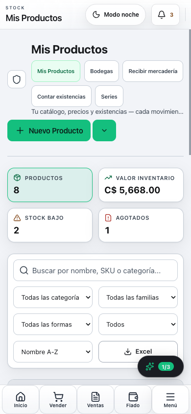
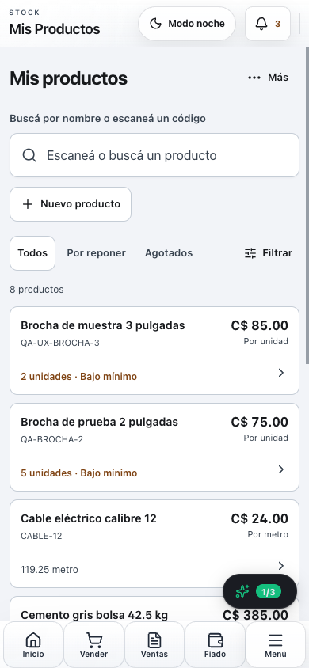
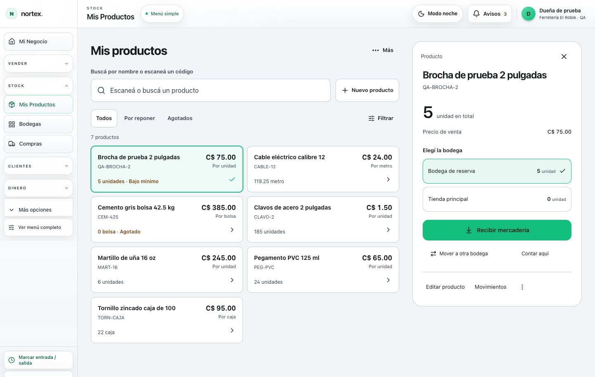
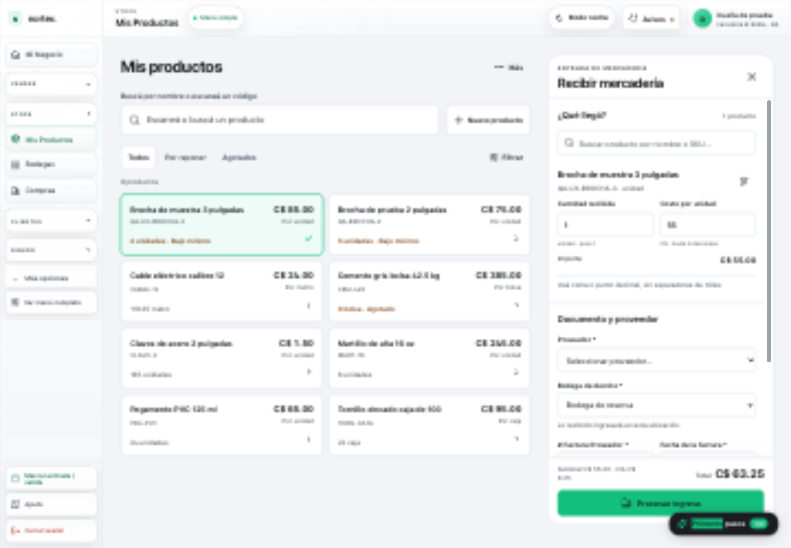

# Bodega con el recorrido del POS — revisión del 12 de septiembre de 2026

La primera reparación corrigió integridad y campos, pero mantuvo una pantalla de administración: pestañas, cuatro indicadores y cinco selectores antes de llegar al producto. Esta segunda entrega cambia la interacción. Se busca un producto, se abre su ficha y se recibe o se mueve desde ese contexto.

## Lo observado y lo que cambió

| Paso | Fricción observada en la primera reparación | Comportamiento nuevo | Evidencia |
|---|---|---|---|
| Buscar | En 390×844 no entraba ningún producto en la primera pantalla; primero aparecían pestañas, indicadores y filtros. | Búsqueda y tres estados; los primeros tres productos quedan completos a la vista. Filtros avanzados y herramientas se despliegan. | Capturas 02 y 14, misma base QA de ocho productos. |
| Elegir | Editar, Kardex y menús repetidos en cada fila; ubicación fuera del catálogo. | Una tarjeta seleccionable y una ficha con existencias por bodega. En teléfono se abre una hoja. | 03, 04, 15, 18. |
| Crear → recibir | Guardar cerraba el alta y obligaba a localizar el producto otra vez. | El producto recién creado queda seleccionado; se elige la bodega y se abre la recepción con ambos datos. | 06–09 y ui-receipt-evidence.json. |
| Recibir | Formulario separado; documento antes de los productos; tabla ancha. | Producto/cantidad/costo primero, proveedor y documento después, total y confirmación visibles en el pie. Misma autoridad de registro. | 05, 08; pruebas de ReceivingWorkspace. |
| Mover | Había que entrar a Bodegas y volver a identificar origen y producto. | “Mover a otra bodega” abre el traslado con ambos verificados, sin registrar automáticamente. | 10, 11, 17. |
| Contar | Creación, métricas e historial compitiendo con la captura. | Conteos abiertos primero; historial desplegable, nuevo conteo con bodega conservada, captura continua y revisión final. | 12–13; pruebas de captura y conteo. |

Se tomó como referencia el POS existente de Nortex: búsqueda delante, objetos fáciles de tocar y contexto persistente al lado. La exposición gradual de opciones sigue el criterio de reducir decisiones simultáneas de [Apple HIG: Layout](https://developer.apple.com/design/human-interface-guidelines/layout). No se copió una apariencia de vidrio ni se agregó un asistente obligatorio por pasos.

## Demostración ejecutada

1. Crear `QA-UX-BROCHA-3`, “Brocha de muestra 3 pulgadas”, precio C$85 y existencias cero.
2. Ver que su ficha queda seleccionada inmediatamente al guardar.
3. Seleccionar Bodega de reserva y abrir Recibir mercadería sin volver a escribir producto ni ubicación.
4. Capturar 2 unidades a C$55, proveedor de prueba, factura `QA-UX-RECIBO-001`, crédito hasta 2026-10-12.
5. Confirmar: subtotal C$110, IVA C$16.50, total C$126.50. Catálogo y ficha muestran dos unidades en reserva y cero en principal.
6. Verificar en MySQL local: una compra, un comando con UUID, una auditoría PURCHASE_CREATED, un movimiento 0→2 y un asiento balanceado.
7. Abrir el traslado desde la ficha: producto y origen aparecen listos. Cerrar sin transferir y volver conserva producto/búsqueda.
8. Abrir un nuevo conteo desde esa bodega: ubicación conservada. Se revisó el formulario y se cerró sin crear un conteo adicional.

Todo se ejecutó con una cuenta sintética de propietario en MySQL 8 local descartable. La integración automatizada usa otra base separada de la demostración. No hay despliegue, CI remoto, migración de bases ajenas ni prueba con usuarios reales.

## Correcciones encontradas durante la segunda revisión

- Respuesta tardía de otra ficha o sesión: no puede llenar la ficha actual. Se valida todo el contrato del desglose; una respuesta inválida muestra error y reintento, nunca cero inventado.
- Recepción abierta: el lector y el catálogo de detrás quedan bloqueados. Cambiar el ancho de pantalla conserva el formulario; durante envío no cierra por Escape.
- Escape móvil antes de enviar: liberaba la hoja pero dejaba el catálogo inutilizable; ahora libera ambos y conserva el borrador.
- La recepción lateral heredaba columnas del ancho de la ventana: ahora responde al contenedor. El cuerpo desplaza y el pie permanece visible.
- Colores de fecha/acciones y nota del conteo: se recuperaron asociaciones accesibles de error, tokens de contraste y respuesta táctil.
- Datos incompletos: confirmar muestra los errores y enfoca el campo, sin mandar una compra inválida.
- El cierre del panel después de una compra confirmada debe vaciar su borrador de forma síncrona antes de desmontar, preservando los borradores independientes y la identidad de intentos inciertos. La regresión se verificó con desmontaje inmediato del padre y reapertura; un replay real conservó las dos unidades y una sola compra. La próxima entrada mantiene la bodega elegida y elimina factura/identidad anteriores.

## Evidencia y límites

- [Resumen de QA](evidence/stock-experience-20260912/qa-summary.json): Prisma generate, TypeScript, sistema de diseño y build aprobados; 371 suites y 5126 casos generales aprobados. Los 362 casos omitidos se registran aparte.
- [Lectura de la recepción demostrada](evidence/stock-experience-20260912/ui-receipt-evidence.json).
- [Integración obligatoria](evidence/stock-experience-20260912/integration-summary.json): 43 suites, 376 casos, ninguno omitido.
- Los casos omitidos del pase general se registran aparte; no acreditan integración ni se cuentan como aprobados.
- La revisión móvil usa Chromium emulado a 390×844; no acredita teclado, lector o cámara de un teléfono físico, ni un estudio de facilidad con personas.
- El desglose es de existencias físicas. Lotes, vencimientos y disponibilidad vendible conservan sus reglas específicas.
- Bodega/recepción mantienen sus validaciones y transacciones; el nuevo endpoint es de solo lectura, sin costos y con tenant del JWT. Su desglose está acotado a 100 bodegas activas y expone saldo fuera del desglose.
- Permanecen los límites de alcance de la auditoría anterior: archivo global de productos, devoluciones a proveedor y otras capacidades allí identificadas no forman parte de esta transformación de la interacción.
- No se afirma aumento de retención ni que la experiencia esté libre de errores por pasar pruebas. La evidencia muestra el recorrido concreto simplificado y sus límites.

## Comparación visual

Antes, móvil:

Después, mismo ancho y catálogo:

Ficha y recepción:

La comparación de escritorio 01/03 se capturó con siete productos; la comparación móvil 02/14 se capturó después del alta de prueba y tiene ocho en ambas versiones. No se mezclan sus conteos.

## Tamaño y composición

Las operaciones se mantienen en sus controladores; catálogo, ficha y vista de recepción tienen responsabilidades separadas. No se añadieron flujos a POS.tsx ni server.ts.

| Archivo de origen | Antes | Después | Delta |
|---|---:|---:|---:|
| components/Inventory.tsx | 3635 | 3171 | -464 |
| components/Purchases.tsx | 2873 | 2504 | -369 |
| components/StockCount.tsx | 1116 | 937 | -179 |
| components/Warehouses.tsx | 938 | 934 | -4 |

Los módulos y estilos nuevos suman 1635 líneas. El total de producción afectado pasa de 9236 a 9869 líneas (+633); se informa el costo total y no solo la reducción de los archivos originales. La deuda de botones sin respuesta táctil se mantiene en cero en las superficies cubiertas por el contrato.
