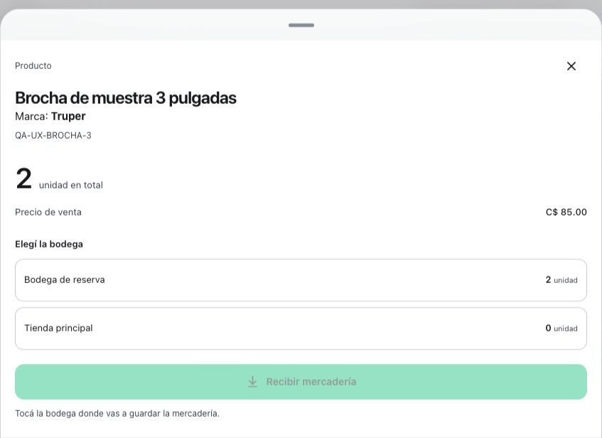
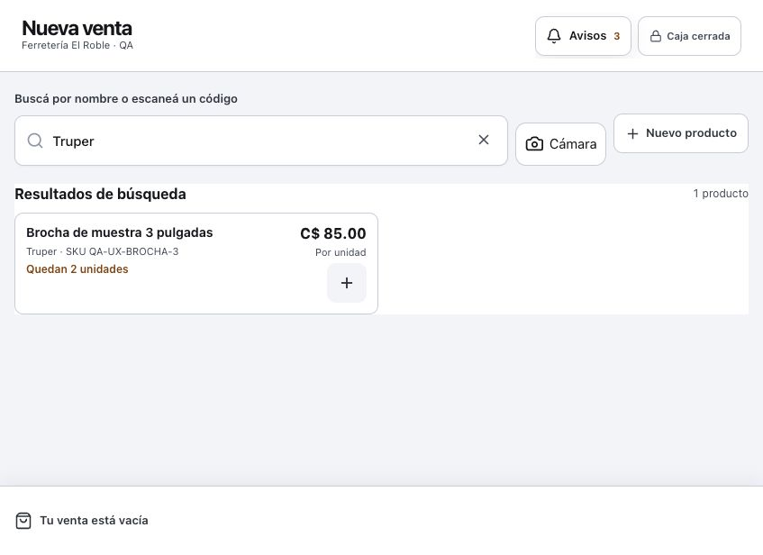
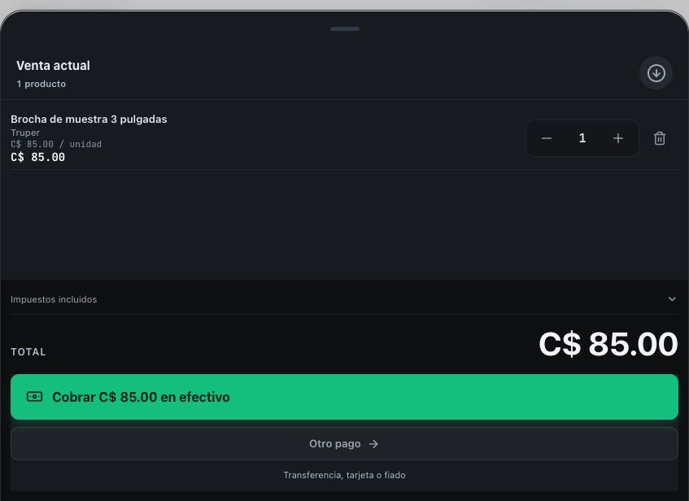
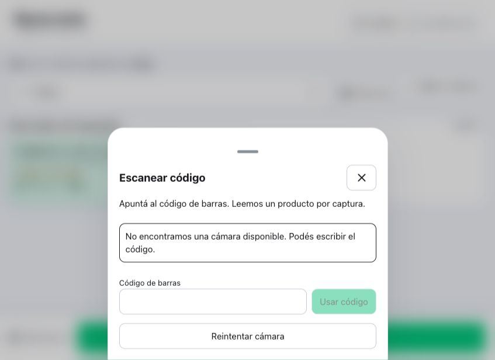

# Marcas y cámara como lector — entrega local del 12 de septiembre de 2026

La marca era inexistente como campo del producto: el servidor la descartaba y el índice del POS no la buscaba. El lector óptico anterior vivía solamente en el laboratorio de fase 0. Esta entrega incorpora ambos al producto, conservando el recorrido de bodega y POS.

## Recorrido disponible

- Crear o editar un producto permite indicar **Marca (opcional)**. Se guarda aparte del nombre; un producto anterior sin marca sigue funcionando. No se inventan marcas a partir del nombre.
- La marca se muestra en el catálogo y ficha de inventario, existencias por bodega, toma física, catálogo del POS y descripción del ticket en curso. Se puede buscar por marca en estos listados. Las facturas históricas no se reescriben.
- Excel reconoce `marca`, `brand` y `marca comercial`; la exportación incluye Marca. Importar un archivo sin esa columna conserva la marca existente. Para vaciarla se usa la edición explícita del producto.
- **Cámara** junto al buscador abre el lector. En POS entrega al mismo router que usa el lector de teclado, conservando prioridad y validaciones de etiquetas de balanza. Agregar al carrito no confirma la venta.
- En inventario identifica exactamente el código y abre la ficha. En Bodegas y Conteo identifica el producto dentro de la ubicación o toma actual; la cámara no suma conteos ni registra entradas o traslados por sí sola.
- Un código inexistente ofrece crear el producto con el código conservado únicamente al administrador autorizado y después de un 404 confirmado. Un fallo de conexión o permiso no ofrece ese alta.
- El usuario puede escribir el código si no dispone de cámara. Una lectura cierra la captura: otro agregado necesita una nueva acción. Cerrar, desmontar o pasar al fondo detiene los recursos del lector; la respuesta tardía de otra sesión se descarta.

## Demostración local ejecutada

Se usó la cuenta sintética Ferretería El Roble · QA, sin datos de negocios reales.

1. Editar `QA-UX-BROCHA-3`, guardar Truper y encontrarlo buscando la marca.
2. Consultar `QA-CAMARA-NUEVO` mediante la alternativa manual del panel del lector. El servidor confirmó que no existía; Crear producto abrió el formulario con ese código.
3. Crear “Brocha para demostración de cámara”, marca Stanley, precio 95 y existencia cero. La ficha quedó seleccionada y mostró la marca guardada.
4. Abrir POS, buscar Truper y usar el panel del lector con `QA-UX-BROCHA-3`. El ticket mostró una unidad a 85 y la marca Truper.
5. Consultar MySQL en solo lectura: la brocha anterior conserva stock 2; la nueva tiene 0; ninguna tiene una venta registrada por esta demostración.

La ventana observada medía 847×616. Las capturas corresponden a ese tamaño real; no se presentan como prueba de un teléfono físico.

## Verificación y límites

- Prisma 6.4.1 validate/generate, TypeScript, sistema de diseño (104 archivos) y build aprobados con Node 22.23.2.
- Vitest general: **376 suites / 5149 casos aprobados**. Los 43 grupos / 368 casos omitidos se registran aparte y no cuentan como aprobados.
- Integración HTTP/MySQL 8: **44 suites / 382 casos, cero omitidos**, con base descartable separada de la demo. Incluye persistencia y edición de marca, importación que conserva opcionales, tenant ajeno, vendedor con catálogo asignado y bodeguero sin exposición de precios/costos.
- La migración añade una columna nullable y un índice no único. Se compararon antes/después 1351 productos y 1248 saldos por bodega de QA: identidad, nombre, SKU, precio, costo y stock existentes permanecieron idénticos. No hubo backfill ni `--accept-data-loss`.
- Se reprodujeron en rojo el descarte de marca, la búsqueda que no la encontraba y el agregado tardío después de cambiar de sesión; las regresiones reparadas pasaron. Un selector de prueba del placeholder anterior se cambió a la etiqueta accesible; el doble de preview del POS ahora responde la clasificación SKU real.
- **SOFTWARE_ONLY_NOT_PHYSICAL:** ZXing real decodificó un EAN-13 rasterizado sintético. Se probaron duplicados, cancelación antes de resolver permiso, cierre, fondo, ausencia de HTTPS, permiso denegado y alternativa manual. El navegador de demostración no expone cámara física; no se acredita enfoque, iluminación, lectura desde un empaque ni funcionamiento instalado en Android/iPhone.
- La cámara web requiere HTTPS o localhost y permiso del navegador. La captura procesa video localmente; no sube ni guarda fotogramas. Implementación basada en [ZXing Browser](https://github.com/zxing-js/browser/blob/master/README.md) y el ciclo de vida de [getUserMedia](https://developer.mozilla.org/en-US/docs/Web/API/MediaDevices/getUserMedia) y [MediaStreamTrack.stop](https://developer.mozilla.org/en-US/docs/Web/API/MediaStreamTrack/stop).
- Pendiente antes de aprobar uso óptico real: probar Android e iPhone sobre HTTPS con empaques EAN/UPC/Code128/Code39, repetición del mismo código, permisos, cierre, fondo y retorno; registrar precisión y tiempo con 30 intentos por combinación. No se modificó el contenedor nativo de Capacitor ni se publicó en Google Play.
- No hubo commit, push, merge, CI remoto ni despliegue.

[Resumen de QA](evidence/marca-camara-20260912/qa-summary.json) · [Integración obligatoria](evidence/marca-camara-20260912/integration-summary.json) · [Verificación de la demostración](evidence/marca-camara-20260912/ui-verification.json).

## Composición

Se caracterizó el catálogo por HTTP antes de extraer sus lecturas; 16 casos pasaron antes y después. `backend/server.ts` pasa de 13518 a 13404 líneas; el router de catálogo extraído tiene 127. La consulta exacta vive en `backend/routes/productLookup.ts`, aislada por JWT y permisos de catálogo.

Se caracterizó el lector del POS con render antes de extraerlo. `components/POS.tsx` pasa de 6882 a 6853 líneas. El listener de teclado y el control de sesión viven en `hooks/useBarcodeInput.ts`; captura y panel son módulos compartidos. Ambos presupuestos se redujeron, sin ampliar excepciones. Estas reducciones no se presentan como una reducción del total del producto: se añadieron captura, interfaz, datos y pruebas.

El total de código, tipos y schema de producción afectado pasa de 33941 a 34196 líneas (+255), incluyendo los módulos nuevos; la migración SQL añade otras dos líneas. Pruebas, documentación y capturas se contabilizan aparte.
