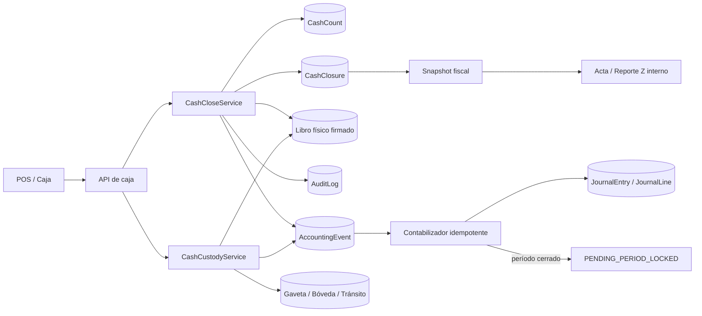

# Plan maestro — Cierre de caja profesional, DGI y contabilidad

> Fecha de corte: 31 de agosto de 2026\
> Estado: plan técnico listo para ejecución; activación financiera bloqueada hasta
> validación CPA/DGI indicada en este documento.\
> Alcance de este documento: arquitectura, datos, APIs, política operativa,
> controles fiscales, contabilización, migración y QA. No implementa cambios.

## 1. Decisión ejecutiva

Nortex no necesita “volver a hacer” su cierre de caja. Ya posee una base útil:
apertura con responsable, conteo ciego, una fórmula centralizada de efectivo,
auditoría atómica y un libro firmado de movimientos. Lo correcto es evolucionar
esa base de forma aditiva hasta separar tres procesos que hoy están acoplados:

1. **Cierre operativo:** contar el dinero físico y liberar la gaveta.
2. **Cierre fiscal:** comprobar secuencias, anulaciones, notas de crédito e impuestos
   ya congelados en las ventas.
3. **Cierre contable:** registrar únicamente diferencias, custodia, depósitos,
   liquidaciones y ajustes cambiarios.

La regla contable principal es innegociable:

> **Cerrar una caja nunca vuelve a contabilizar ventas, IVA, costo, inventario,
> devoluciones ni gastos que ya fueron registrados.**

Un cierre exacto sin traslado de custodia no produce asiento. Si el período está
bloqueado, el cierre físico finaliza y el evento contable queda
`PENDING_PERIOD_LOCKED`; Nortex no deja la gaveta abierta ni reabre el período.

## 2. Alcance y exclusiones

### Incluye

- Caja física por negocio, ubicación, terminal, gaveta y turno.
- Conteo ciego por denominación y moneda.
- Recuento, aprobación y cierre forzado auditado.
- Efectivo NIO y USD con importe original y equivalente funcional.
- Traslados gaveta → bóveda → depósito en tránsito → banco.
- Diferencias de caja, liquidaciones de adquirentes y ajustes cambiarios.
- Snapshot inmutable del cierre y reimpresión fiel.
- Controles DGI: series, rangos, anulaciones, notas de crédito y resumen fiscal.
- Idempotencia, concurrencia, reversos y aislamiento multi-tenant.
- Activación gradual por tenant mediante modo sombra.

### No incluye

- Declarar que el “Reporte Z” sea una obligación fiscal universal en Nicaragua.
- Presentar trámites ante la DGI o afirmar que Nortex ya está autorizado como SFC
  para cada contribuyente y sucursal.
- Definir sin CPA cuentas, materialidad, tasas de retención o políticas fiscales.
- Descontar faltantes automáticamente al empleado.
- Reabrir períodos contables de forma automática.
- Borrar, editar o reemplazar silenciosamente ventas, cierres, conteos o asientos.

## 3. Evidencia actual de Nortex

### Fortalezas que deben conservarse

- El cajero declara primero y conoce el esperado después.
- `calcularEfectivoTurno()` centraliza el efectivo esperado.
- Apertura y cierre escriben `AuditLog` dentro de la transacción.
- `CashMovement` usa libro firmado y separación parcial NIO/USD.
- Las ventas conservan régimen fiscal, versión, IVA y parte exenta.
- Las facturas anuladas permanecen con estado `VOIDED`; no se eliminan.
- Los asientos se bloquean cuando el período fiscal está cerrado.

### Brechas P0 verificadas

| Brecha | Riesgo | Evidencia actual |
|---|---|---|
| CARD, TRANSFER y QR usan Caja General en el asiento de venta | Infla la gaveta y oculta la cuenta por cobrar al adquirente | `backend/services/accounting.ts`, `buildSaleJournalLines()` |
| La venta no conserva la composición física completa del cobro | USD, vuelto NIO y pagos mixtos no pueden reconstruirse con fidelidad | `Sale.paymentMethod` es un único string |
| El reembolso no efectivo puede acreditar Banco antes de la liquidación | El banco contable disminuye antes de que el adquirente procese el reembolso | `recordReturn()` |
| `JournalEntry` no tiene llave contable idempotente | Un retry puede producir dos pólizas | Solo hay índices no únicos de referencia |
| `Shift` no identifica terminal ni gaveta física | Multi-caja real no puede atribuir custodia | `Shift` solo conoce tenant, usuario, empleado y montos |
| El cierre puede leerse y actualizarse sin exigir `status = OPEN` | Riesgo de recierre o sobrescritura administrativa | `POST /api/shifts/close` |
| El cierre normal no persiste denominaciones | La evidencia de conteo existe solo como total | La calculadora vive en force-close y no se guarda |
| `AJUSTE` no tiene política contable | Sobrantes/faltantes no llegan al mayor correctamente | `cashMovementJournalLines()` devuelve `null` |
| El reporte Z se arma desde datos vivos | Una reimpresión futura puede diferir del cierre original | No existe snapshot final completo |

## 4. Arquitectura objetivo



### Separación de responsabilidades

| Componente | Responsabilidad | No debe hacer |
|---|---|---|
| `CashCloseService` | Cortar eventos, calcular esperado, guardar conteo y finalizar custodia | Recontabilizar ventas o reabrir períodos |
| `CashCustodyService` | Mover efectivo entre contenedores con entrega/recepción | Tratar traslados como ingresos o gastos |
| Libro físico | Probar entradas, salidas, reversos y secuencia por tenant | Ser reemplazado por un saldo editable |
| `AccountingEvent` | Desacoplar evento económico de la póliza y permitir retry | Cambiar el cierre operativo |
| Contabilizador | Crear una sola póliza balanceada por `postingKey` | Confiar en códigos hardcodeados sin política activa |
| Snapshot fiscal | Congelar lo ocurrido al momento del cierre | Recalcular impuestos con reglas futuras |

## 5. Modelo de datos propuesto

Todos los montos nuevos usan `Decimal(18,4)`. Toda tabla de negocio incluye
`tenantId`, índices por tenant y fechas, y relaciones cuya propiedad se valida con
el tenant del JWT.

### 5.1 Política contable

#### `AccountingPolicyVersion`

- `tenantId`
- `version`
- `status`: `DRAFT | CPA_APPROVED | ACTIVE | RETIRED`
- `frameworkEdition`
- `functionalCurrency`
- `fxSource`
- `cashTolerance`
- `materialityPolicy Json`
- `transitTrigger`
- `approvalReference`
- `activatedAt`

Una política nunca se modifica después de activarse. Un cambio crea una versión.

#### `AccountingRoleMapping`

- `tenantId`
- `policyVersionId`
- `role`
- `scopeKey`
- `accountId`
- `effectiveFrom`
- `effectiveTo?`

`scopeKey` es obligatorio para evitar duplicados permitidos por `UNIQUE + NULL` en
MySQL. Ejemplos: `GLOBAL`, `CURRENCY:USD`, `REGISTER:<id>`, `ACQUIRER:<id>` y
`BANK:<id>`.

Roles mínimos:

- `GAVETA`
- `BOVEDA`
- `DEPOSITO_TRANSITO`
- `BANCO`
- `CXC_CLIENTE`
- `CXC_ADQUIRENTE`
- `RESERVA_ADQUIRENTE`
- `VENTAS`
- `DEVOLUCIONES`
- `IVA_PAGAR`
- `INVENTARIO`
- `COGS`
- `SOBRANTE_CAJA`
- `FALTANTE_CAJA`
- `COMISION_ADQUIRENTE`
- `CONTRACARGO`
- `GANANCIA_FX`
- `PERDIDA_FX`
- `REDONDEO`

No se activa una política mientras falte un rol obligatorio.

### 5.2 Medio de cobro y multimoneda

#### `SaleTender`

- `tenantId`
- `saleId`
- `shiftId?`
- `method`: `CASH | CARD | TRANSFER | QR | CREDIT | OTHER`
- `currency`
- `amountOriginal`
- `amountFunctional`
- `rateSnapshotId?`
- `providerId?`
- `terminalId?`
- `externalReference?`
- `clientEventId`
- `payloadHash`
- `createdAt`
- `@@unique([tenantId, clientEventId])`

`Sale.paymentMethod` permanece durante la transición como campo legado. La nueva
tabla permite pagos mixtos y separa dinero físico de derechos de cobro.

#### `ExchangeRateSnapshot`

- `tenantId`
- `baseCurrency`
- `quoteCurrency`
- `rate`
- `source`
- `effectiveAt`
- `capturedAt`

Nunca se reconstruye una venta histórica usando la tasa actual.

### 5.3 Caja y custodia física

#### `CashRegister`

- `tenantId`
- `warehouseId?`
- `code`
- `name`
- `status`: `ACTIVE | INACTIVE`
- `createdAt`, `updatedAt`
- `@@unique([tenantId, code])`

`warehouseId` es una asociación operativa opcional, no una afirmación de que bodega
y sucursal sean conceptos idénticos.

#### `CashContainer`

- `tenantId`
- `registerId?`
- `warehouseId?`
- `code`
- `name`
- `type`: `DRAWER | SAFE | BANK_TRANSIT`
- `status`: `ACTIVE | COUNTING | SEALED | IN_TRANSIT | INACTIVE`
- `createdAt`, `updatedAt`
- `@@unique([tenantId, code])`

`Shift` recibe `registerId?`, `drawerId?`, `businessDate?` y `closureVersion`. Los
campos empiezan nullable; los turnos históricos permanecen `LEGACY` y no se les
inventa una caja.

#### `ActiveCashDrawer`

- `tenantId`
- `drawerId @unique`
- `shiftId @unique`
- `openedAt`

MySQL/Prisma no ofrecen un índice parcial natural para imponer “solo un turno con
`status = OPEN`”. Esta fila de lease se crea y elimina dentro de la misma transacción
de apertura/cierre; sus dos `@unique` convierten la exclusión en una garantía de base
de datos y no en un `findFirst` vulnerable a carreras.

#### `CashContainerBalance`

- `tenantId`
- `containerId`
- `currency`
- `balanceOriginal`
- `updatedAt`
- `@@unique([containerId, currency])`

Es una proyección de saldo actual, actualizada atómicamente junto con el evento
inmutable; nunca sustituye el libro físico.

### 5.4 Conteos y cierre

#### `CashCount`

- `tenantId`
- `shiftId`
- `containerId`
- `type`: `OPENING | CLOSING | RECOUNT | TRANSFER_ACCEPTANCE`
- `submittedBy`
- `submittedAt`
- `clientEventId`
- `payloadHash`
- `supersedesId?`
- `snapshotHash`
- `@@unique([tenantId, clientEventId])`

#### `CashCountLine`

- `tenantId`
- `countId`
- `currency`
- `denomination`
- `quantity`
- `amountOriginal`

La suma de las líneas es autoritativa. El total enviado por el cliente se compara,
pero no reemplaza la suma server-side.

#### `CashClosure`

- `tenantId`
- `shiftId @unique`
- `registerId`
- `drawerId`
- `state`
- `calculationVersion`
- `cutoffAt`
- `expectedBreakdown Json`
- `tenderSummary Json`
- `fiscalSummary Json`
- `snapshotHash`
- `reasonCode?`
- `notes?`
- `countedBy`
- `approvedBy?`
- `finalizedBy?`
- `finalizedAt?`
- `closeEventId`
- `payloadHash`
- `accountingStatus`
- `@@unique([tenantId, closeEventId])`

#### `CashClosureCurrency`

- `tenantId`
- `closureId`
- `currency`
- `expectedOriginal`
- `declaredOriginal`
- `differenceOriginal`
- `rateSnapshotId?`
- `expectedFunctional`
- `declaredFunctional`
- `differenceFunctional`

#### `CashDiscrepancy`

- `tenantId`
- `closureId`
- `currency`
- `reasonCode`
- `status`: `OPEN | RECOUNTED | APPROVED | INVESTIGATING | RESOLVED`
- `reviewedBy?`
- `resolution?`
- `resolvedAt?`

#### `CashWorkflowEvent`

- `tenantId`
- `aggregateType`: `CLOSURE | TRANSFER | DEPOSIT`
- `aggregateId`
- `fromState`, `toState`
- `clientEventId`
- `payloadHash`
- `actorId`
- `createdAt`
- `@@unique([tenantId, clientEventId])`

Cada transición de aprobación, entrega, recepción, sellado o confirmación genera un
evento append-only. Así la idempotencia cubre cada mutación del workflow y no solo la
creación de su encabezado.

### 5.5 Libro físico y transferencias

#### `CashRegisterEvent`

- `tenantId`, `registerId`, `drawerId`, `shiftId?`
- `sourceType`, `sourceId`, `sourceLeg`
- `direction`: `IN | OUT`
- `currency`
- `amountOriginal`
- `amountFunctional`
- `rateSnapshotId?`
- `eventAt`
- `clientEventId`
- `payloadHash`
- `seq`, `prevHash`, `signature`
- `@@unique([tenantId, clientEventId])`
- `@@unique([tenantId, sourceType, sourceId, sourceLeg])`

Legs mínimos: `SALE_RECEIPT`, `CHANGE_GIVEN`, `RETURN_REFUND`, `FLOAT`, `MANUAL`,
`AGENT`, `TRANSFER` y `REVERSAL`.

La llave única por fuente y leg impide duplicar un cobro y su vuelto cuando un
cliente offline reintenta.

#### `CashTransfer` y `CashTransferLine`

- Contenedor origen y destino.
- Cierre o turno asociado, cuando corresponda.
- Estado: `PREPARED | HANDED_OFF | ACCEPTED | EXCEPTION | REVERSED`.
- Entrega, recepción y aprobación por usuarios distintos cuando la política lo exija.
- Bolsa/sello, referencia, notas y metadatos de evidencia.
- Líneas con `tenantId`, moneda e importe original.
- `clientEventId`, `payloadHash`, hash y firma.
- `@@unique([tenantId, clientEventId])` en el encabezado.

#### `CashDeposit`

- Estado: `PREPARED | SEALED | IN_TRANSIT | BANK_CONFIRMED | RECONCILED | EXCEPTION`.
- Bolsa/sello único.
- Cuenta bancaria destino.
- Importe esperado, confirmado y diferencia por moneda.
- Responsables de preparación, entrega y confirmación.
- `tenantId`, `clientEventId` y `payloadHash`.
- Líneas con `tenantId` y montos por moneda.
- `@@unique([tenantId, clientEventId])` y sello único dentro del tenant.

### 5.6 Contabilización idempotente

#### Campos nuevos de `JournalEntry`

- `postingKey?`
- `payloadHash?`
- `economicDate?`
- `postedAt`
- `entryKind`: `ORIGINAL | REVERSAL | REPLACEMENT`
- `reversalOfId? @unique`

`@@unique([tenantId, postingKey])` permite múltiples históricos con `NULL` y una sola
póliza para cada evento nuevo.

La unicidad de `reversalOfId` garantiza en MySQL que un asiento original tenga como
máximo un reverso, incluso bajo dos solicitudes concurrentes.

`JournalLine.debit`, `JournalLine.credit` y `Account.balance` deben converger a
`Decimal(18,4)` después de un preflight MySQL que demuestre ausencia de pérdida.

#### `AccountingEvent`

- `tenantId`
- `sourceType`, `sourceId`, `version`
- `economicDate`
- `requestedPostingDate`
- `status`: `READY | PENDING_PERIOD_LOCKED | POSTED | ERROR | REVERSED`
- `payloadHash`
- `journalEntryId?`
- `errorCode?`, `lastError?`, `retryCount`
- `createdAt`, `postedAt?`
- `@@unique([tenantId, sourceType, sourceId, version])`

El evento se escribe junto con el cierre físico. La póliza se procesa en una
transacción posterior. Esto evita que un período cerrado impida liberar la gaveta.

## 6. Estados y permisos

### Cierre operativo

```text
OPEN
  -> LOCKED_FOR_COUNT
  -> COUNT_SUBMITTED
  -> RECOUNT_REQUIRED | REVIEW_REQUIRED
  -> APPROVED
  -> FINALIZED
```

- `FINALIZED` nunca vuelve a `OPEN`.
- Un segundo conteo no modifica el primero; crea otro snapshot enlazado.
- Un cajero no aprueba su propia diferencia.
- Un cierre forzado exige razón, nota y rol autorizado.
- En negocio de una sola persona se permite `SELF_APPROVED` como control
  compensatorio visible, nunca como aprobación independiente ficticia.

### Estado contable independiente

```text
NOT_REQUIRED | READY | POSTED | PENDING_PERIOD_LOCKED | ERROR | REVERSED
```

### Matriz mínima de roles

| Acción | CASHIER | MANAGER | OWNER/ADMIN | ACCOUNTANT | AUDITOR/VIEWER |
|---|---:|---:|---:|---:|---:|
| Abrir su caja | Sí | Sí | Sí | No | No |
| Conteo ciego | Sí | Sí | Sí | No | No |
| Aprobar diferencia ajena | No | Sí | Sí | No | No |
| Forzar cierre | No | Sí, con política | Sí | No | No |
| Preparar traslado | Según política | Sí | Sí | No | No |
| Confirmar recepción | No si entregó | Sí | Sí | No | No |
| Resolver evento contable | No | No | No/según política | Sí | No |
| Reabrir período | No | No | Restringido | Restringido | No |
| Consultar auditoría | Solo propia | Sí | Sí | Sí | Sí |

## 7. Política contable propuesta

Los nombres son roles configurables, no códigos de cuenta universales.

| Evento | Debe | Haber | Momento |
|---|---|---|---|
| Bóveda → gaveta | GAVETA | BOVEDA | Al aceptar el fondo |
| Cambio de cajero sobre la misma gaveta | Sin asiento | Sin asiento | Solo conteo y cadena de custodia |
| Venta en efectivo NIO | GAVETA:NIO + COGS | VENTAS + IVA + INVENTARIO | En la venta |
| Venta en efectivo USD | GAVETA:USD en equivalente funcional + COGS | VENTAS + IVA + INVENTARIO | En la venta |
| Venta con tarjeta | CXC_ADQUIRENTE + COGS | VENTAS + IVA + INVENTARIO | En la venta |
| Venta a crédito | CXC_CLIENTE + COGS | VENTAS + IVA + INVENTARIO | En la venta |
| Faltante | FALTANTE_CAJA | GAVETA | Al aprobar/finalizar diferencia |
| Sobrante | GAVETA | SOBRANTE_CAJA | Al aprobar/finalizar diferencia |
| Gaveta → bóveda | BOVEDA | GAVETA | Al aceptar recepción |
| Bóveda → tránsito | DEPOSITO_TRANSITO | BOVEDA | Según trigger aprobado |
| Confirmación bancaria | BANCO | DEPOSITO_TRANSITO | Al confirmar banco |
| Liquidación adquirente | BANCO + COMISION + RETENCION/RESERVA | CXC_ADQUIRENTE | Al recibir liquidación |
| Aumento por revaluación FX | GAVETA_FX | GANANCIA_FX | Cierre de período |
| Disminución por revaluación FX | PERDIDA_FX | GAVETA_FX | Cierre de período |
| Cierre exacto sin traslado | Sin asiento | Sin asiento | No aplica |

### Reglas adicionales

- No crear `CXC_EMPLEADO` automáticamente por un faltante.
- La liquidación neta de tarjeta nunca altera la gaveta.
- Una retención o comisión del adquirente nunca se muestra como faltante de caja.
- Un reembolso CARD reduce CxC al adquirente o crea reembolso por pagar; no acredita
  Banco antes de que el canal lo procese.
- Las correcciones usan reverso exacto y, cuando corresponda, asiento sustituto.
- Toda póliza conserva fecha económica y fecha efectiva de posteo.

## 8. Controles fiscales DGI incorporados al cierre

Este plan no sustituye asesoría legal o contable. La clasificación siguiente se basa
en investigación de fuentes oficiales y debe validarse para el régimen y municipio
de cada tenant.

| Prioridad | Control | Clasificación | Aceptación de producto |
|---|---|---|---|
| P0 | Retención de registros y soportes durante al menos cuatro años | Requisito tributario investigado | Un cierre retenido no se borra y una exportación reconstruye todo el turno |
| P0 | Secuencia por tenant, sucursal y serie | Requisito fiscal investigado | No se repite número; el snapshot muestra emitidas, anuladas y huecos |
| P0 | Anulación inmutable | Requisito fiscal investigado | `VOIDED` conserva documento, número, fecha, motivo y autor |
| P0 | Devolución distinta de anulación | Requisito fiscal investigado | Nota de crédito y reembolso enlazados sin modificar la venta original |
| P0 | IVA separado del ingreso | Requisito fiscal investigado | El cierre suma IVA congelado; no recalcula reglas |
| P0 | Conversión de moneda extranjera | Requisito monetario investigado | Persiste moneda, importe, tasa, fuente, equivalente y cambio |
| P1 | Autorización de facturación computarizada | Procedimiento vigente pendiente de confirmar | Serie y modalidad solo se habilitan con configuración autorizada |
| P1 | Retenciones sufridas | Aplica según sujeto/canal | Bruto = neto + retención + comisión/otros ajustes |
| P1 | Régimen de Cuota Fija | Aplicación pendiente de validar | Cambio de régimen no modifica documentos históricos |
| P1 | Ley 1279 de 2026 | Vigente; clasificación pendiente CPA | El cierre usa impuesto guardado por línea/venta |
| P2 | Conteo ciego y doble aprobación | Control recomendado | Esperado oculto hasta confirmar y umbral con revisor |

El documento impreso se denominará **Acta de cierre de turno**. “Reporte Z interno”
puede mantenerse como nombre secundario, sin afirmar que sea una declaración DGI.

## 9. Contratos API propuestos

El `tenantId` nunca se acepta en body o query; proviene del JWT.

### Configuración

- `GET /api/cash-registers`
- `POST /api/cash-registers` — `OWNER | ADMIN`
- `PATCH /api/cash-registers/:id` — `OWNER | ADMIN`
- `GET /api/accounting/cash-policy`
- `POST /api/accounting/cash-policy/drafts` — `ACCOUNTANT | OWNER`
- `POST /api/accounting/cash-policy/:id/validate`
- `POST /api/accounting/cash-policy/:id/activate` — exige aprobación registrada

### Apertura y conteo

- `POST /api/cash-registers/:registerId/shifts/open`
- `POST /api/cash-closes/:shiftId/lock`
- `POST /api/cash-closes/:shiftId/counts`
- `POST /api/cash-closes/:shiftId/recounts`
- `POST /api/cash-closes/:shiftId/approve`
- `POST /api/cash-closes/:shiftId/finalize`
- `GET /api/cash-closes/:shiftId`

### Custodia y depósitos

- `POST /api/cash-transfers`
- `POST /api/cash-transfers/:id/hand-off`
- `POST /api/cash-transfers/:id/accept`
- `POST /api/cash-deposits`
- `POST /api/cash-deposits/:id/seal`
- `POST /api/cash-deposits/:id/hand-off`
- `POST /api/cash-deposits/:id/confirm-bank`
- `POST /api/cash-deposits/:id/reconcile`

### Contabilidad y excepciones

- `GET /api/accounting/events?status=...`
- `POST /api/accounting/events/:id/retry`
- `POST /api/accounting/events/:id/reverse`
- `POST /api/accounting/events/:id/resolve-period`

### Compatibilidad

`POST /api/shifts/close` permanece temporalmente como adaptador legado. Con
`cashCloseMode = V2_ACTIVE`, los clientes antiguos reciben una respuesta de upgrade
controlado o pasan por una compatibilidad explícita; no se permite que un PWA viejo
omita conteos y aprobaciones silenciosamente.

Antes de incorporar modelos V2, PR-01 endurece este endpoint legado: agrega
`clientEventId` y `payloadHash`, condiciona la transición por
`tenantId + shiftId + status = OPEN`, y guarda una llave única de cierre. Un replay
idéntico devuelve el cierre existente sin producir otro `SHIFT_CLOSED`; una petición
distinta contra un turno ya cerrado responde `409`.

El paso expand-only añade a `Shift` `closeEventId?`, `closePayloadHash?` y
`@@unique([tenantId, closeEventId])`; `NULL` conserva todos los turnos históricos.

## 10. Concurrencia e idempotencia

### Invariantes

- Una gaveta admite un solo turno activo.
- Un turno admite un solo `CashClosure` final.
- Una petición repetida con el mismo `clientEventId` y mismo hash devuelve el mismo
  resultado.
- La misma llave con payload distinto responde `409` y no escribe.
- Un original admite como máximo un reverso.
- El corte del cierre excluye eventos posteriores a `cutoffAt`.
- Todas las validaciones y escrituras monetarias ocurren en la misma transacción.

La primera invariante se respalda con `ActiveCashDrawer.drawerId @unique`; no depende
de consultar si existe un turno y crear después. Las demás mutaciones financieras
usan `@@unique([tenantId, clientEventId])`, `payloadHash` y, cuando son legs de libro,
unicidad adicional por fuente y leg. Los `P2002` se interpretan dentro del contrato
idempotente: mismo hash devuelve el original; hash distinto es conflicto.

### Patrón de cierre

1. Resolver tenant, rol, register, drawer y shift.
2. Bloquear `Shift`, gaveta y cabeza del libro en orden canónico.
3. Cambiar estado mediante `updateMany` condicionado al estado anterior.
4. Fijar `cutoffAt`.
5. Calcular con Decimal desde eventos firmados y ventas/tenders válidos.
6. Persistir conteo, cierre, discrepancia, auditoría y `AccountingEvent`.
7. Confirmar la transacción física.
8. Procesar la póliza en otra transacción idempotente.

No hay llamadas externas dentro de la transacción.

## 11. Migración y rollout seguros

### Estrategia expand-only

- Crear tablas y campos nullable con defaults que preserven el flujo actual.
- No inventar backfill de USD, gavetas o conteos históricos.
- Históricos quedan marcados como `LEGACY`.
- Crear caja/registro inicial mediante una mutación explícita de configuración, nunca
  desde un endpoint GET.
- Añadir índices compuestos junto con las queries nuevas.
- Validar DDL MySQL y datos antes de introducir índices únicos.
- Nunca usar `--accept-data-loss`.

### Modos por tenant

```text
LEGACY -> V2_SHADOW -> V2_READY -> V2_ACTIVE
```

- `LEGACY`: comportamiento actual.
- `V2_SHADOW`: genera libro físico V2 y compara, pero no crea una segunda póliza.
- `V2_READY`: política aprobada, mappings completos y QA del tenant superado.
- `V2_ACTIVE`: V2 es autoritativo para ventas, devoluciones y caja.

Ventas y devoluciones V2 se activan juntas en una fecha de corte. No se reenvían
ventas históricas que ya tengan póliza legacy.

## 12. Plan de PRs secuenciales

Cada PR debe ser mergeable, aditivo y verificable por separado.

### PR-00 — Contrato contable y expediente CPA

**Objetivo:** fijar invariantes, matriz de asientos, decisiones y evidencia de
aprobación antes de activar comportamiento.

**Entregables:**

- Política de cierre y matriz de asientos.
- Lista de decisiones CPA/DGI.
- Estados operativos y contables.
- Regla de no duplicación.
- Referencia de aprobación sin guardar documentos sensibles.

**Gate:** no activa runtime.

### PR-01 — Núcleo contable y cierre legado idempotentes

**Objetivo:** garantizar una póliza por evento, reversos exactos y un cierre legado
seguro mientras se construye V2.

**Cambios:**

- `postingKey`, `payloadHash`, fechas y cadena de reverso.
- `postJournalOnce()` y `reverseJournalOnce()`.
- Preflight para `Decimal(18,4)` en líneas y saldos.
- `clientEventId`/hash en el cierre actual y transición `OPEN → CLOSED` mediante
  `updateMany` condicionado por tenant, id y estado.
- Replay determinista sin un segundo `AuditLog` ni recierre.

**Aceptación:** 50 retries concurrentes producen una póliza; payload conflictivo no
escribe; falta de cuenta revierte todo; dos cierres concurrentes producen un solo
`SHIFT_CLOSED`.

### PR-02 — Política versionada y cuentas por roles

**Objetivo:** eliminar códigos contables rígidos de los flujos nuevos.

**Cambios:** `AccountingPolicyVersion`, `AccountingRoleMapping`, validación de
cobertura, aprobación y activación.

**Aceptación:** una cuenta siempre pertenece al tenant; una política incompleta no
se activa; modificar mapping crea versión nueva.

### PR-03 — Caja física, conteos y snapshot

**Objetivo:** identificar dónde está el dinero y quién lo contó.

**Cambios:** register, contenedores, relaciones nullable de `Shift`, conteos,
denominaciones, cierre y discrepancias.

**Aceptación:** una gaveta no abre dos turnos bajo carrera; un closure por shift;
conteo y hash son inmutables; el cajero no aprueba su diferencia.

**Gate:** PR-03 crea estructura y estados en modo no autoritativo. No puede finalizar
un cierre V2 ni generar un snapshot oficial hasta que PR-04 provea tenders, tasa FX y
legs físicos. Las pruebas de PR-03 usan fixtures NIO controlados y no se presentan
como evidencia multimoneda.

### PR-04 — Libro físico multimoneda y tenders

**Objetivo:** registrar la realidad física por moneda y canal.

**Cambios:** `SaleTender`, tasa congelada, legs firmados y
`calcularEfectivoTurnoV2()`.

**Caso obligatorio:** venta C$700 pagada con US$20 a 36.50 registra `+US$20` y
`-C$30` de vuelto, no `+C$700` en la gaveta NIO.

### PR-05 — Enrutamiento contable V2 de ventas y cobros

**Objetivo:** dejar de tratar tarjeta/QR/transferencia como efectivo.

**Cambios:** asiento por tenders y roles, bajo flag; ingreso, IVA y COGS se reconocen
una sola vez aunque haya pago mixto.

**Aceptación:** CARD no mueve Caja/Banco; total de tenders iguala total; mapping
faltante aborta todo.

### PR-06 — Finalización, diferencias y período bloqueado

**Objetivo:** cerrar físicamente sin romper el período contable.

**Cambios:** estado condicional, `AccountingEvent`, faltante/sobrante y dispatcher.

**Aceptación:** período cerrado devuelve cierre `FINALIZED` con evento pendiente; no
reabre período; no repostea ventas/IVA/COGS.

### PR-07 — Cadena de custodia y depósitos

**Objetivo:** controlar gaveta, bóveda y banco.

**Cambios:** transferencias, depósitos, bolsa/sello, entrega/recepción y
confirmaciones parciales.

**Aceptación:** total por moneda se conserva; sello no se reutiliza; entrega y
recepción quedan segregadas o marcadas como control compensatorio.

### PR-08 — Adquirentes y liquidaciones

**Objetivo:** conciliar tarjetas por lote, no por gaveta.

**Cambios:** adquirente, terminal, batch, settlement, fees, retención, reserva y
contracargo.

**Aceptación:** neto bancario + fees + retenciones/reservas = bruto del lote; un lote
duplicado no duplica póliza.

### PR-09 — Devoluciones y contracargos por canal

**Objetivo:** devolver por el canal original sin dobles movimientos.

**Cambios:** reembolso resuelto desde tender original; CARD no mueve banco antes del
settlement; mercancía dañada usa merma/deterioro.

**Aceptación:** devolución parcial o mixta no excede el original; no duplica
`CashMovement`; conserva nota de crédito y snapshot fiscal.

### PR-10 — Correcciones y resolución de períodos

**Objetivo:** corregir sin editar historia.

**Cambios:** original → reverso → reemplazo; fecha económica, fecha de posteo,
aprobador y decisión de período.

**Aceptación:** retry idempotente; período siguiente conserva la fecha económica;
reabrir exige razón y cierre explícito posterior.

### PR-11 — Conciliación, acta y activación V2

**Objetivo:** cerrar el circuito y activar por tenant.

**Cambios:** reportes de gaveta, bóveda, tránsito, banco, adquirente, diferencias y
eventos pendientes; acta desde snapshot.

**Gate de activación:**

- Política `CPA_APPROVED` y `ACTIVE`.
- Todos los roles contables cubiertos.
- Cero errores/pending antiguos sin justificar.
- Al menos 30 cierres o 7 días en sombra sin diferencias inexplicadas.
- Pruebas de reverso, período cerrado, depósito y settlement superadas.

## 13. Archivos principales por capa

| Capa | Archivos actuales o nuevos |
|---|---|
| Schema | `backend/prisma/schema.prisma`, migraciones MySQL aditivas |
| Contabilidad | `backend/services/accounting.ts`, nuevo `journalPosting.ts`, `cashAccounting.ts` |
| Dominio caja | nuevo `cashCloseService.ts`, `cashCustodyService.ts`, `cashLedgerV2.ts` |
| API | routers nuevos bajo `backend/routes/`; adaptadores temporales en `backend/server.ts` |
| Validación | `backend/validation/schemas.ts` o schemas locales Zod por router |
| POS | componentes nuevos en `components/pos/`; `POS.tsx` solo compone |
| Supervisión | `components/CashRegisters.tsx`, bandeja contable y reportes |
| Reportes | `components/Reports.tsx`, endpoints agregados/paginados |
| Fiscal | `backend/services/nicaTax.ts`, `AUDITORIA_DGI.md`, `MANUAL_TECNICO_DGI.md` |
| Pruebas | unitarias Decimal, integración MySQL, concurrencia, mutación y E2E de negocio |

## 14. Matriz mínima de QA

| Caso | Resultado esperado |
|---|---|
| Apertura y cierre exacto sin ventas | Finaliza sin póliza de diferencia |
| Venta CASH NIO | Aumenta solo gaveta NIO |
| Venta CASH USD con vuelto NIO | Dos legs físicos, tasa histórica reproducible |
| Pago mixto NIO + USD + CARD | Tenders suman el total; ingreso/IVA/COGS se reconocen una vez |
| Venta CARD | No aumenta gaveta ni banco; aumenta CxC adquirente |
| Settlement con fee y retención | Concilia al bruto sin crear faltante |
| Devolución CASH | Salida de gaveta y nota de crédito enlazada |
| Devolución CARD | No toca gaveta/banco antes del canal |
| Anulación `VOIDED` | No reutiliza correlativo ni elimina documento |
| Diferencia bajo umbral | Sigue política aprobada y queda evidencia |
| Diferencia sobre umbral | Recuento/aprobación ajena obligatoria |
| Dos cierres concurrentes | Uno finaliza; el otro obtiene resultado idempotente o conflicto |
| Retry con misma key y hash | Devuelve el mismo resultado |
| Misma key con payload distinto | `409`, cero escrituras parciales |
| Evento después del cutoff | No entra al cierre ya congelado |
| Período cerrado | Cierre físico final; contabilidad pendiente |
| Traslado gaveta → bóveda | Suma total por moneda se conserva |
| Depósito parcial | Tránsito y banco concilian por líneas |
| Reimpresión | Mismo snapshot y hash que el original |
| Tenant atacante | No lee ni muta caja, cuenta o cierre ajeno |
| PWA offline/replay | No duplica venta, tenders, legs, cierre ni póliza |
| Corrección | Original intacto; reverso y reemplazo enlazados |

### Compuertas por PR

- `mise exec -- npx --no-install prisma validate --schema=backend/prisma/schema.prisma`
- `mise exec -- npx --no-install prisma generate --schema=backend/prisma/schema.prisma`
- `mise exec -- npx tsc --noEmit`
- Vitest unitario e integración MySQL proporcional al cambio.
- `NORTEX_CI_MUTATION=1 nortex check` cuando cambie matemática o posting.
- `npm run build` si se toca frontend.
- Revisión explícita de todas las queries nuevas por `tenantId`.
- Pruebas de carrera con índice único y transacciones reales, no mocks únicamente.
- `deploy-schema-smoke` contra una copia anonimizada o fixture representativo de
  datos existentes antes de cada `db push` que agregue unique o amplíe Decimal.
- Prueba de `P2002`: mismo hash recupera el resultado y hash distinto hace rollback.
- Mutación explícita de `calcularEfectivoTurnoV2`, builders de posting/reverso,
  asignación FX y cualquier nueva función pura de dinero.
- Verificación de que cada tabla hija de caja se consulta y escribe con su propio
  `tenantId`, no únicamente por confianza en un join al padre.

## 15. Observabilidad y soporte

Métricas por tenant y ubicación:

- Turnos abiertos por encima de duración máxima.
- Diferencias por cajero, gaveta, moneda y período.
- Cierres `REVIEW_REQUIRED` y `SELF_APPROVED`.
- Eventos contables `PENDING_PERIOD_LOCKED` o `ERROR` por antigüedad.
- Depósitos en tránsito no confirmados.
- Lotes de adquirentes no conciliados.
- Reintentos idempotentes y conflictos de payload.
- Fallas de integridad de hash/firma.
- Huecos de secuencia fiscal y anulaciones sin soporte.

No se registran PIN, secretos, datos completos de tarjetas ni payloads sensibles en
logs.

## 16. Decisiones bloqueantes para CPA/DGI

Estas decisiones bloquean `V2_ACTIVE`, no el modelado ni el modo sombra:

1. Edición de NIIF para PYMES y moneda funcional.
2. Fuente y momento de la tasa FX; tasa comercial frente a contable.
3. Catálogo y mapping de roles.
4. Tolerancias, materialidad y tratamiento de sobrantes/faltantes.
5. Condiciones legales para crear CxC al empleado.
6. Momento exacto en que un depósito entra en tránsito.
7. Fees, retenciones, reservas, contracargos y documentos del adquirente.
8. Política de redondeo y diferencias cambiarias.
9. Errores de períodos anteriores y cuándo procede reabrir o ajustar después.
10. Nota de crédito, devolución y devolución posterior a declaración.
11. Autorización vigente de Nortex SaaS/SFC y alcance por tenant/sucursal/versión.
12. Series, contingencia offline, copias y reimpresiones conforme DT 09-2007.
13. Cuota Fija, Ley 1279 y obligaciones municipales/sectoriales.
14. Retención documental superior al mínimo fiscal cuando corresponda.

## 17. Documentación DGI que debe sincronizarse

Antes de presentar expediente alguno:

- Actualizar `docs/MANUAL_TECNICO_DGI.md`: actualmente contiene apartados que aún
  describen anulación como pendiente aunque el código ya usa `VOIDED`.
- Revalidar `docs/AUDITORIA_DGI.md` contra el código y fecha de release.
- Completar datos legales marcados `[[...]]` únicamente con información entregada
  por el propietario; nunca inventarlos.
- Confirmar respaldo externo desplegado y una restauración exitosa.
- Documentar versión exacta del sistema autorizada y el mecanismo de actualización.

## 18. Fuentes regulatorias principales

- [Código Tributario, Ley 562](https://legislacion.asamblea.gob.ni/gacetas/2005/11/g227.pdf)
- [Reglamento de la Ley de Concertación Tributaria](https://legislacion.asamblea.gob.ni/SILEG/Gacetas.nsf/15a7e7ceb5efa9c6062576eb0060b321/9c520cbf65bf930606257aec005d6802/%24FILE/2013-01-15-%20Decreto%20Ejecutivo%20No.%2001-2013%2C%20Reglamento%20de%20la%20Ley%20No.%20822%2C%20Ley%20de%20concertaci%C3%B3n%20tributaria.pdf)
- [DGI: facturación y anulaciones](https://www.dgi.gob.ni/FAQ/obligaciones_de_los_responsabl.htm)
- [DGI: rangos y anulaciones DMI v2.1](https://www.dgi.gob.ni/pdfNoticia/3203)
- [DGI: devoluciones y notas de crédito](https://www.dgi.gob.ni/FAQ/credito_fiscal.htm)
- [DGI: facturación computarizada](https://www.dgi.gob.ni/FAQ/otros_tramites.htm)
- [Ley 842, protección al consumidor](https://legislacion.asamblea.gob.ni/SILEG/Gacetas.nsf/CF9FC11552DDF95A0625888C005CBD78/%24File/Ley%20N%C2%B0.%201097%2C%20Ley%20del%20Digesto%20Jur%C3%ADdico%20Nicarag%C3%BCense%20de%20la%20Materia%20EIC.pdf?Open=)
- [Ley 1232, sistema monetario y financiero](https://www.bcn.gob.ni/sites/default/files/marco_juridico_financiero/Ley_1232_Administraci%C3%B3n_del_Sistema_Monetario_Financiero.pdf)
- [Código de Comercio](https://www.poderjudicial.gob.ni/pjupload/registros/pdf/codigo_de_comercio_de_nicaragua.pdf)
- [Ley 1279, reforma tributaria de 2026](https://www.spiex.gob.ni/media/4mpnovbp/2026-04-09-ley-1279-ley-de-reformas-y-derogacio-n-a-la-ley-822.pdf)

## 19. Definition of Done del programa

- Cada caja física, turno, conteo y custodio es identificable.
- El cierre es ciego, inmutable, idempotente y seguro bajo concurrencia.
- NIO y USD se reconstruyen desde eventos físicos, no desde supuestos.
- Tarjeta/QR/transferencia no aumentan la gaveta.
- Diferencias, bóveda, tránsito, banco y adquirentes concilian por submayor.
- Ningún cierre duplica venta, IVA, COGS o inventario.
- Un período cerrado no impide el cierre físico.
- Toda corrección conserva original, reverso y reemplazo.
- El acta se reimprime desde un snapshot idéntico.
- La evidencia fiscal permite reconstruir series, anulaciones y notas de crédito.
- Aislamiento por tenant, auditoría atómica y libro firmado están verificados.
- Política CPA aprobada y controles DGI confirmados antes de `V2_ACTIVE`.
- `nortex check` y mutación financiera pasan sin degradar umbrales.

---

Este plan debe revisarse al inicio de cada PR contra el código real. Las líneas y
comportamientos citados describen el corte del 31 de agosto de 2026 y no sustituyen
reconocimiento técnico, criterio de CPA ni confirmación normativa vigente.
