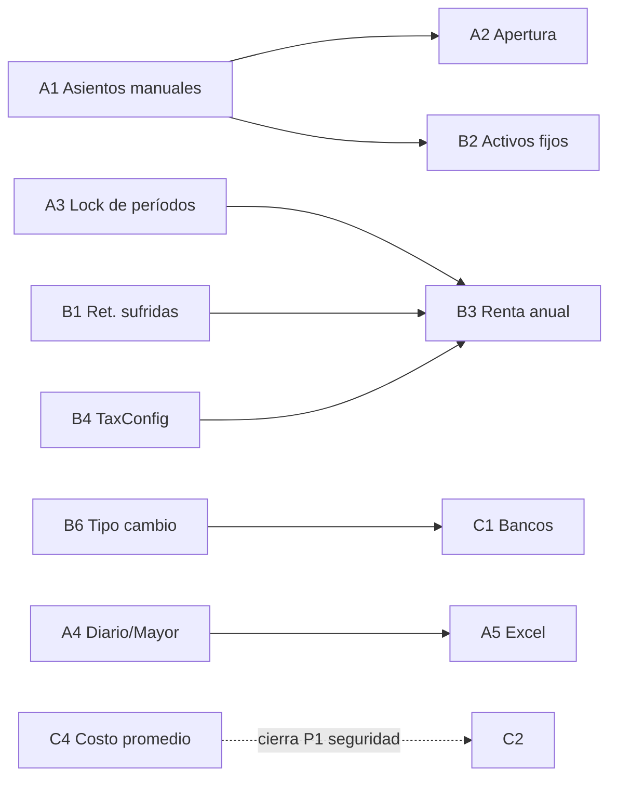

# Nortex — Plan "Contador Experto"

> Objetivo: que Nortex pase de *registrar* contabilidad a **ser el contador del negocio** — y la herramienta donde el contador externo trabaja, declara y firma.
> Auditoría realizada sobre `main` (services/accounting.ts, nicaTax.ts, nicaLabor.ts, 19 endpoints contables/fiscales).

---

## 1 · Lo que Nortex YA hace bien (no tocar, capitalizar)

| Capacidad | Evidencia |
|---|---|
| **Partida doble automática** en 7 eventos (venta, abono, compra, gasto, caja, devolución, nómina) con validación débito=crédito | `accounting.ts` (8 hooks + `createJournalEntry`) |
| **Plan de cuentas nicaragüense** (25 cuentas, activo→gasto) auto-seed por tenant | `CHART_OF_ACCOUNTS` |
| **Balance General + Estado de Resultados** | `/api/accounting/balance-general`, `estado-resultados` |
| **Impuestos mensuales DGI**: IVA neto (débito−crédito fiscal), Anticipo IR 1%, IMI 1%, resumen **VET** | `nicaTax.ts`, `/api/fiscal/vet-export` |
| **Libros de Compras y Ventas** | `/api/fiscal/libro-compras`, `libro-ventas` |
| **Retenciones en la fuente** (IR 2% + IMI 1% sobre compras) + **constancia DGI imprimible** | `generateRetentions`, `/api/fiscal/constancia-retencion` |
| **Planilla Ley 185 completa**: INSS 7%/22.5% con techo, INATEC 2%, IR progresivo, liquidación (vacaciones, treceavo, indemnización) | `nicaLabor.ts` |
| **Cierre mensual** con snapshot (`TaxReport`) | `fiscalClose` |
| **Rol ACCOUNTANT** con vista dedicada (Fiscal/Compras/Auditoría) | `Layout.tsx` |
| 🏆 **Libro firmado anti-manipulación** (cadena HMAC) — ningún competidor local lo tiene | `ledger.ts` |

## 2 · Las debilidades (lo que un contador pide el día 1)

**El veredicto duro:** hoy un contador puede *leer* Nortex pero no puede *trabajar* en Nortex. Tres bloqueos estructurales y una lista de cumplimiento incompleta:

| # | Hueco | Por qué duele | Confirmación |
|---|---|---|---|
| G1 | **No hay asientos manuales** (comprobante de diario) | Sin esto no hay ajustes, correcciones, provisiones, ni **saldos de apertura** al migrar un negocio. El contador la primera semana lo pide. | 0 endpoints POST de journal |
| G2 | **El cierre no bloquea el período** | `fiscalClose` genera el snapshot pero nada impide ventas/gastos/asientos retroactivos: el contador declara a la DGI y los números *siguen moviéndose*. Gravísimo. | sin modelo de lock |
| G3 | **No hay bancos ni conciliación** | Existe la cuenta 1.1.2 pero no hay cuentas bancarias reales, movimientos, ni conciliación vs estado de cuenta. Transferencias/POS bancario = ciego. | 0 modelos Bank* |
| G4 | **Activos fijos sin registro ni depreciación** | Las cuentas existen (1.2.1/1.2.2/5.2.5) pero nadie las alimenta: no hay registro de activos ni depreciación mensual automática (tasas Ley 822). | 0 modelos, 0 lógica |
| G5 | **Retenciones SUFRIDAS no se registran** | Cuando un cliente grande (empresa/Estado) le retiene IR 2% al negocio, eso es **crédito contra el Anticipo IR**. Sin registrarlo, el negocio **paga impuesto de más todos los meses**. | inexistente |
| G6 | **No hay declaración ANUAL de IR** | Solo mensualidades. Falta la renta anual: IR 30% sobre utilidad vs Pago Mínimo Definitivo (el mayor), con anticipos y retenciones acreditables. | inexistente |
| G7 | **Sin Flujo de Efectivo ni Aging** | Faltan el 3er estado financiero y la antigüedad de saldos CxC/CxP (30/60/90) — lo primero que mira un financiero. | 0 |
| G8 | **Tipo de cambio hardcoded** (`36.56` en POS) | El deslizamiento del córdoba es oficial (BCN, tabla diaria). Ventas en USD con tasa fija = descuadre contable y fiscal permanente. | `POS.tsx:162` |
| G9 | **Libros sin export para el contador** | Los libros devuelven JSON; el contador vive en Excel. (XLSX ya es dependencia — es barato.) | endpoints JSON-only |
| G10 | **Tasas fiscales sin parametrizar** | INSS patronal es 21.5%/<50 empleados vs 22.5%/≥50 (código fijo en 22.5%); el Anticipo IR/PMD es 1-3% según escala del contribuyente (fijo en 1%); IMI varía por alcaldía. Hoy son constantes. | `nicaLabor.ts`, `nicaTax.ts` |
| G11 | **Planilla sin salida INSS (SIE)** | Calcula perfecto pero no genera el reporte/archivo para declarar al SIE del INSS. | inexistente |
| G12 | **Costeo de inventario informal** | `costAtSale` viaja desde el frontend; no hay costo promedio ponderado formal server-side. | `salesService` |

## 3 · El plan — 3 fases

### FASE A — "Contabilidad de verdad" (los cimientos del contador) · ~1.5 semanas
*Convierte el motor en un lugar donde el contador trabaja. Sin esto, el resto no se sostiene.*

| RF | Requerimiento | Detalle técnico |
|---|---|---|
| **A1** | **Comprobante de diario manual** | `POST /api/accounting/journal` (rol OWNER/ACCOUNTANT): líneas N-débito/N-crédito, validación `Σdebe == Σhaber` en Decimal, contra cuentas del catálogo del tenant, con descripción y referencia. UI en la vista del contador. |
| **A2** | **Saldos de apertura** | Tipo especial de comprobante (`OPENING`) para migrar negocios existentes: cargar inventario, CxC, CxP, capital iniciales. Una sola vez por tenant, auditado. |
| **A3** | **Bloqueo de períodos** | Modelo `FiscalPeriod { tenantId, year, month, status: OPEN/CLOSED, closedBy, closedAt }`. `fiscalClose` lo marca CLOSED; **todo write contable** (ventas/compras/gastos/asientos/nómina) valida que el período de la fecha esté OPEN → si no, 409. Reapertura solo OWNER con motivo auditado. |
| **A4** | **Libro Diario + Libro Mayor** | `GET /api/accounting/libro-diario/:m/:y` (asientos correlativos) y `libro-mayor/:cuenta/:m/:y` (movimientos + saldo por cuenta). Son vistas de datos que ya existen. |
| **A5** | **Export Excel de TODO** | Botón "Descargar Excel" en libros (diario, mayor, compras, ventas, retenciones, planilla). XLSX ya está en deps; generar server-side o client-side. |
| **A6** | **Cuentas personalizables** | CRUD de subcuentas sobre el catálogo (ej. 5.2.1.01 "Luz", 5.2.1.02 "Alquiler") sin romper los hooks automáticos. |

### FASE B — "Cumplimiento DGI/INSS completo" · ~2 semanas
*Que ningún negocio pague de más ni reciba multa por lo que Nortex pudo calcular.*

| RF | Requerimiento | Detalle técnico |
|---|---|---|
| **B1** | **Retenciones sufridas** (crédito IR) | Al registrar un abono de cliente: opción "me retuvieron" (2% IR / 1% IMI) → constancia recibida, asiento (anticipo pagado), y **acreditación automática** contra el Anticipo IR del mes en el reporte VET. |
| **B2** | **Activos fijos + depreciación** | Modelo `FixedAsset { nombre, categoria, costo, fechaAlta, vidaUtil, metodo }` con tasas Ley 822 precargadas (edificios 10%, vehículos/maquinaria/mobiliario 20%, cómputo 50%). **Cron mensual** postea la depreciación (5.2.5 / 1.2.2). Reporte de activos y valor en libros. |
| **B3** | **Declaración anual IR** | `GET /api/fiscal/renta-anual/:year`: utilidad fiscal del ejercicio, **IR 30% vs Pago Mínimo Definitivo (1-3%)** → el mayor, menos anticipos mensuales pagados y retenciones sufridas (B1) → saldo a pagar o a favor. Pre-llenado del formato DGI. |
| **B4** | **Parametrización fiscal** | Tabla `TaxConfig` por tenant: % INSS patronal (21.5/22.5 según plantilla), escala PMD (1/2/3%), % IMI de su alcaldía, salario mínimo vigente. Las constantes actuales pasan a defaults. |
| **B5** | **Salida INSS (SIE) + nómina export** | Reporte mensual por empleado con formato compatible al SIE (cédula, INSS, salario, cotizaciones) + colilla de pago imprimible. |
| **B6** | **Tipo de cambio BCN** | Tabla `ExchangeRate { fecha, rate }` (carga manual o semilla mensual del deslizamiento). El POS y los reportes la consumen; asiento de **diferencial cambiario** al cobrar CxC en USD. Mata el `36.56` hardcoded. |

### FASE C — "El CFO del negocio" · ~2 semanas
*De cumplir, a dirigir: lo que un gerente financiero miraría cada lunes.*

| RF | Requerimiento | Detalle técnico |
|---|---|---|
| **C1** | **Bancos + conciliación** | Modelo `BankAccount` + `BankMovement`; registrar transferencias/depósitos desde caja; **import CSV del estado de cuenta** y matching semiautomático (monto+fecha) con diferencias señaladas. |
| **C2** | **Flujo de Efectivo** | Tercer estado financiero (método directo: ya tenemos cada movimiento clasificado — operación/inversión/financiamiento). |
| **C3** | **Aging CxC / CxP** | Antigüedad de saldos por buckets (corriente/30/60/90+) con totales por cliente/proveedor y alertas de vencimiento (la data ya existe: `dueDate`, `balance`). |
| **C4** | **Costo promedio ponderado server-side** | Al comprar: recalcular costo promedio del producto; al vender: `costAtSale` sale de la BD (no del frontend). Cierra también el P1 de seguridad pendiente. |
| **C5** | **Panel del Contador** | Dashboard para el rol ACCOUNTANT: checklist mensual (IVA ✓, Anticipo ✓, IMI ✓, INSS ✓, retenciones ✓), calendario de obligaciones con fechas DGI, y botón "cerrar mes" guiado. |
| **C6** | **Verificación nocturna del libro firmado** | Cron que corre `verifyTenantLedger` + `verifyDriverLedger` para todos los tenants y alerta al SUPER_ADMIN si una cadena se rompió. El sello "contabilidad inviolable" como argumento de venta. |

## 4 · Priorización y dependencias

- **Empezar por A1 + A3** (asientos manuales + lock): son los dos bloqueos que descalifican a Nortex frente a un contador hoy, y A3 protege la integridad de todo lo demás.
- **B1 es la victoria de plata más rápida**: cada mes que pasa sin retenciones sufridas, los clientes que venden a empresas pagan IR de más.
- **C6 es marketing gratis**: ya está construido el motor de verificación; falta solo el cron.

## 5 · Lo que NO haremos (alcance negativo)

- **Facturación electrónica DGI**: Nicaragua aún no la exige de forma general; cuando la DGI publique el estándar, se diseña. (Vigilar.)
- **NIIF completas / consolidación multiempresa**: fuera del segmento PyME.
- **Contabilidad de costos industriales** (órdenes de producción): no es el cliente de Nortex.

## 6 · Criterios de aceptación globales

1. Un contador externo puede llevar **toda** la contabilidad mensual de una ferretería sin salir de Nortex: ajustes, depreciación, cierre, libros en Excel, cifras de la VET listas.
2. Después del cierre, **nada** del período declarado puede moverse (verificable).
3. El negocio que sufre retenciones nunca paga Anticipo IR de más.
4. tsc estricto, Decimal.js en todo cálculo, períodos y asientos cubiertos por el lock, cero `any`.
