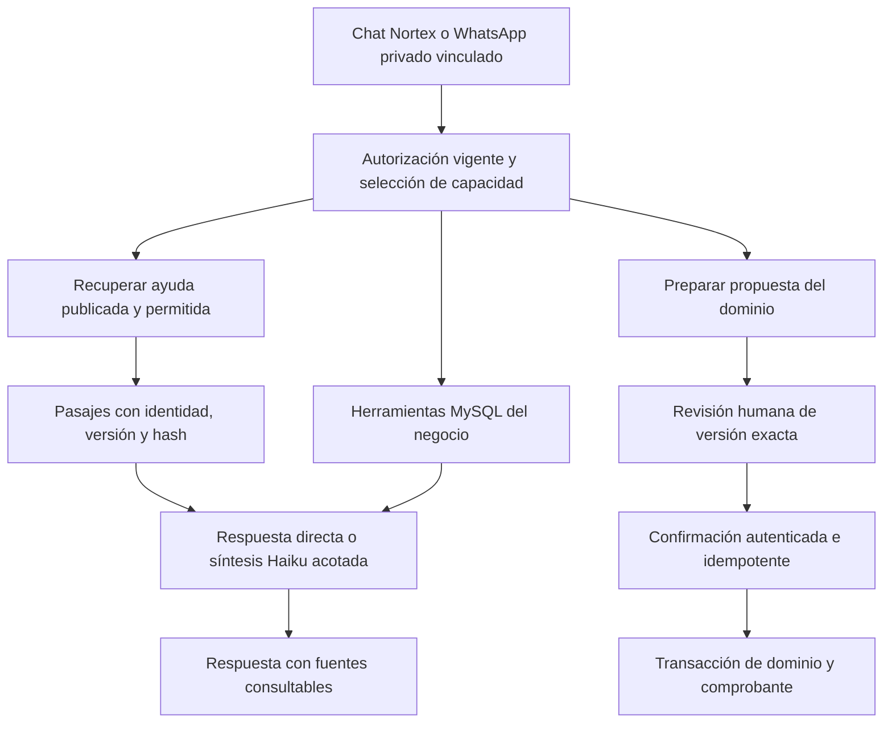

# Plan de desarrollo: RAG de Nortex y estabilidad operativa

**Estado: plan de desarrollo reconciliado con el producto `484f58a` y la promoción `07f30c9`; implementación, despliegue y pendientes separados. Actualización: 2026-09-08.**

Este documento integra tres revisiones: investigación de RAG, contraste de contratos del asistente y pendientes de desarrollo/infraestructura, más revisión final del plan. La actualización documental no implementa las tareas pendientes ni certifica producción. La autorización de publicar/desplegar proviene de la solicitud del usuario y sigue sujeta a las compuertas técnicas. Conserva React/Vite, Express, Prisma 6.4.1, MySQL 8, Node 22.23.2, npm, la rama y los cambios actuales. El [manifiesto de 30 archivos revisados](evidence/nortexgpt/rag-plan-20260908/code-manifest.json) identifica el corte de código mediante hashes. Ese manifiesto corresponde a la investigación anterior al merge. El [manifiesto del candidato integrado](releases/evidence/2026-09-08-consolidated/qa-source-manifest.json) y la [verificación local](releases/evidence/2026-09-08-consolidated/local-verification.json) identifican la nueva evidencia. Consultar [estado actual](ESTADO_ACTUAL_NORTEX.md) y [equipo por dominio](EQUIPO_DESARROLLO_NORTEX.md) para coordinar el siguiente lote.

**Inspección posterior de capacidad:** [Droplet Nortex](CAPACIDAD_DROPLET_NORTEX_2026-09-08.md): 2 vCPU, 4 GiB RAM y 80 GiB de disco verificados en DigitalOcean; se observó una semana de CPU/I/O. La inspección posterior incluida en la verificación local registra una muestra puntual: 1.695 MiB de RAM disponible, 879 MiB de swap usado y 61 GiB libres en raíz; producción, staging y Coolify comparten el host. No es una serie temporal ni una medición de throughput sostenible. El informe añade a D06/D08/D09 una matriz de carga sintética de 10/25/50/100 cajas; no son capacidades aprobadas ni se ejecutará saturación sobre producción.

## 0. Prioridad añadida: consolidar los cuatro clientes actuales

**C00 — EN CURSO, prioridad inmediata; aceptación operativa pendiente, 2026-09-08.** La autorización de preparar publicación y producción se gestiona por el integrador con sus compuertas; no convierte esta ampliación del plan en trabajo ejecutado. Consolidar los cuatro clientes indicados por el responsable del producto antes de ampliar capacidades operativas. Cuatro clientes no equivale a cuatro cajas simultáneas: medir cantidad de operadores, horas punta y recorridos, sin copiar datos personales ni documentos reales a fixtures.

| Frente / responsable | Trabajo y evidencia de salida |
|---|---|
| Recuperación / Infraestructura | El respaldo SQL externo fue restaurado en MySQL 8 aislado y el schema candidato aplicado dos veces, con conciliación aprobada. Coolify tiene su respaldo y ensayos independientes. Falta restaurar originales privados y referencias de NortexGPT con ejecución, envíos y cobros apagados; medir recuperación del servicio completo y pérdida máxima de datos. La restauración SQL no acredita la de archivos. |
| Continuidad del despliegue / Infraestructura + QA | El reemplazo productivo de `07f30c9` mostró HTTP 503 transitorio; no se midió su duración continua. Medir la transición en staging y verificar la estrategia de reemplazo de app/base antes de afirmar ausencia de cortes. Probar carrito y operaciones con respuesta incierta, conservación de identidad y recuperación sin cobros duplicados. No cambiar la topología productiva como parte del cierre documental. |
| Recursos y errores / Infraestructura | Medir memoria disponible, RSS por proceso, swap/OOM, disco libre y crecimiento, CPU, conexiones/espera MySQL, reinicios, errores API y edad de cola durante una ventana documentada que incluya apertura, pico y cierre. Fijar alertas y responsable de respuesta sin registrar secretos ni contenido privado. |
| Carga y p95 / QA + Infraestructura | Reproducir fuera de producción la mezcla observada de los cuatro clientes con tenants sintéticos: búsqueda, venta, cobro, consulta y cierre. Medir p50/p95/p99, throughput, errores, timeouts, locks y recursos; aumentar carga por pasos y detener ante degradación o efectos incoherentes. Acordar el objetivo después del baseline y antes de la corrida de aceptación; las matrices 10/25/50/100 cajas son ensayos futuros, no capacidad acreditada. |
| Venta y caja / QA de dominio | Recorrer venta/pago/vuelto, medios de pago vigentes, devoluciones/anulaciones, offline y respuesta perdida, apertura/cierre y conciliación de stock, caja, deuda y asiento. Usar HTTP/MySQL descartable y un recorrido de equipo/lector/impresora representativo; probar concurrencia, reintento, auditoría fallida y rollback. Cero diferencias o duplicaciones en los escenarios aceptados. |
| Modularidad / Clean Code + integrador | Continuar por dominio con caracterización previa: alta rápida POS y conteos físicos en lotes separados. Las exportaciones fiscales y constancias ya fueron extraídas; medir su carga y mejorar el módulo existente si corresponde, sin repetir la extracción. Conservar los servicios financieros transaccionales. Reducir el presupuesto del origen y reportar origen/destinos/total sin elevar excepciones. Medir regresiones funcionales y p95 sobre el mismo escenario. |

**Avance modular verificado del candidato:** `backend/server.ts` tiene 14.131 líneas; `components/POS.tsx`, 5.924 y 96 referencias textuales `useState`. La extracción fiscal pasó de 14.674 a 14.131 líneas de servidor, con 244 en `retentionCertificate.ts` y 330 en `fiscalExports.ts`: delta conjunto +31. Sus ocho pruebas de conducta antes/después constan en la evidencia. El presupuesto del servidor bajó de 14.266 a 14.131 y el del POS quedó en 5.924/96. Este resultado no acredita capacidad de carga ni termina la modularización.

**Avance de release:** CI, staging y producción del SHA `07f30c9` terminaron correctamente; venta, devolución, anulación y cierre sintéticos se conciliaron en ambos entornos. El reemplazo mostró HTTP 503 transitorio. La observación posterior y sus límites se registran en el [expediente de producción](releases/2026-09-08-production-verification.md). C00 permanece abierto por capacidad, alertas, adjuntos, dispositivos y carga representativa; el despliegue no activa automáticamente IA ni acredita el piloto.

**Cierre de C00:** candidato identificado, restauración demostrada, recursos y errores observados, carga sintética aceptada y recorridos de venta/caja conciliados, con límites y pendientes explícitos. Un defecto de dinero, inventario, pérdida de trabajo o aislamiento bloquea el flujo afectado. Documentar baseline y primer lote modular; no exigir una reescritura completa para cerrar la consolidación. D00/D06/D08/D09/D10/D11/D12 aportan las entregas, sin duplicarlas. La curación de ayuda y las pruebas deterministas de RAG pueden avanzar en paralelo.

**Escala del trabajo ya construido:** el rango de **3.500–6.500 horas-persona** es una aproximación de ingeniería al esfuerzo de reposición de funcionalidades comparables; no son horas registradas, presupuesto contractual, plazo de este plan ni valoración de la empresa. La referencia histórica de **611 commits en 94 días** tampoco demuestra esfuerzo laboral: commits, herramientas y concurrencia no permiten convertir ese historial en horas. Reestimar cada lote con su alcance y evidencia real.

## 1. Decisión recomendada

Construir **RAG de ayuda oficial con publicación revisada, búsqueda verificable y fuentes que se puedan abrir**. Mejorar primero contenido, permisos, recuperación y evaluación; comparar después MySQL FULLTEXT y contexto completo autorizado. Añadir embeddings o reranking únicamente si resuelven errores medidos dentro del presupuesto y la capacidad operativa disponibles.

El núcleo conserva tres fronteras:

- **Explicar:** ayuda aprobada, versionada y autorizada; fuentes visibles y abstención si falta respaldo.
- **Investigar:** herramientas cerradas que consultan servicios MySQL y devuelven evidencia al orquestador.
- **Actuar:** propuesta guardada y versionada, revisión humana y confirmación del servidor mediante el dominio existente.

La búsqueda semántica no reemplaza datos actuales, autorización, catálogo de unidades ni transacciones. Mantener el monolito modular: los workers pueden ser procesos del mismo repositorio; dinero, stock y auditoría permanecen juntos en MySQL.

## 2. Comparación contra nuestro código

| Área | Estado observado | Trabajo pendiente |
|---|---|---|
| Ayuda | `knowledge.ts:18-54`: 12 artículos; roles, sección y versión. | Ampliar procedimientos y formalizar revisión/publicación/retirada. |
| Recuperación | `knowledge.ts:62-73`: coincidencia exacta en sección y keywords, top 2; no busca en el cuerpo. | Baseline, vocabulario revisado, búsqueda sobre texto completo y calibración de rechazo/ambigüedad. |
| Citas | `shared/assistant.ts:14`, `NortexAssistantPanel.tsx:100`: etiqueta de fuente; `nortex-help:<id>` no abre una versión. | Resolver pasajes mediante endpoint autenticado, manteniendo compatibilidad de citas anteriores. |
| Cita operativa | `operations/tools.ts:25` entrega texto/citas; `AssistantOperationalEvidence.tsx:44-59` no los renderiza. | Reproducir `search_help → run → interfaz`, corregir y conservar prueba de conducta. Es un hallazgo estático, no una reproducción ejecutada aquí. |
| Orquestación | `operations/orchestrator.ts:47-137`: feedback de herramientas, checkpoints, cuatro llamadas/60 segundos y fallback. | Evaluar selección de herramientas y soporte de afirmaciones con Haiku real; no reconstruir el orquestador. |
| Respaldo de respuestas | `orchestrator.ts:28-31,99-104` valida IDs y presencia de números. | Comprobar relación entre afirmación y fuente: una cifra presente puede atribuirse al sujeto o período equivocado. |
| Permisos e historial | `access.ts:31-74`, `conversations.ts`, `runService.ts`: usuario activo, tenant y rol vigente/original. | Añadir vigencia documental a historial, checkpoints, citas y caché antes de ampliar el corpus. |
| Catálogo | `operations/catalogSearch.ts`: coincidencias exactas, alias aprobados y aproximación acotada, sin costos. | Medir ambigüedad de productos/unidades; no transformar sinónimos de lenguaje en equivalencias comerciales automáticas. |
| Operaciones A–E | Compras, comparaciones, reposición, propuestas OC/merma/devolución, promociones y WhatsApp privado tienen código y pruebas locales. | Completar evaluación, operación, dispositivos y piloto; no tratarlos como dominios inexistentes. |
| Consumo | `AssistantUsage.runId` y reservas transaccionales ya existen. | Mantener enlace y costos inciertos; dimensionar reservas por petición y revisar cobertura de todos los canales. |
| Salud | `operations/healthStatus.ts` y ruta de estado ya existen. | Agregar heartbeat de workers, edad de cola, percentiles y contador de replays; el código actual declara ese contador no disponible. |

**Evidencia del candidato integrado `484f58a`:** Prisma generate/validate, TypeScript, diseño y build SEO aprobados; general 5.736 aprobadas, cero fallidas y 318 omitidas; MySQL obligatorio 37 suites/332 casos aprobados, sin fallos ni omisiones. Mutación de 64 módulos: 100 %, 5.759 eliminados, cuatro timeouts detectados, cero sobrevivientes/sin cobertura y 20 exclusiones históricas. CI `34286306801` terminó exitosamente sobre ese SHA con cuatro checks aprobados. La [evidencia estructurada local](releases/evidence/2026-09-08-consolidated/local-verification.json) contiene métricas y hashes; [estado actual](ESTADO_ACTUAL_NORTEX.md) registra continuidad de CI y publicación. Estas cifras describen esa corrida y alcance, no todos los flujos o calidad del modelo.

Las corridas anteriores de 300 casos MySQL y 4.821 generales/286 omitidos permanecen como [historial](NORTEXGPT_CIERRE_Y_DEUDA_2026-09-08.md), sin sumarlas a la corrida integrada. La revisión documental actual no ejecutó nuevas pruebas de producto. Los formularios [ferretería](evidence/nortexgpt/qa-live-20260908/model-review-ferreteria.json) y [farmacia](evidence/nortexgpt/qa-live-20260908/model-review-farmacia.json) siguen con revisión humana pendiente; no acreditan lectura de facturas ni calidad de respuesta con Haiku real. Staging, restauración vigente, piloto y despliegue no quedan demostrados por el CI exitoso.

## 3. Qué aporta la investigación

| Alternativa | Ventaja para Nortex | Coste o límite | Decisión |
|---|---|---|---|
| Léxico mejorado sobre corpus compilado | Simple, reproducible, disponible sin IA, sin servicio adicional. | Requiere contenido suficiente y vocabulario; puede fallar con paráfrasis. | Primera implementación y baseline. |
| MySQL FULLTEXT | Índice persistente y ranking en infraestructura conocida. | No equivale a comprensión semántica; tokens cortos, stopwords y collation requieren pruebas. | Implementar adaptador experimental cuando exista corpus ampliado; promover por evidencia. |
| Contexto completo autorizado | Con corpus pequeño elimina errores de selección de fragmentos. | Más tokens y ruido; no elimina errores de interpretación ni ACL. | Comparador acotado, no modo universal. |
| Léxico + embeddings | Puede recuperar paráfrasis conservando términos exactos. | Añade modelo, índice, costo de ingesta y recuperación/operación. | Fase condicional tras comparación; sin segundo proveedor automático. |
| Reranking y contextualización generada | Puede mejorar el orden y desambiguar fragmentos. | Más latencia/costo y resultados generados que también requieren evaluación. | Sólo si mejora al método anterior; no primera entrega. |

Anthropic muestra ventajas de combinar recuperación léxica, semántica y contexto de fragmentos en sus evaluaciones. **Sus porcentajes no predicen el resultado de Nortex**. Aquí compararemos alternativas usando nuestro corpus, modelo, permisos y presupuesto. [Contextual Retrieval](https://www.anthropic.com/engineering/contextual-retrieval)

En InnoDB FULLTEXT, los términos menores de tres caracteres se excluyen por defecto. `OC`, `mg`, `ml` y `kg` requieren tratamiento exacto adicional; `PVC` tiene tres caracteres y no debe citarse como ejemplo de token excluido por longitud. No borrar números, concentraciones ni unidades. Revisar stopwords y collation en MySQL descartable; no cambiar configuración global del catálogo para beneficiar la ayuda. [Búsqueda natural](https://dev.mysql.com/doc/refman/8.0/en/fulltext-natural-language.html), [stopwords](https://dev.mysql.com/doc/refman/8.0/en/fulltext-stopwords.html)

Los filtros de acceso pertenecen a cada búsqueda y preceden a la entrega de resultados. Tomamos ese patrón sin incorporar Azure: ocultar campos después no constituye autorización. [Patrón de filtrado de seguridad](https://learn.microsoft.com/en-us/azure/search/search-security-trimming-for-azure-search)

## 4. Arquitectura y contratos del RAG

### 4.1 Contenido y publicación

**Primera cobertura:** procedimientos reales de POS/cobro, offline, caja, compras/recepciones, unidades BASE/PACK/fracciones, inventario/bodegas, farmacia/lotes/retenciones, devoluciones/merma, crédito/cartera, comparación de resultados, reposición, promociones y permisos/canal privado. Meta editorial inicial: 40–60 secciones útiles; el número no acredita calidad.

- Contenido fuente en `content/assistant-help/**`, Markdown o JSON estructurado; manifiesto tipado validado por CI. No rastrear automáticamente el repositorio ni convertir instrucciones de agentes en ayuda.
- Cada sección debe indicar objetivo, quién puede realizarlo, precondiciones, pasos, efecto real, casos bloqueantes, recuperación y módulo/versión compatible.
- Metadatos: `documentId`, `version`, `sectionId`, `contentHash`, `status`, `module`, `roles/capabilities`, `channels`, `effectiveFrom`, `supersedes`, autor, revisor y fecha de revisión. Personas reales validan reglas; un agente puede preparar borradores, no inventar aprobación.
- Estados editoriales: `DRAFT → REVIEWED → PUBLISHED → RETIRED`. La publicación valida todas las secciones y cambia el release activo de forma atómica; nunca mezcla dos versiones parcialmente importadas.
- Mantener IDs y adaptador de los 12 artículos actuales durante la transición. No atribuirles una revisión humana inexistente ni retirar la ayuda actual hasta tener un reemplazo compatible comprobado.
- Para retiro operativo entre API y workers, registrar release activo y estado de versiones en MySQL. Proponer modelos aditivos `AssistantKnowledgeRelease` y `AssistantKnowledgeVersion`; cuerpos/índice léxico pueden seguir compilados desde archivos revisados. Cada proceso sólo sirve un release cuyo hash conoce. Incompatibilidad → ayuda no disponible, no contenido obsoleto por suposición.
- Ensayar convivencia de dos builds: registrar qué releases puede servir cada uno, activar sólo tras comprobar compatibilidad de API/workers y mantener retirada por encima de cualquier fallback. Un rollback del código no republica una fuente retirada; una versión desconocida produce indisponibilidad explícita.
- Publicador interno mediante CLI controlado, sin CMS nuevo en esta fase. No aceptar del modelo operaciones editoriales. El integrador define migración e índices según consulta de release/documento/versión/estado.
- Sólo ayuda oficial compartida en el piloto. Facturas y chats continúan privados en sus dominios. Manuales técnicos de productos, documentos propios de negocios, normativa clínica/fiscal externa y permisos de documentos por tenant necesitarán un contrato posterior; no se añaden por arrastre.

### 4.2 Recuperación y fragmentación

Interfaz propuesta: `HelpRetriever.search(principal, query, context) → {status, passages, publicationVersion}`. `principal` y contexto autorizado son inyectados por el servidor, nunca argumentos elegidos por el modelo. Estados: `found`, `ambiguous`, `no_source`, `unavailable`.

1. Validar identidad, módulos habilitados, rol, canal y publicación vigente antes de seleccionar candidatos. Un rol permitido no habilita por sí solo un módulo apagado.
2. Normalizar acentos, voseo y alias de lenguaje revisados. Mantener términos exactos, SKU, números y unidades. “Saco/bolsa” puede ayudar a recuperar una explicación; no autoriza conversión ni selección automática de producto.
3. Buscar título, sección, palabras clave y cuerpo. Evaluar pesos y top-k con conjunto de desarrollo; umbral bajo o resultados incompatibles producen aclaración/abstención.
4. Fragmentar por procedimiento completo y conservar sus condiciones/tablas. Empezar ensayos con rangos aproximados de 300–700 tokens por sección y variar según contenido; no cortar una regla de su excepción para cumplir tamaño.
5. Para un corpus pequeño, ranking local sobre el universo autorizado y acotado. Si se usa MySQL, filtrar y rankear en SQL antes del límite, con fallback exacto para términos cortos; no traer una primera página arbitraria para anunciar ranking global.
6. No hacer una llamada pagada para reformular cada pregunta. Probar primero expansión determinista. El contexto conversacional nunca aporta permisos ni sustituye una consulta actual.
7. El índice es derivado y reconstruible; versión incompleta o caída conserva respuesta determinista permitida o indisponibilidad explícita.

### 4.3 Fuentes, síntesis y retirada

- Extender `AssistantCitation` aditivamente con referencia de sección/pasaje, hash y disponibilidad. Conservar las citas anteriores en historial como referencias históricas, sin fingir que resolvían un documento completo.
- Añadir GET autenticado bajo `/api/assistant/knowledge/documents/:id/versions/:version/sections/:sectionId`. Devuelve sólo un pasaje permitido y su estado; los identificadores no conceden acceso.
- Abrir fuentes en un panel del asistente, conservando carrito, lector y atajos bloqueados. Mostrar cuándo una fuente es histórica, retirada o ya no accesible.
- La respuesta directa de ayuda aprobada sigue disponible sin modelo. En síntesis, el servidor resuelve `sourceIds` contra evidencia realmente recuperada; las afirmaciones operativas preservan período, entidad y procedencia.
- La guardia actual de números se conserva como control parcial; no se llama verificación semántica. Evaluación humana revisa negaciones, condiciones, cantidades, sujetos y causas atribuidas.
- Revalidar identidad y publicación antes de enviar contexto al proveedor y antes de entregar respuesta. Retirada durante una llamada impide entregar/reutilizar la fuente; no puede deshacer datos ya enviados cuando eran autorizados.
- Filtrar copias de ayuda en mensajes, resultados anteriores y checkpoints al recuperarlas. Mantener identidad de evidencia para auditoría, pero no reinyectar contenido retirado al modelo. Purgar caché y suprimir pasajes no autorizados del historial visible.
- Registrar dependencias de cada respuesta o síntesis respecto a las versiones/pasajes utilizados. Retirar una fuente invalida también el texto derivado en mensajes, `run.result.text` y salidas pendientes de WhatsApp: ocultar sólo la cita no elimina su contenido. Suprimir la respuesta derivada completa o regenerarla con evidencia vigente en una nueva consulta autorizada; no disparar regeneraciones pagadas automáticas. Revalidar esas dependencias antes del envío privado. No se puede retirar de un dispositivo externo un mensaje ya entregado.
- Caché de recuperación por release/hash, política vigente, canal, alcance autorizado y consulta normalizada. No compartir respuestas de negocio por texto de pregunta; verificar permisos también al acertar caché.
- Contenido recuperado y OCR son datos no confiables. Nunca habilitan herramientas, SQL, cambios de tenant o confirmaciones. Probar ataques incrustados y fuentes aparentemente válidas con instrucciones maliciosas. [Guía de mitigación](https://platform.claude.com/docs/en/test-and-evaluate/strengthen-guardrails/mitigate-jailbreaks)

Claude ofrece citas nativas, pero no son compatibles con `output_config.format` JSON estricto. El orquestador actual utiliza herramientas y schemas, no ese formato: **no es un bug actual por incompatibilidad**. Mantener inicialmente nuestras referencias validadas; cualquier adopción de citas nativas requiere probar parser, interfaz y costo, sin agregar una llamada final por defecto. [Citas de Claude](https://platform.claude.com/docs/en/build-with-claude/citations)

## 5. Consumo, rendimiento y evaluación

### 5.1 Presupuesto

- Mantener US$20/mes total del piloto y US$10 por negocio; QA tiene su propio tope observado de US$5. No sumarlos como autorización de US$25: toda llamada de este trabajo debe contabilizarse dentro del límite total acordado.
- `AssistantBudget` es global dentro de una base MySQL, no entre QA, staging y producción. Primera solución: asignaciones conservadoras por entorno y credencial, con registro de gasto/reservas inciertas y suma de asignaciones ≤US$20. Ejemplo propuesto: QA US$5, staging sin llamadas pagadas y piloto hasta US$15 mientras se consume la asignación QA; US$10 por tenant sigue siendo un máximo, no una cuota adicional. D05 implementa topes por entorno que sólo puedan reducir el máximo global y verifica que ningún adaptador quede fuera. Redistribuir sólo saldo no consumido ni reservado tras conciliación. Si luego se necesita reparto dinámico, diseñar una autoridad única; no conectar la compuerta descartable a la base de producción. El límite de Console es una defensa adicional, no la sincronización de los buckets.
- Haiku 4.5 conserva tarifa estándar de US$1/millón de tokens de entrada y US$5/millón de salida, según fuente consultada. Ejemplo ilustrativo: una llamada de 6.000 tokens de entrada y 800 de salida cuesta US$0,01, sin caché ni adicionales. Una consulta puede contener varias llamadas; esto no es un gasto observado ni una promesa de capacidad mensual. [Precios oficiales](https://platform.claude.com/docs/en/about-claude/pricing)
- Reservar antes de cada llamada y vincular a ejecución o trabajo. El código de operaciones ya registra `runId`; interpretar texto y extraer facturas requieren mantener su propia trazabilidad, no fabricar un run inexistente.
- La reserva actual utiliza un techo de extracción muy conservador también para consultas breves. Diseñar límites por tipo de solicitud y un contexto acotado; usar conteo de tokens más salida máxima y margen comprobado. El endpoint de conteo es gratuito, sujeto a límites, y produce una estimación; su caída no autoriza una reserva insuficiente. [Conteo de tokens](https://platform.claude.com/docs/en/build-with-claude/token-counting)
- Si se desconoce el costo, conservar reserva. No liberar por timeout, reinicio, cambio de mes o fallo de parsing. Reconciliar liquidaciones y solicitudes antes de afirmar gasto por consulta.
- El canal comercial llama al proveedor en `whatsapp/brain.claude.ts` sin el mecanismo de `AssistantBudget`: no asumir presupuesto global compartido. Antes de activarlo bajo el mismo tope, unificar medición/reserva detrás de adaptador y probar concurrencia entre canales.
- Caché de proveedor queda desactivada inicialmente: Haiku 4.5 requiere prefijos de al menos 4.096 tokens; con TTL de cinco minutos, escribir cuesta 1,25 veces entrada y leer 0,1 veces. Sólo activar tras medir reutilización y añadir liquidación correcta de tokens cacheados; hoy pueden quedar como consumo incierto. [Prompt caching](https://platform.claude.com/docs/en/build-with-claude/prompt-caching)
- Un índice o proveedor adicional debe tener costo operativo explícito; no absorberlo silenciosamente en “IA US$20”. Sin cambio automático a modelo más caro.

### 5.2 Evaluación propuesta

Separar calidad de recuperación, calidad de respuesta y exactitud de acciones. Los 120 escenarios operativos y 100 facturas existentes se conservan; no sustituirlos por tests de búsqueda. [Criterios y evaluaciones](https://platform.claude.com/docs/en/test-and-evaluate/develop-tests)

| Conjunto | Diseño y uso |
|---|---|
| Desarrollo de RAG | 120 preguntas propuestas, equilibradas entre ambas verticales y módulos, con variantes por rol. Incluye respuesta existente, ausente, ambigua, typo/voceo, términos cortos, versión retirada e injection. Etiquetas humanas: sección esperada, respuesta admisible y datos prohibidos. |
| Reserva de RAG | 60 preguntas nuevas, 30 por vertical, separadas por familias de intención de las de desarrollo. Sellar versión antes del ajuste; no usarla para inventar alias que después se evalúan sobre la misma pregunta. Si se usa para ajustar, deja de ser reservada. |
| Operaciones con modelo | Conservar las 60 consultas reservadas existentes y su revisión humana. Ejecutar por lotes recuperables dentro del presupuesto, sin convertir simulación en proveedor real. |
| Extracción | Mantener 50 facturas por vertical; revisar etiquetas e incorporar documentos anonimizados sólo con autorización. Evaluar campos críticos, ambigüedades, duplicados y bloqueos, no únicamente OCR literal. |
| Piloto | Diez tareas por área y vertical: reposición, vencimientos, promociones; 60 tareas comparables manual/asistente. Registrar tiempos, correcciones, errores y resultado posterior del borrador. |

Objetivos iniciales de ingeniería, **no resultados actuales**:

- Recall@5 ≥95 % en preguntas contestables; informar también MRR, top-2 actual y resultados por módulo/rol/vertical. Una buena media no oculta una categoría que falla.
- Abstención correcta ≥95 % en preguntas sin fuente; referencias existentes/versionadas/autorizadas 100 %.
- ≥95 % de afirmaciones verificables respaldadas según revisión humana; cero errores críticos de dinero, unidades, concentración, acceso o confirmación. Reportar tamaño muestral y desacuerdos, no certificar ausencia universal de fallos.
- Objetivo inicial de retrieval p95 ≤300 ms en hardware QA documentado; ayuda determinista p95 ≤1 s en API. Para IA, medir p50/p95 y conservar límite duro de 60 segundos y cuatro llamadas. Fijar carga de prueba tras medir uso esperado, sin prometer capacidad no ensayada.
- Embeddings sólo avanzan si resuelven una clase persistente de fallos semánticos y mejoran materialmente el conjunto reservado; referencia propuesta: ≥5 puntos porcentuales en esa clase con muestra suficiente y sin regresión crítica, dentro de costo/latencia. Reranker debe superar al híbrido sin él.
- Piloto: objetivo de reducción ≥20 % en mediana de tiempo, sin aumentar correcciones y cero incidentes críticos. No se promete retención a partir de este ensayo.

Comparar siempre con el mismo corpus autorizado, mismos documentos y versión, mismo modelo y presupuesto de salida. Registrar candidate hash, corpus hash, algoritmo/configuración, modelo, política de permisos, costo, latencia y revisión. No ejecutar toda la batería paga si el presupuesto sólo permite un lote: informar evaluación parcial.

## 6. Backlog de desarrollo y dependencias

Cada fila es un paquete de entregas pequeñas, no un único PR gigante. Prioridad alta significa atacar o reproducir pronto el flujo afectado; no bloquear ayuda de lectura independiente por un módulo ajeno.

| ID / prioridad | Entrega | Dependencias | Condición de cierre |
|---|---|---|---|
| C00 / inmediata | Consolidación de cuatro clientes: restauración, recursos/errores, carga p95, venta/caja y primer lote modular. | Baseline D00 y entregas pertinentes D06/D08–D12. | Criterios de sección 0 demostrados; ningún conteo de clientes sustituye carga ni conciliación. |
| D00 / alta, avance parcial | Candidato integrado, manifiesto y QA/CI ya registrados; completar baseline específico de recuperación RAG y matriz de revisión humana. Mantener cifras/documentos reconciliados. | Ninguna. | Huellas y evidencia separadas; no duplicar trabajo ya implementado; resultados esperados con revisor identificado. |
| D01 / alta | Reproducir y reparar citas de ayuda en run/UI; abrir fuente compatible sin perder carrito. | D00; endpoint completo se integra con D03. | Prueba `search_help → run → UI`, sección/version/pasaje visibles, rol negativo, móvil y teclado. |
| D02 / alta | Curación de ayuda y manifiesto editorial, 40–60 secciones objetivo. | D00; participación de revisor del producto y farmacia. | Cada procedimiento coincide con función vigente, pruebas/evidencia y límites; ninguna aprobación ficticia. |
| D03 / alta | Publicación versionada, metadatos MySQL, API de fuentes y retiro en historial/checkpoints/cache. | D02; integrador de schema y contratos. | Publicación atómica; versiones incompletas no visibles; retiro y revocación comprobados antes/durante/después de consultas. |
| D04 / alta | Retriever léxico por título/cuerpo/alias; comparación con FULLTEXT y contexto autorizado. | D00, D02, D03. | Benchmark congelado, límites/ACL antes de ranking, términos cortos y fallback; promover sólo ganador medido. |
| D05 / alta | Presupuesto por petición y trazabilidad multicanal; evaluación Haiku y facturas en lotes. | D00; D04 para nueva ayuda, D08 para extracción worker. | Reservas concurrentes no superan tope; UNKNOWN retenido; revisión humana y gasto vinculado. No se cierra con mocks. |
| D06 / alta | Consolidar Prisma por pequeños grupos, instrumentar queries/conexiones y latencia. | D00; coordinación integrador. | Una instancia compartida por proceso, logger conservado, pool1 y concurrencia; medir conexiones, no inferirlas del número de constructores. |
| D07 / alta | WhatsApp comercial: inbox antes de ACK, orden por conversación, outbox e incertidumbre; disponibilidad vendible y presupuesto. | D06 para carga; D05 para IA compartida. | Reinicios en cada borde, duplicados/replays, sin entrada aceptada perdida ni reenvío ciego. No mezclar permisos ni conversaciones del privado. |
| D08 / alta, avance parcial | Respaldo SQL externo y muestra de recursos registrados; completar contrato API/workers/volumen privado, cobertura de originales, restauración y retención. | D00; configuración del entorno objetivo. | Adjuntos sobreviven recreación; restauración aislada con hashes/referencias/operaciones conciliadas; recuperación y pérdida máxima medidas. Staging del mismo candidato antes de promover. |
| D09 / alta | Ampliar salud actual: heartbeat, edad de cola, p95, replays y alertas accionables. | D05–D08 según métrica. | Simular worker caído/proveedor lento/budget agotado, señal de alerta verificada y runbook de recuperación; sin texto privado en logs. |
| D10 / alta dentro de C00, avance parcial | Exportaciones/constancias fiscales ya extraídas y caracterizadas. Continuar con alta rápida POS y conteos físicos por dominio; medir carga de exportación en el módulo existente. | D00; reproducción y caracterización por flujo. | Contratos/errores/permisos intactos; presupuesto de origen baja; reportar destino+total; carga de exportación medida sin bloquear POS. |
| D11 / alta por flujo | Cerrar riesgos financieros/heredados de la sección 7 antes de conectarlos o ampliarlos. | Reproducción individual; revisión de dominio. | Expected independiente, reparación y HTTP/MySQL con rollback/concurrencia. Una media de tests no sustituye la conciliación. |
| D12 / alta antes de piloto | Acreditar operaciones existentes: compras, OC, merma/devolución, promociones y privado. | D05, D08, D09 y D11 si comparte el flujo. | Matriz completa de fallos, confirmación exacta y comprobantes; dispositivos y red reales controlados. |
| D13 / posterior | Piloto ferretería/farmacia, backtest autorizado, CI/staging/candidato y promoción gradual. | Gates relevantes D01–D12. | Calidad y valor medidos, rollback ensayado; autorización separada para producción. |
| D14 / condicional | Híbrido embeddings y eventualmente reranker; escalado horizontal sólo por necesidad medida. | D04/D05, restauración/observabilidad; decisión adicional de costo. | Mejora comprobada, índice reconstruible, caída segura, ACL y presupuesto. Para múltiples API: resolver rate limit, caché y jobs por proceso antes. |

**Pendiente del arnés comercial (D00/D07):** `.claude/skills/nortex-rag/sim.ts` exige una base `nortex_rag_qa_<run>` en loopback. El `smoke.sh` de `run-nortex` crea recursos `nortex_smoke_*`, rechaza `--keep` y los destruye al cerrar; no es un lanzador reutilizable del simulador. Antes de anunciar diálogo comercial end-to-end probado, implementar y verificar un ciclo único de creación/migración/seed sintético/simulación/cleanup con conexión sólo en proceso hijo. La prueba `nortexRagSimulatorSafety.test.ts` acredita guardas de entrada, no ese ciclo. Este pendiente no invalida las otras suites MySQL ya ejecutadas ni bloquea curación y retrieval léxico de ayuda.

La fuente de documentos puede desarrollarse mientras infraestructura mejora; no se necesita terminar todas las extracciones para medir ayuda. La activación de cada capacidad depende sólo de sus garantías y del entorno que utiliza.

## 7. Pendientes heredados que no se deben perder

La tabla conserva riesgos y ubicaciones del corte anterior al merge. Sus números de línea son históricos: D11 debe ubicarlos por ruta/símbolo en `484f58a` y adjudicar si la integración los conserva o ya corrigió. No atribuir a producción un patrón histórico ni repetir una reparación existente. **No se reprodujeron nuevos incidentes en esta actualización documental.** D11 empieza con una prueba que adjudique cada caso; no conectar nuevas herramientas a estos caminos hasta aclarar su contrato.

| Riesgo / referencia | Trabajo concreto |
|---|---|
| CxP: `server.ts:8648-8660`, `take:500` y total derivado de esas filas. | Separar página de total global, conservar saldo legacy correcto; expected independiente con 501+ documentos y permisos. Verificar si alguna herramienta reutiliza el endpoint antes de afirmar que sus cifras están afectadas. |
| B2B: `server.ts:1740-1773`, precio/total recibidos del cliente. | Definir cotización/catálogo autoritativo e idempotencia; probar precio manipulado y solicitudes concurrentes. Decimal y débito atómico no validan por sí solos el valor comercial. |
| Seriales: `routes/serials.ts:146-168`, SOLD admite vínculo ausente y auditoría posterior. | Definir transición ligada a venta/unidad; auditoría en transacción y rollback, reintentos y tenant. |
| RRHH: `routes/hr.ts:250-255,367-385`, estado pendiente leído antes de actualización. | Reproducir decisiones/pagos concurrentes, reclamar estado dentro de la transacción, único efecto y auditoría. |
| Caja bancaria: `routes/agentBanking.ts:127-130,160-162`, selección CASH sin filtros de anulación y lock sin relectura OPEN. | Caracterizar efectivo y cierre concurrente, unificar política contable y estado del turno; no corregir sólo filtrando sin expected independiente. |
| WhatsApp comercial: `whatsapp/tools.ts:57`, `rag.ts:88,101`, stock físico tratado como disponibilidad. | Leer disponibilidad vendible desde servicio, conservando lotes/retenciones/vencimientos; no usar el índice como fuente autoritativa. |
| Float/borrados históricos y N+1 | Inventariar rutas activas antes de intervenir. Migrar dinero por agregado con expansión/backfill/reconciliación; preservar históricos. Medir queries y locks de venta antes de optimizar; nunca sacar auditoría/asiento de la transacción. |

Continuidad E01–E08: quedan conciliación histórica y revisión profesional, piloto farmacéutico, recuperación tras cierre abrupto en dispositivos, protecciones efectivas de release y jornada real (CI del candidato ya aprobado), cohortes de activación/retorno, accesibilidad/zoom/lector/impresora, rendimiento en equipos económicos/red limitada y reducción modular. La cobertura administrativa M06 requiere inventario actualizado, no declarar que falta toda. Estos pendientes se registran con evidencia propia; no se llaman resueltos por mejorar RAG.

## 8. Contratos de agentes e integración

La [matriz del equipo](EQUIPO_DESARROLLO_NORTEX.md) define un responsable por dominio funcional; Clean Code e Infraestructura son responsabilidades de calidad dentro de cada lote. No crear dos equipos que editen simultáneamente el mismo servicio porque uno se llame “refactor”. Antes de trabajar, fijar firmas, respuestas/errores, archivos exactos y pruebas. Los archivos compartidos quedan bajo un único integrador; revisar no concede permiso de editarlos. Ninguna fila representa agentes permanentes ni un despliegue ya realizado.

| Dominio / responsable | Archivos permitidos iniciales | Entrega y límites |
|---|---|---|
| Conocimiento Nortex + revisor humano | `content/assistant-help/**`, `backend/services/assistant/knowledge/**`, adaptador `knowledge.ts`, matriz editorial y tests de retrieval. | D02–D04: ayuda aprobada, ACL, vigencia y benchmark. Borradores de IA no se autopublican; no editar lógica de negocio. |
| Experiencia del asistente | `backend/routes/assistantKnowledge.ts`, `components/assistant/AssistantHelpEvidence.tsx`, renderer operativo expresamente asignado. | D01: fuentes consultables, carrito/lector y revocación. Contratos/montaje de rutas por integrador. |
| Ventas/POS/caja | Nuevos `components/pos/PosQuickProductDialog.tsx`, `hooks/usePosQuickProduct.ts`, tests conductuales asignados; servicios de venta/caja sólo en lote propio. | C00/D10/D12: extraer alta rápida y verificar venta/pago/offline/cierre sin crecer POS ni crear otra cola. Integrador aplica composición en `POS.tsx`. |
| Inventario/compras/farmacia | Nuevos `backend/routes/stockCounts.ts`, `backend/services/stockCountService.ts`, tests de conteo y contratos de inventario asignados. | C00/D10/D11/D12: caracterizar conteos y conciliación antes de moverlos; stock/auditoría/asiento juntos. Integrador retira/completa handlers de `server.ts`. |
| Fiscal/contabilidad | `backend/routes/fiscalExports.ts`, `backend/routes/retentionCertificate.ts` y pruebas del dominio. | Extracción ya implementada. Medir consultas y exportación; cualquier nuevo servicio debe responder a carga comprobada, conservando cortes, formatos y snapshots. |
| Canales privados/comerciales | Módulos `assistant/privateWhatsapp/**` y `whatsapp/**` asignados por lote, sin mezclarlos. | D07/D12: mantener identidad y cola privada existente; resolver durabilidad/costo/disponibilidad comercial. No envío implícito ni tools internas para clientes. |
| Plataforma/operación | Consumidores Prisma asignados, workers, respaldo/telemetría del lote. | D06/D08/D09: singleton por proceso, restauración, alertas y carga; servidor/schema/scripts compartidos por integrador. Credenciales de lectura no conceden escritura o deploy. |
| QA independiente | `tests/fixtures/assistant/help/**`, `scripts/qa/nortexgpt-help-evaluation.*`, pruebas acordadas con cada dominio. | Labels independientes, reproducción de fallos, corpus reservado y evidencia por candidato. No aprobar su propia salida ni activar proveedor por defecto. |
| Integrador único | `server.ts`, `POS.tsx`, `shared/assistant*.ts`, `conversations.ts`, `operations/tools.ts`, `runService.ts`, Prisma/migraciones, CI/despliegue y presupuestos. | Compone módulos, preserva cambios ajenos y concilia evidencia. No elevar presupuestos ni transferir QA entre candidatos. |

### Primeras tandas ejecutables

1. **Tanda 1 — consolidación C00:** completar D00 desde el candidato/CI ya comprobados; serie temporal de recursos/errores y diseño de carga representativa de cuatro clientes; completar aceptación de venta/caja; reproducción D01; bosquejo/revisión D02; primer lote D06; diseño y ensayo aislado D08; repro de CxP/seriales como D11. Edición de server/schema se serializa.
2. **Tanda 2:** D03/D04 y primer lote de evaluación D05; comercial D07; completar D09; extracción POS D10 independiente del backend.
3. **Tanda 3:** cerrar pendientes de matriz D12 sobre los 332 casos MySQL existentes sin repetirlos como inexistentes, pruebas de dispositivos y backtest; completar revisiones humanas pendientes y preparar D13.
4. **Después de resultados:** decidir D14. No fijar una fecha comercial antes de conocer disponibilidad de revisores, volumen y defectos reproducidos.

## 9. Verificación y promoción

- En cada cambio: Prisma generate/validate, TypeScript, Vitest, sistema de diseño y build según compuerta vigente. Dinero/inventario/presupuesto: `test:integration:required` MySQL 8 descartable sin omitidos, mutación pertinente y prueba de rollback de auditoría.
- Revisión RAG negativa: dos negocios, todos los roles/canales, usuario deshabilitado, revocación entre turnos, cita ajena, versión retirada, injection y fallos de almacenamiento/proveedor. Índice y caché no amplían permisos.
- Compra: directa y recepción OC, BASE/PACK/fracciones, IVA, efectivo/crédito, caja/período cerrado, lotes requeridos, duplicados y respuesta perdida; conciliación de stock/caja/deuda/asiento/comprobante.
- Operaciones: reposición separa vendible/vencido/retención/entradas, historial insuficiente y fechas Managua; backtest sin stock actual aplicado a un pasado ficticio. OC borrador no es pedido enviado ni resultado resuelto.
- Promociones: expiración con carrito abierto, cambio de precio/presentación, mayoreo/PACK, descuentos incompatibles, total nuevo aceptado, respuesta incierta sin cola offline automática y devolución histórica.
- Privado: vínculo/revocación, adjuntos y mensajes duplicados, orden/reinicio, UNKNOWN de salida y confirmación únicamente en Nortex autenticado. No repetir como inexistente la implementación durable actual.
- Monolitos del candidato `484f58a`: 14.131 líneas en server; 5.924 en POS y 96 referencias textuales `useState`. Cada extracción reporta origen, destinos y suma, baja presupuestos y no añade excepciones; el total puede crecer por pruebas/contratos y debe explicarse.
- Respaldo: copiar SQL y originales fuera del host, restaurar aisladamente, conciliar hashes/referencias, retención y permisos. Flags de ejecución/envío apagados durante restauración. No atribuir configuración real de Coolify a un Compose local.
- Activar primero ayuda/consultas, luego preparación/extracción y cada ejecución cuando cumpla su gate. Conservar degradación determinista y operaciones normales cuando falle IA. Probar desactivación sin perder propuestas ni reenviar operaciones inciertas.
- CI terminal y staging deben corresponder al mismo candidato que se propone promover. Piloto y producción necesitan sus verificaciones y autorización separada; aviso local no equivale a aviso publicado.

## 10. Entradas humanas pendientes y resultado esperado

Ya existe una referencia de contacto de ferretería proporcionada en la conversación. **No acredita vinculación de tenant, consentimiento de datos ni identidad del revisor.** Falta identificar farmacia y responsables que revisen procedimientos, etiquetas y resultados. No incorporar correos personales a fixtures públicas ni marcar `expectedOutcomesReviewed` automáticamente.

Las credenciales de lectura para los dos entornos fueron preparadas con vencimiento el 2026-10-08; no son credenciales del modelo ni evidencia de despliegue. Su estado y rotación pertenecen al [estado operativo](ESTADO_ACTUAL_NORTEX.md), sin valores en documentos. Verificar por una comprobación segura la configuración de Haiku en el backend privado; la creación de credenciales de infraestructura no acredita esa configuración ni evaluación del modelo. Esto no bloquea corpus, baseline, pruebas deterministas, modularidad o infraestructura aislada.

Diremos que el nuevo RAG está listo para el piloto cuando una persona pueda preguntar con su vocabulario, recibir ayuda correcta con pasaje accesible, distinguir datos actuales de documentación, continuar una tarea sin perder trabajo y obtener rechazo claro donde falta evidencia o permiso; todo ello con consumo y recuperación comprobados. Ampliar el número de artículos o pasar una suite, por sí solos, no satisface ese resultado.
