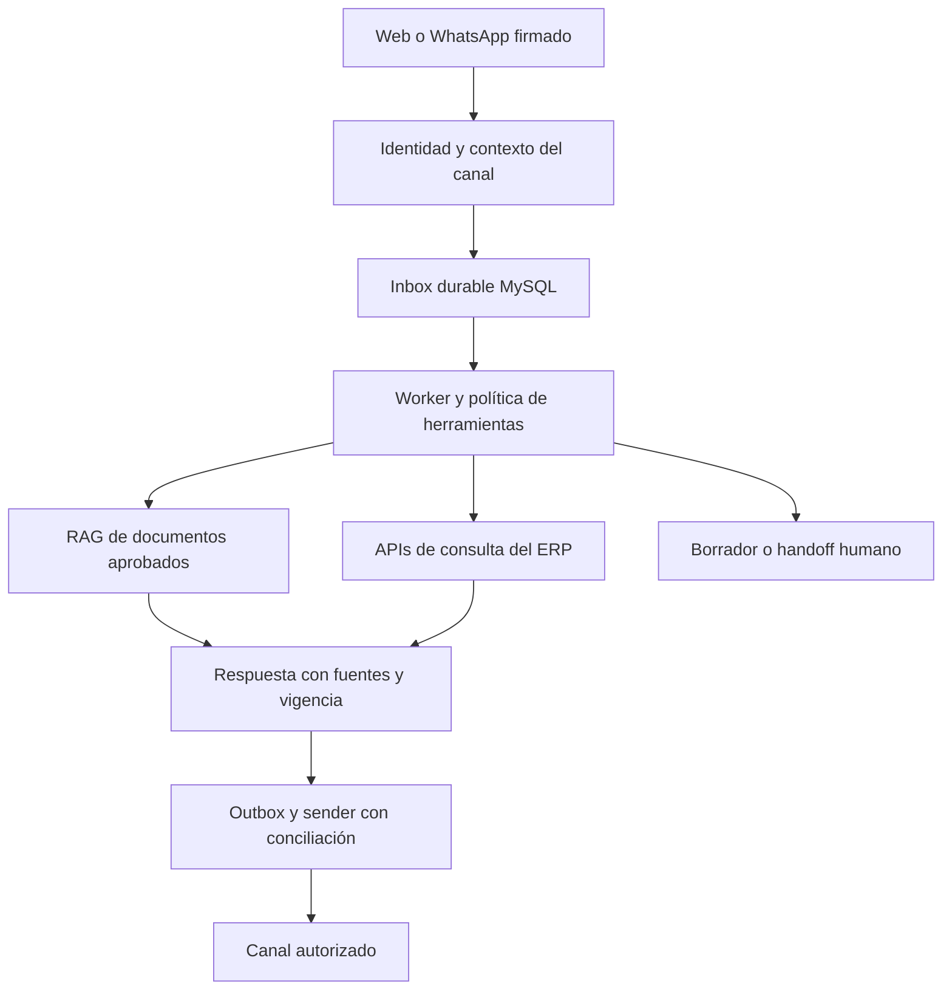

# Nortex: plan de transformación y validación comercial

> Avance local, 2026-09-04: [reparación E01–E08 y verificación por módulo](VERIFICACION_MODULOS_2026-09-04.md). Contabilidad por canal, recuperación offline, fechas, permisos, activación, catálogo y QA transaccional implementados. Piloto, brechas M01–M07 y publicación siguen separados.

Fecha: 2026-09-04. Estado: **programa priorizado con implementación local parcial de T04/T14; evidencia local en el informe por módulo y validación comercial pendiente**.
Responsables propuestos: fundador (producto/comercial), ingeniería (implementación), QA (evidencia) y responsable contable/fiscal cuando corresponda. Si una persona cubre varios roles, reducir trabajo simultáneo.

Este plan coordina los planes de dominio. La [auditoría general](AUDITORIA_GENERAL_2026-09-04.md) contiene la evidencia y sus límites. El [índice documental](README.md) distingue documentos vigentes de históricos. No autoriza despliegues, mensajes externos ni nuevas inversiones por sí solo.

## Dirección y validación transversal — ampliación 2026-09-04

El [plan de dirección UX y validación operativa](PLAN_DIRECCION_UX_Y_VALIDACION_2026.md) concreta responsables, skills a reconciliar, contrato Apple/web, pruebas independientes de matemáticas/roles/stock/caja y una matriz de veinte escenarios. La [ficha común de entrega](templates/CONTRATO_ENTREGA_VERIFICADA.md) mantiene el mismo brief y evidencia al cambiar de modelo.

Estado de esta ampliación: IMPLEMENTADO_LOCAL en el alcance E01–E08 descrito en el informe por módulo. Ya existe compuerta obligatoria HTTP/MySQL y evidencia local; quedan contratos y pilotos pendientes. Complementa T03/T04/T05/T14/T15/T17/T18; no cierra esas tareas ni acredita skills activadas, validación financiera o producción.

## 1. Decisión de dirección

**Nortex tiene una base técnica aprovechable y una señal inicial de utilidad. Su viabilidad comercial todavía no está demostrada.** La transformación debe conseguir que un grupo concreto de comercios venda, vuelva y pague de forma sostenible.

El fundador informa 45 personas registradas y 3 que usan el producto regularmente, en ferreterías y farmacias. El cociente es 6,7 %, pero no es retención D7/D30: se desconocen fechas, denominador de negocios frente a personas, frecuencia exacta, cuentas de prueba y pagos. Tampoco corresponde llamar a las otras 42 personas clientes perdidos. Hay tráfico y recomendaciones ocasionales de ChatGPT según el fundador; falta atribución verificable.

La recomendación es invertir primero en **activación, fiabilidad y soporte**, y evaluar de nuevo en 30, 60 y 90 días. Más módulos y más tráfico no prueban que se resuelve el problema del negocio.

### Qué conservar y concentrar

- Núcleo React/PWA + Express/Prisma/MySQL; venta autoritativa, stock atómico y contabilidad dentro de la transacción donde ya existe.
- Propuesta cotidiana: vender, controlar existencias, cuadrar caja y seguir el fiado; lenguaje y soporte nicaragüenses.
- Ferreterías como primer piloto operativo de WhatsApp, sujeto a comprobar que sus problemas justifican ese canal.
- Farmacias como segundo grupo de aprendizaje del POS; lotes, vencimientos y privacidad son criterios de aceptación. Empezar su soporte WhatsApp con ayuda sobre Nortex, sin asesoramiento médico ni comercio automatizado de productos regulados.
- Ayuda RAG respaldada por documentación aprobada, disponible en web y WhatsApp.

Durante el primer ciclo de 30 días, diferir nuevos verticales, préstamos/delivery/banca nuevos, rediseños generales repetidos, tiendas móviles y microservicios, salvo defectos que afecten a usuarios actuales. Mantener y corregir los módulos que estos ya usan. La prioridad de farmacia no convierte en verificada una implementación local de seguridad de lotes.

## 2. Descubrir por qué se quedan tres

**Semana 1, dueño: fundador; apoyo: producto.** Observar a los 3 usuarios habituales y entrevistar a 5–8 registrados que no volvieron. Son tamaños de aprendizaje propuestos, no una muestra estadística representativa. Obtener consentimiento antes de contactar/grabar; este trabajo no ha enviado mensajes.

Guion de 20 minutos:

1. ¿Cómo llevabas ventas e inventario antes? Mostrame una tarea de ayer.
2. ¿Qué te hizo probar Nortex y qué esperabas terminar ese día?
3. Mostrame cómo cargás un producto, vendés, cobrás y cerrás caja. Observar sin dirigir primero.
4. ¿En qué paso necesitaste ayuda o desconfiaste? ¿Qué seguís anotando fuera?
5. ¿Qué pasa con mala señal, impresora, lector, unidad/empaque o lote/vencimiento?
6. ¿Qué parte usaste esta semana y qué perderías si no estuviera?
7. ¿Quién decide y paga el sistema? ¿Qué precio aceptaría por ese resultado y bajo qué condiciones?

Registrar segmento, dispositivo, tarea, bloqueo reproducible, ayuda requerida, alternativa actual y evidencia. Separar fricción observada de una explicación retrospectiva. No asumir que el abandono se debe al precio, errores o complejidad hasta comprobarlo.

Entregable: tres problemas ordenados por frecuencia e impacto, un segmento principal y un recorrido de primera venta que se pueda probar con gente real.

## 3. Métricas que permiten decidir

Fuente de verdad: hechos del backend por **tenant de comercio**, timestamps y cobros conciliados. Excluir demo, pruebas, cuentas internas, ventas anuladas y eventos duplicados. Conservar métricas por usuario para UX, sin mezclarlas con comercios.

| Métrica | Definición operativa propuesta | Estado inicial |
|---|---|---|
| Registro calificado | Comercio real del segmento con responsable identificable | Desconocido; 45 son personas autorreportadas |
| Activación D1/D7 | Primera venta real confirmada dentro de 24 h/7 días desde alta | Hay hitos de onboarding; falta cohorte conciliada |
| Tiempo a primera venta | Tiempo alta → primera venta; reportar mediana/p75 y no activados | Sin línea base verificada |
| Uso semanal con valor | Tenants con ventas confirmadas en ≥3 días distintos/semana | 3 habituales autorreportados, definición pendiente |
| Retención semana 4 | Activados que vuelven a vender en días 22–28 desde su primera venta real / activados con ≥28 días desde esa venta | Desconocida |
| Conversión a pago | Nuevas suscripciones efectivamente pagadas / trials elegibles de la cohorte | Desconocida |
| MRR contratado | Importe recurrente vigente normalizado por mes, sin trials ni pagos únicos | El campo actual monthlyRevenue no sirve |
| Cobro real | Pagos de suscripción conciliados menos devoluciones del período | Desconocido; distinto de MRR |
| Costo de servir | Infra atribuible + IA + Meta + minutos de soporte valorizados por tenant activo/pagador | Sin medición |
| Calidad | Ventas fallidas/duplicadas, diferencias de caja/stock y sincronización pendiente | Instrumentar y verificar |

Eventos mínimos: registro, inicio de onboarding, producto creado/importación terminada, primer intento de venta, venta confirmada (server-side), error clasificado, segunda sesión con venta, cierre confirmado, trial vencido, pago confirmado, solicitud de ayuda y resolución. Consentimiento, minimización de datos, IDs internos y deduplicación por evento. No enviar montos, teléfonos ni contenido privado a analítica pública.

La definición actual de activo administrativo incluye login o venta en 30 días; sirve para contacto, pero no mide hábito ni valor recurrente. Mantener nombres distintos.

Cohortes nuevas se agrupan por semana de alta; reactivadas, por semana de primera venta tras ≥30 días sin ventas. Reportarlas por separado. Para activación contar desde el alta; para repetición semana 4, desde la primera venta de esa cohorte. Excluir cohortes inmaduras del denominador y mostrar siempre número absoluto de casos.

### Criterios propuestos para revisar el futuro

Son umbrales de decisión internos para acordar antes del piloto, no benchmarks de la industria ni promesas:

- Día 14: causas observadas de fricción en los 3 habituales y al menos 5 inactivos; embudo medible; defectos críticos reproducidos y contenidos.
- Día 30: en 10 comercios nuevos/calificados o reactivados con seguimiento separado, al menos 6 logran una venta sin que ingeniería opere por ellos; cero incidentes críticos en el piloto. Con menos participantes, describir casos individuales, sin porcentajes concluyentes.
- Día 60: medir semana 4 de la cohorte madura; buscar al menos 5 comercios con uso semanal de valor y al menos 3 pagos reales o renovaciones conciliadas. No contar una intención de pago como pago.
- Día 90: dos cohortes mejoran activación/retención frente a su línea base, pagos se repiten y margen de contribución por pagador es positivo incluyendo soporte. Si no ocurre, reducir segmento/oferta o pausar inversión de expansión y rediseñar el experimento.

No cerrar el proyecto solo por 3/45; tampoco afirmar product-market fit por tráfico, número de features o recomendaciones de un asistente.

## 4. Hoja de ruta por resultados

Calendario orientativo para **1 desarrollador dedicado + fundador 5–8 h/semana + revisión QA/contable puntual**. No se conoce la capacidad real; no es compromiso de entrega. Seguridad y datos tienen prioridad sobre fechas. Con más equipo pueden paralelizarse documentación/entrevistas y pruebas, preservando un responsable por agregado.

Las ventanas son momentos de validación y decisión; el backlog completo puede exceder 16 semanas. Seleccionar entregas según capacidad real y terminar cada cambio con QA antes de iniciar otro del mismo dominio.

| Fase | Ventana estimada | Entrega y responsable | Condición de salida |
|---|---|---|---|
| 0. Diagnóstico y control | Días 1–7 | Fundador: entrevistas; ingeniería: mapa de cambios, riesgos, identidad WhatsApp, métricas y evidencia de backups | Baseline fechada; riesgos P0 contenidos; no abrir canal privado sin identidad |
| 1. Primera venta confiable | Semanas 2–4 | Ingeniería/UX: resolver los 3 bloqueos observados, importación guiada, errores recuperables, cobro/retorno y soporte visible; fundador: validar pago de suscripción | Prueba observada, flujo sin asistencia de ingeniería; HTTP/roles/offline/caja verificados; pago conciliable |
| 2. Ayuda RAG documental | Semanas 4–6 | Producto: corpus; ingeniería: ingesta, ACL, citas y evaluación; soporte: handoff real | Evals offline pasan; ayuda útil en web; respuestas sin evidencia se abstienen |
| 3. WhatsApp durable supervisado | Semanas 6–10 | Ingeniería: inbox/outbox, worker, identidad, consentimiento, políticas y bandeja; fundador: piloto | Reinicios/reintentos no pierden trabajo; cero lecturas privadas no autorizadas; piloto consentido y medido |
| 4. Consolidar y renovar | Semanas 10–16 | Ingeniería: modularidad/pools/reportes; fundador: renovación y segmentación | Revisión comercial, costo de soporte/IA, restauración y carga representativa; decidir siguiente inversión |

El trabajo mínimo de RAG y durabilidad puede prepararse en paralelo con activación, pero su despliegue depende de las compuertas técnicas y del caso de uso validado. La transformación posterior de RRHH, banca, delivery y hardware se retoma por demanda demostrada.

## 5. Backlog ejecutable

Prioridades: P0 bloquea activar la capacidad afectada; P1 protege datos/decisiones/recorrido central; P2 reduce costo o habilita expansión. Estimaciones en días de ingeniería, **no sumables al calendario sin descubrimiento y QA**.

| ID / prioridad | Cambio y archivos principales | Dependencia / esfuerzo inicial | Aceptación verificable |
|---|---|---|---|
| T00 P1 | Mapa de trabajo local/ramas, propietarios y releases; docs/releases, CI | Primero / 1–2 d | Cada cambio se clasifica local/PR/staging/producción con evidencia. Preservar checkout actual |
| T01 P0 | Identidad y autorización privada WhatsApp; identity.ts, tools.ts, types.ts, brain.claude.ts | Antes de B2B/BOTH/deuda / 3–5 d | Remitente desconocido no accede a ventas/deuda; vínculo exacto y verificado, revocación, matriz roles, pruebas dos tenants/dos usuarios |
| T02 P1 | Métricas SaaS reales y recorrido de pago; admin metrics extraído de server.ts, SuperAdmin.tsx, billing/Stripe | T00 / 2–4 d | MRR, cobros, GMV y trial separados; fixtures cancelación/reembolso/trial; pago de prueba verificable y conciliación del medio realmente utilizado |
| T03 P1 | Cohortes/eventos y razones de abandono; onboarding, analytics, reportes admin | Entrevistas / 2–4 d | Eventos backend idempotentes; cohortes maduradas, exclusión demo, timestamps y denominadores visibles |
| T04 P1 | Recorrido ferretería: producto→venta→caja→volver; MiNegocio, OnboardingHub, components/pos/*, HelpCenter | 3 fricciones observadas / 4–8 d | 5 pruebas observadas; sin crear ventas demo en libros reales; error conserva trabajo, acceso por rol |
| T05 P1 | Farmacia: lotes/vencimientos/stock disponible y transición de modos; plan bodega/farmacia | Validar código y uso actual / 5–10 d | Físico/vendible/retenido distinguidos; expirados no vendibles según política; devoluciones y concurrencia con MySQL; no certificar solo por simulación |
| T06 P1 | Total cuentas por pagar y paginación; ruta purchases/pending → módulo compras | T00 / 2–4 d | Caso >500 documentos y balance efectivo legacy; total global exacto independiente de página; no sumar una columna incompatible con fallback |
| T07 P0 canal | Inbox persistido antes del ACK; webhook.ts, inbound.ts, schema + preflight | T01 + backup/schema gate / 3–5 d | Caída de DB da error reintentable; duplicado/claim concurrente seguro; reinicio tras recepción recupera mensaje |
| T08 P0 canal | Outbox/sender durable, retries, DLQ, leases y conciliación | T07 / 4–7 d | Timeout ambiguo no provoca reenvío ciego; crash antes/después de envío; estados accepted/delivered/failed; orden por conversación |
| T09 P1 | Fuentes documentales, editor/aprobación y corpus versionado | T04/entrevistas / 3–5 d | Propietario, ACL, versión, vigencia, hash; borrado/corrección propagados; excluye archivos de ingeniería y PII innecesaria |
| T10 P1 | Retriever documental y respuestas con citas; interfaz separada del catálogo | T09 / 4–7 d | Dataset 100 preguntas, aislamiento y abstención; precios/stock/saldos desde API, nunca del índice |
| T11 P1 | Bandeja soporte y handoff, canal corporativo separado de comercios | T07–10 / 4–7 d | Asignado, pendiente, atendido, resuelto; persona puede responder con permiso y pausar bot; SLA observado |
| T12 P1 | Consentimiento/opt-out/plantillas/costos/eligibilidad vertical | Antes de mensajes piloto / 2–4 d | Sin envío fuera de política, opt-out inmediato, cuotas por tenant, auditoría de costo; revisión Meta vigente |
| T13 P1 escala | Singleton Prisma, scheduler único y estado compartido | T17 y antes de segunda instancia / 4–8 d | 1 cliente por proceso; getAccount usa tx; conexión máxima presupuestada; prueba dos instancias rate-limit/paywall/crons |
| T14 P2 | Extraer dominios de server/POS, strict por módulo, Decimal por agregado | Cada PR / continuo | Presupuestos no crecen; prueba conductual antes de mover; migración expand/backfill/verify sin pérdida |
| T15 P1 operaciones | Restore real, monitoreo, SLO, release de SHA exacto | Antes de releases sensibles / 3–6 d + operación | Backup off-site y restauración fechados; staging exacto + smoke autenticado; rollback ensayado |
| T16 P2 expansión | Pricing/oferta, búsquedas/SEO y evaluación semántica/infra nueva | Cohortes y pagos positivos / decidir después | Conversión por fuente medible y margen positivo; cambio semántico supera baseline; presupuesto aprobado |
| T17 P1 contabilidad | Resolver cuentas con tx y lecturas consolidadas; accounting.ts | Ingeniería; antes de T13 / 2–4 d | Pool pequeño con ventas concurrentes, rollback de asiento y cuentas nuevas; sin consulta global anidada que requiera otra conexión |
| T18 P1 QA | Job obligatorio de negocio MySQL 8; CI, suites HTTP/MySQL | Ingeniería/QA; antes de promover cambios transaccionales / 3–5 d | Dos tenants/roles; venta-stock-caja-asiento, devolución y replay; cero omisiones de suites requeridas y corrida vacía falla |
| T19 P1 históricos | Archivar productos por dominio; schema, ruta products y consultas | Ingeniería; antes de ampliar bajas de catálogo / 3–5 d | Baja oculta de catálogo vendible, conserva Kardex/lotes/conteos; replays y FK; SKU, restauración y auditoría probados |

Cada PR incluye problema, alcance, evidencia, pruebas, rollback y documento actualizado. Actualizar este plan no corrige por sí mismo los hallazgos: cada entrega debe identificar qué implementó y qué verificó.

### Avance local posterior a la auditoría — 2026-09-04

Responsable de implementación: ingeniería; revisión: QA. Estado: **IMPLEMENTADO_LOCAL parcial**. La [entrega de activación y modularidad](ACTIVACION_Y_MODULARIDAD_2026-09-04.md) concentra los archivos, deltas medidos, pruebas, QA visual, omisiones y condición de salida. La verificación final sigue en curso al registrar esta nota; los resultados se mantienen en ese informe para evitar cifras divergentes entre planes.

| Tarea | Parte implementada localmente | Pendiente para cerrar la tarea |
|---|---|---|
| T04 | Inicio orienta primera/próxima venta; el alta rápida exige existencia real, permite guardar 0 sin agregar un agotado al carrito cuando no se permite stock negativo y conserva la acción de volver a vender | QA final del corte, cinco pruebas observadas con comercios, fricciones de caja/offline/roles y evidencia de uso recurrente |
| T14 | Lectura `GET /api/onboarding` extraída a ruta/servicio con Prisma compartido; catálogo visual del POS extraído a `PosCatalogPane`, con pruebas conductuales y reducción del archivo central | Verificar deltas y trinquete finales; seguir extrayendo dominios, strict por módulo y transición Decimal por agregado con sus compuertas |
| T03 | El endpoint incorpora progreso derivado de ventas del tenant para orientar la UI; excluye `VOIDED`/`CANCELLED` | Sigue abierto: no es una cohorte, un historial de eventos backend idempotentes ni medición D1/D7/retención; faltan denominadores, exclusiones de demo/pruebas, entrevistas y pagos conciliados |

Este corte no acredita staging, producción, adopción ni mejora comercial medida. Las entrevistas, las compuertas transaccionales de otros dominios y el piloto RAG/WhatsApp mantienen sus dependencias originales. Coordinar futuras extracciones con un responsable por dominio, contrato y lista de archivos permitidos antes de paralelizar; no aumentar presupuestos para aprobar tests.

## 6. RAG y WhatsApp: experiencia y arquitectura

Primer resultado: el dueño pregunta cómo cargar existencias, cobrar o resolver una sincronización; recibe pasos vigentes con fuente, enlace a la pantalla y opción de hablar con una persona. Medir si termina la tarea y vuelve a vender.

Separar tres contextos:

1. **Nortex → dueño:** soporte y activación del SaaS, CRM corporativo y consentimiento propio.
2. **Comercio → comprador:** catálogo permitido, información pública y estado autorizado de pedido; datos del tenant del comercio.
3. **Dueño → negocio:** consultas privadas con vinculación fuerte a usuario/rol. No se habilitan porque el canal sea B2B.

El código actual ya tiene canal, menú determinista, adaptador LLM, tres tools y búsqueda de catálogo FULLTEXT. Falta un RAG de manuales/políticas con ciclo documental, ACL, vigencia, citas y evaluación. No importar todos los MD: auditorías técnicas, instrucciones de agentes, datos privados y planes futuros no son respuestas al cliente.

Núcleo transaccional en MySQL. La ADR existente mantiene PostgreSQL/pgvector como evolución documental condicionada por calidad; no se provisiona por este plan. Conservar FULLTEXT como baseline y comparar antes de asumir el costo de embeddings/vector store/reranker. El worker podrá ser otro proceso del mismo repositorio.

Contrato mínimo por fragmento: tenant o público, ACL, documento/chunk, título, fuente, propietario, idioma, versión/hash, aprobado, validFrom/validTo, fecha de revisión. Filtrar permisos **antes** de recuperar; también validar después al construir respuesta. Retirar versiones vencidas y propagar borrados a índices/cachés.

Hechos vivos: stock, precio, deuda, caja, impuestos y pedidos salen de APIs deterministas. El modelo no recibe SQL libre ni credenciales de escritura. En el piloto solo lectura pública/privada autorizada y borradores; dinero, crédito, descuentos fuera de política, nómina, permisos y stock físico requieren política explícita y aprobación humana ligada a una acción exacta. Cada comando futuro valida identidad, tenant, versión, idempotencia y auditoría dentro del dominio.

### Evals y salida a piloto

Dataset inicial propuesto: 100 preguntas anonimizadas, dividido en ayuda/errores, catálogo permitido, ambigüedad/sin respuesta, documentos contradictorios y ataques/aislamiento. Mantener set reservado y versión de corpus/modelo/prompt. Simulaciones con proveedores falsos y MySQL efímero para cambios del core.

- ≥95 % de citas correctas/vigentes sobre respuestas que afirman hechos documentales.
- ≥90 % de respuestas de ayuda correctas según rúbrica humana en preguntas respondibles; la finalización real de tareas se mide aparte con usuarios durante el piloto.
- Reportar cobertura = preguntas respondibles contestadas / respondibles; abstención correcta = casos sin evidencia escalados / casos sin evidencia; escalamiento innecesario = respondibles escaladas / respondibles. Objetivos iniciales ≥90 %, ≥95 % y ≤10 %, respectivamente, con numeradores y denominadores visibles.
- Cero fuga entre tenants/roles, cero consulta privada sin identidad y cero acción crítica no autorizada en los casos probados. Esto no demuestra ausencia universal de fallas.
- Abstenerse o escalar ante fuente inexistente/contradictoria y ataques conocidos.
- Persistencia/ACK objetivo p95 <1 s; respuesta asistida p95 <20 s como objetivo inicial a medir, no capacidad actual.
- Presupuesto de IA y Meta por tenant fijado antes de piloto; contar intentos fallidos, reintentos y soporte humano.
- Handoff con responsable y horario; fuera de horario informa cuándo podrá atenderse, sin prometer disponibilidad que el equipo no tiene.

Escalera: offline → sombra sin envío → borrador supervisado → piloto consentido de pocos comercios → expansión condicionada. Interruptor global/tenant/tool, cola pausable, DLQ y runbook. No prometer entrega exactamente una vez: conservar deduplicación interna y conciliar resultados ambiguos con el proveedor.

### Reglas del canal

Revalidar políticas oficiales de Meta antes del piloto y después de cambios. La política contempla consentimiento, opt-out, ventanas y plantillas; también restricciones de comercio regulado, fármacos y cobranza. Nicaragua tiene una excepción condicionada para mensajes sobre medicamentos de venta libre; eso no autoriza experiencias de comercio de productos regulados ni asesoramiento médico. Un asistente de soporte empresarial debe mantenerse acotado; no asumir elegibilidad de un bot generalista de IA. Ver fuentes y límites en la auditoría.

## 7. Calidad, seguridad y datos

Piso por cambio de negocio: TypeScript, Prisma, pruebas de dominio, HTTP por roles y tenant, conducta UI, build y diseño. Para dinero/stock: integración MySQL con carreras, replay idéntico, misma clave/diferente payload, rollback y mutación de lógica pura. Una suite local verde no certifica UX real, producción ni conformidad fiscal.

No aumentar server.ts/POS/HRM con más flujos; extraer por caso de uso probado. Mantener una sola instancia Prisma por proceso, paginar y agregar en DB, impedir escrituras en GET y trabajos pesados en HTTP. Migrar dinero Float por agregado mediante expansión/backfill/reconciliación; preservar precisión en límites de API/persistencia. No convertir dinero a Number como regla general ni mover el asiento de venta fuera de su transacción para reducir latencia.

Archivo/soft delete por dominio y retención definida; evitar cascadas que pierdan Kardex/histórico. Auditoría de seguridad independiente por superficies (auth/roles/tenant/uploads/webhooks/offline) antes de expansión, con hallazgos y pruebas; esta auditoría general no la reemplaza.

Farmacia: físico, retenido, vencido y vendible separados; reglas de fecha civil Managua y lotes/series coherentes. La contabilidad, presentación fiscal y cumplimiento legal son entregables distintos; validar obligaciones con un profesional local, sin tratar un reporte Z o un test como certificación DGI.

## 8. Operación y economía

No se verificaron backups, infraestructura o despliegue productivos en esta auditoría. Pedir evidencia agregada y fechada del último backup off-site, restauración, alertas y SHA. Los objetivos históricos RPO 24 h/RTO 4 h son provisionales y requieren aceptación del negocio: perder un día de ventas puede ser inaceptable. Definir reducción mediante PITR cuando la capacidad/costo lo justifique.

SLO iniciales para acordar: venta confirmada p95 ≤2 s bajo carga representativa, disponibilidad mensual del core ≥99,5 %, cero pérdida/duplicación de venta en pruebas de fallo, sincronización con estado visible, restauración ensayada. Son objetivos, no resultados medidos. Alertar por errores, backlog, DLQ, backup vencido y diferencias contables; incidentes con dueño y procedimiento de comunicación.

Antes de infraestructura nueva, registrar costos mensuales de hosting/DB/backups, modelos/embeddings, Meta/BSP, monitoreo y soporte. Fórmula de contribución: ingresos netos por suscripción menos costos variables de servicio y soporte. Punto de equilibrio orientativo: costos fijos mensuales / contribución media por pagador; no calcularlo mientras esa contribución sea desconocida o ≤0. No convertir 3 habituales en 3 pagos ni 45 registros en demanda monetizada.

El precio publicado en el código local es $20/mes y trial de 30 días; validar cobro real y coherencia de todos los canales. Probar oferta simple con resultado y soporte definido; no cambiar precios a ciegas. Loyverse ofrece TPV básico gratuito y complementos de pago, por lo que competir solo por catálogo de funciones/precio es una hipótesis débil. La ventaja por validar es adaptación al comercio local y tiempo hasta obtener valor, con confianza operativa.

## 9. Primeras diez acciones

1. Clasificar cambios locales y preservar una baseline reproducible.
2. Confirmar identidad de los 3 negocios y si pagan, con datos agregados.
3. Observarlos y entrevistar 5–8 inactivos con consentimiento.
4. Corregir la definición de métricas de ingresos y activación.
5. Contener tools privadas de WhatsApp antes de habilitar canales.
6. Verificar restauración y cerrar defectos de datos del recorrido activo.
7. Resolver tres fricciones de primera venta y probar en dispositivos reales.
8. Convertir 20 preguntas reales de soporte en fuentes aprobadas; crecer hacia el dataset de 100.
9. Implementar inbox/outbox, identidad y bandeja antes de automatizar conversaciones.
10. Revisar resultados en días 30/60/90 y decidir con uso, pagos y costo.

Estado histórico al cierre de la auditoría inicial: documentación actualizada; implementación, entrevistas, pruebas de producción y piloto WhatsApp pendientes. La revisión del Security & Integrity Loop tuvo alcance de diseño documental y no certificó el sistema ni un despliegue. El avance local posterior de T04/T14 se registra en la sección 5 y en el informe de entrega enlazado; las demás condiciones de salida siguen abiertas.
