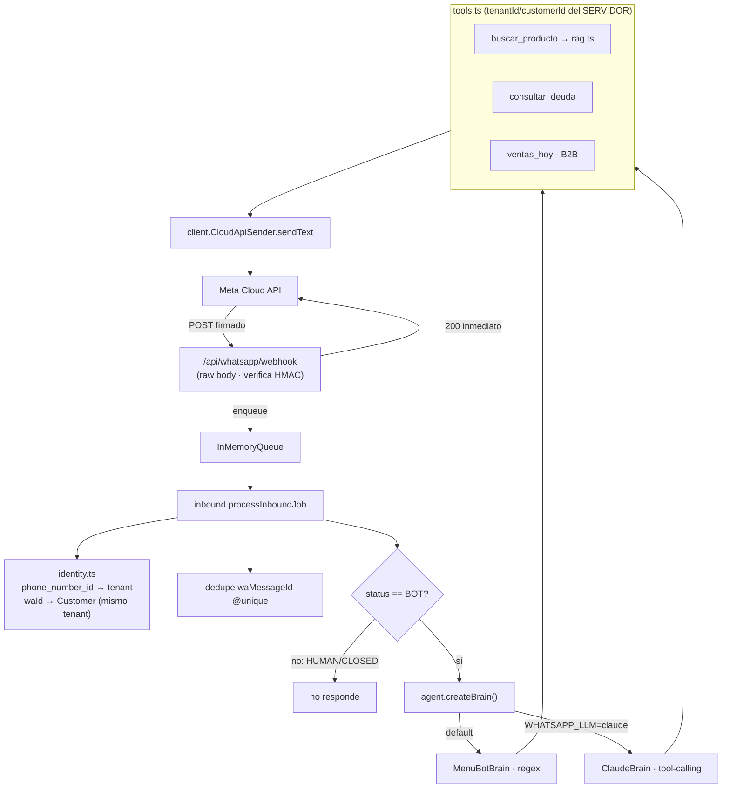

# Nortex — Infraestructura del Agente WhatsApp (RAG)

> Estado: **Capa 1 (Canal) completa y funcional** + tools tenant-scoped + recuperación de catálogo + cerebro determinístico (MenuBot) que corre **sin LLM** + costura de LLM (Claude) lista.
> Stack: Node 22 (fetch global) · Express · Prisma · MySQL 8.0. Cero dependencias nuevas.
> Depende de `services/crypto.ts` (rama de seguridad) para cifrar el access token.

## Qué se construyó



| Pieza | Archivo | Estado |
|---|---|---|
| Webhook (verify + receive + firma HMAC) | `whatsapp/webhook.ts` | ✅ |
| Cola asíncrona en memoria | `whatsapp/queue.ts` | ✅ (seam para BullMQ/Redis) |
| Cliente Cloud API (envío) | `whatsapp/client.ts` | ✅ (interfaz `WhatsAppSender` para Twilio/Evolution) |
| Identidad/tenant routing | `whatsapp/identity.ts` | ✅ |
| Procesador idempotente | `whatsapp/inbound.ts` | ✅ |
| Recuperación de catálogo | `whatsapp/rag.ts` | ✅ léxico tenant-scoped (seam para FULLTEXT/vector) |
| Tools (Zod + JSON Schema) | `whatsapp/tools.ts` | ✅ `buscar_producto`, `consultar_deuda`, `ventas_hoy` |
| Cerebro determinístico | `whatsapp/agent.ts` | ✅ funciona sin LLM |
| Cerebro LLM (tool-calling) | `whatsapp/brain.claude.ts` | ✅ opcional (`WHATSAPP_LLM=claude`) |
| Schema | `WhatsAppChannel`, `WhatsAppConversation`, `WhatsAppMessage` | ✅ aditivo |
| Onboarding de número | `POST /api/admin/whatsapp/channels` (SUPER_ADMIN) | ✅ token cifrado |

## Seguridad — binding de tenant inviolable

El `tenantId` se deriva **siempre** del canal (`phone_number_id → WhatsAppChannel`), nunca del usuario ni del LLM. El `customerId` se resuelve del `waId` contra `Customer` del **mismo** tenant. Las tools reciben ese contexto del servidor: aunque el modelo sea manipulado por *prompt injection*, **no puede** consultar otro tenant ni otro cliente. `consultar_deuda` ignora cualquier id que sugiera el modelo y usa solo el `customerId` resuelto.

## Variables de entorno

```bash
WHATSAPP_ENABLED=true                 # monta el webhook (inerte si no)
WHATSAPP_APP_SECRET=<app secret Meta> # verificación de firma de TODO webhook
WHATSAPP_VERIFY_TOKEN=<token elegido> # challenge del GET webhook
WHATSAPP_API_VERSION=v21.0            # opcional

# Cifrado del access token por tenant (de la fundación cripto):
NORTEX_DATA_KEYS=v1:<base64-32-bytes>

# Cerebro LLM (opcional; default = MenuBot sin LLM):
WHATSAPP_LLM=claude
ANTHROPIC_API_KEY=<key>
WHATSAPP_LLM_MODEL=claude-haiku-4-5-20251001
```

## Runbook de activación

1. **Meta:** crear App + producto WhatsApp, obtener `phone_number_id`, `access_token` permanente y `app secret`. Configurar el webhook a `https://<dominio>/api/whatsapp/webhook` con el `WHATSAPP_VERIFY_TOKEN`.
2. **Coolify:** setear las env de arriba. Deploy (`prisma db push` crea las 3 tablas).
3. **Registrar el número del tenant piloto:**
   ```bash
   curl -X POST https://<dominio>/api/admin/whatsapp/channels \
     -H "Authorization: Bearer <jwt SUPER_ADMIN>" -H "Content-Type: application/json" \
     -d '{"tenantId":"<id>","phoneNumberId":"<meta phone id>","accessToken":"<token>","botScope":"B2C"}'
   ```
4. **Probar:** escribir al número. MenuBot responde de inmediato (menú, búsqueda de productos, saldo). Para el cerebro LLM, setear `WHATSAPP_LLM=claude` + `ANTHROPIC_API_KEY` y redeploy.

## Límites honestos (MVP) y próximas costuras

- **Cola en memoria:** no sobrevive reinicios ni se reparte entre instancias → válido con **una** instancia. La idempotencia por `waMessageId` cubre los reintentos de Meta. Escala → BullMQ/Redis detrás de la misma interfaz.
- **RAG léxico, no vectorial:** MySQL 8.0 no tiene pgvector. Para catálogos PyME alcanza; el `CatalogRetriever` deja la costura para FULLTEXT o vector store externo sin tocar al agente.
- **`ventas_hoy` (B2B)** se habilita por `botScope`; falta autenticar que el `waId` sea efectivamente el dueño (hoy confía en el scope del canal). Endurecer antes de exponer métricas sensibles.
- **No incluido (Fase 4):** panel "Live Chat" en el frontend y notificación de handoff (hoy el handoff solo marca `status=HUMAN` y el bot se calla). El `wa_id` plaintext debería migrar a FLE + blind index (plan PII de `ARQUITECTURA_BLINDAJE.md`).
- **Onboarding de clientes nuevos:** si el `waId` no matchea un `Customer`, la conversación queda con `customerId=null`; falta el flujo de auto-registro.
